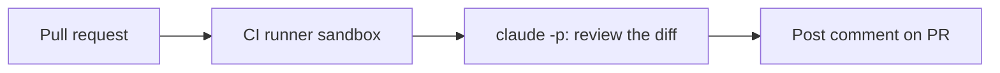

<LevelBadge level="advanced" />

<VerifyNote lastVerified="2026-06-20" source="https://docs.anthropic.com/en/docs/claude-code/sdk">
헤드리스 플래그와 CI 통합 세부 사항은 변합니다 — 공식 Claude Code / Agent SDK 문서를 기준으로 확인하세요.
</VerifyNote>

가치가 큰 고전적인 자동화: Claude가 **모든 풀 리퀘스트를 리뷰**하고 그 발견 사항을 코멘트로 게시하게 하는 것 — CI에서 [헤드리스](/docs/claude-code/headless-and-agent-sdk)로 실행합니다. 안전하게 유지해 주는 가드레일과 함께, 그 형태는 다음과 같습니다.

## 무엇을 하는가

각 PR마다: diff를 체크아웃하고, Claude에게 버그/엣지 케이스/컨벤션 문제를 리뷰하도록 요청한 뒤, 코멘트를 게시합니다. 결정은 여전히 사람이 하며, Claude는 빠른 1차 검토만 제공합니다.



## 워크플로 (개략)

```yaml
name: Claude PR review
on: pull_request
permissions:
  contents: read
  pull-requests: write   # to comment — NOT write to code
jobs:
  review:
    runs-on: ubuntu-latest
    steps:
      - uses: actions/checkout@v4
        with: { fetch-depth: 0 }
      - name: Review the diff
        env:
          ANTHROPIC_API_KEY: ${{ secrets.ANTHROPIC_API_KEY }}
        run: |
          git diff origin/${{ github.base_ref }}...HEAD > /tmp/diff.patch
          claude -p "Review this diff for correctness bugs, missing edge cases, and
          security issues. Report ONLY high-confidence findings as a Markdown
          checklist with file:line. Diff:" < /tmp/diff.patch > /tmp/review.md
      # then post /tmp/review.md as a PR comment (e.g. with the gh CLI or an action)
```

(정확한 헤드리스 호출 방법은 다를 수 있습니다 — 문서를 참고하세요. 원칙은 이렇습니다: diff를 입력하고, Markdown을 캡처하고, 게시한다.)

## 가드레일 ([자율 실행 강화하기](/docs/security/hardening-autonomous-runs)를 읽으세요)

:::warning CI에서의 최소 권한
- **코멘트만.** `pull-requests: write`를 부여하고 `contents: write`는 **부여하지 마세요** — 봇이 코드를 푸시해서는 안 됩니다.
- **토큰 범위를 한정하세요**; 신뢰할 수 없는 PR 콘텐츠를 읽는 작업에 배포/비밀 값 접근을 절대 노출하지 마세요.
- **PR 콘텐츠를 신뢰할 수 없는 것으로 취급하세요** — [프롬프트 인젝션](/docs/security/prompt-injection)을 포함할 수 있습니다; 작업이 중대한 행동을 하게 두지 마세요.
- **비용을 제한하세요** — 큰 diff는 [토큰](/docs/api/tokens-and-pricing)을 소모합니다; 변경된 파일만 리뷰하는 것을 고려하세요.
:::

## 시끄럽지 않고 유용하게 만들기

- **확신도 높은 발견 사항만** 요청하세요 — 사소한 지적이 잔뜩 쌓이면 무시됩니다.
- **1차 검토**로 유지하고, 머지 결정은 사람이 내리게 하세요.

## 다음 단계

- [헤드리스 모드 & Agent SDK](/docs/claude-code/headless-and-agent-sdk)
- [자율 실행 강화하기](/docs/security/hardening-autonomous-runs)
- [코딩 & 소프트웨어 개발](/docs/playbooks/coding)
