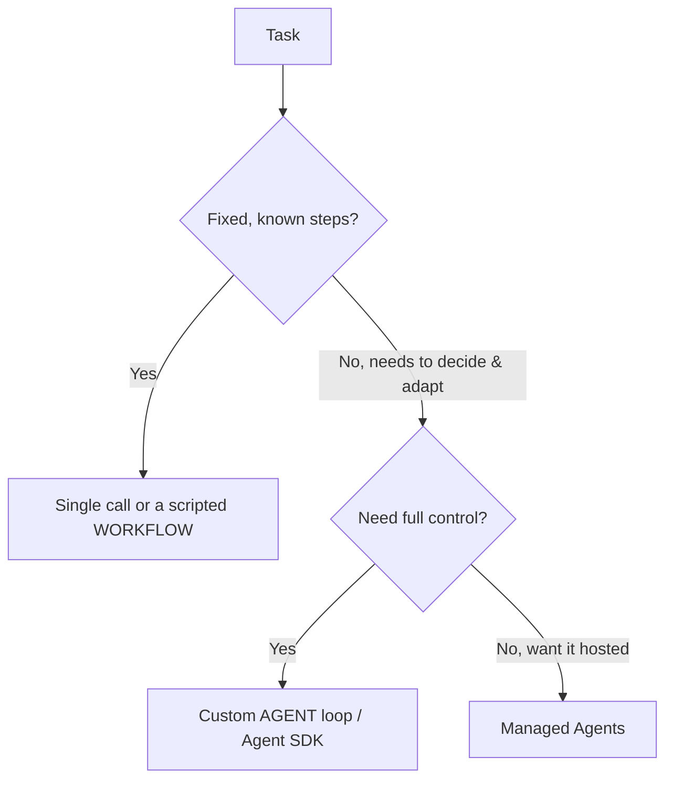

<LevelBadge level="advanced" />

<VerifyNote lastVerified="2026-06-20" source="https://docs.anthropic.com/en/docs/agents-and-tools">
O ferramental de agentes (o Agent SDK, as opções gerenciadas) evolui rapidamente — confirme as opções atuais na documentação oficial.
</VerifyNote>

Um **agente** é um modelo executando em um loop: ele persegue um objetivo chamando [ferramentas](/docs/api/tool-use), observando resultados e decidindo o próximo passo até concluir. Antes de construir um, escolha *a coisa mais simples que funciona*.

## O teste de decisão (não exagere na construção)

- **Chamada única** — um único prompt resolve. A maioria das tarefas. Mais barata e mais confiável.
- **Workflow** — você orquestra uma sequência fixa de chamadas no código (fluxo de controle determinístico). Use quando os passos são conhecidos.
- **Agente** — o modelo decide os passos dinamicamente. Use somente quando o caminho realmente não pode ser codificado de forma fixa.

> Recorra a um agente quando a adaptabilidade for o ponto central — não porque soa impressionante. Um workflow que você controla é mais fácil de testar e depurar.

## Projetando o loop

Um agente personalizado mínimo:

1. **System prompt**: o objetivo, as restrições e as ferramentas disponíveis.
2. **Loop**: envie mensagens → se houver `tool_use`, execute a ferramenta, anexe o `tool_result`, repita → até uma resposta final ou uma condição de parada.
3. **Guardrails**: um limite máximo de iterações, um orçamento de tokens/custo e validação das entradas das ferramentas.
4. **Gerenciamento de contexto**: resuma/reduza conforme o histórico cresce (mesma ideia do [Gerenciamento de Contexto](/docs/claude-code/context-management)).

O **[Claude Agent SDK](/docs/claude-code/headless-and-agent-sdk)** te dá esse loop — ferramentas, permissões, tratamento de contexto — tudo incluído, para que você não precise implementá-lo manualmente.

## Torne-o robusto

- **Limite tudo**: iterações, tempo, custo. Agentes podem entrar em loop.
- **Trate falhas de ferramentas** com elegância (retorne o erro como um resultado).
- **Privilégio mínimo + humano no loop** para ações arriscadas — veja [Protegendo Agentes](/docs/security/securing-agents).
- **Avalie-o** em casos reais antes de confiar nele — veja [Evals](/docs/foundations/evals).

## Próximo

- [Uso de Ferramentas](/docs/api/tool-use) · [Modo Headless e Agent SDK](/docs/claude-code/headless-and-agent-sdk)
- [Agentes Gerenciados](/docs/api/managed-agents) · [Cowork e Times de Agentes](/docs/api/cowork-and-agent-teams)
- [Protegendo Agentes e Ferramentas](/docs/security/securing-agents)
