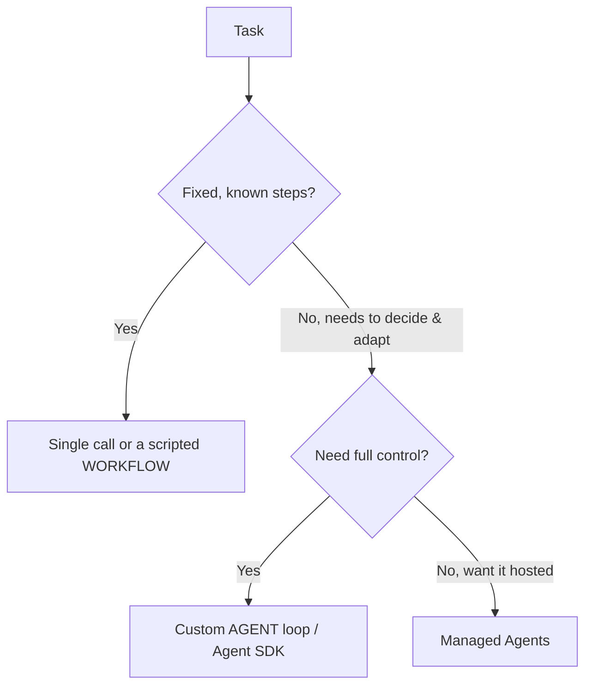

<LevelBadge level="advanced" />

<VerifyNote lastVerified="2026-07-21" source="https://platform.claude.com/docs/en/agents-and-tools/tool-use/overview">
O ferramental de agentes (o Agent SDK, as opções gerenciadas) evolui rapidamente — confirme as opções atuais na documentação oficial.
</VerifyNote>

<Callout type="objectives" items={["Definir o que um agente realmente é: um modelo executando em um loop", "Aplicar o teste de decisão para escolher entre chamada única, workflow ou agente", "Projetar um loop de agente mínimo com as proteções certas", "Saber quando recorrer ao Claude Agent SDK em vez de montar tudo na mão", "Tornar um agente robusto: limite-o, trate falhas, restrinja privilégios, avalie-o"]} />

Um **agente** é um modelo executando em um loop: ele persegue um objetivo chamando [ferramentas](/docs/api/tool-use), observando resultados e decidindo o próximo passo até concluir. Antes de construir um, escolha *a coisa mais simples que funciona*.

## O teste de decisão (não exagere na construção)

Nem toda tarefa precisa de um agente. Percorra esta árvore primeiro — a maioria das tarefas para no topo.

Três opções, da mais simples primeiro:

- **Chamada única** — um único prompt resolve. A maioria das tarefas. Mais barata e mais confiável.
- **Workflow** — você orquestra uma sequência fixa de chamadas no código (fluxo de controle determinístico). Use quando os passos são conhecidos.
- **Agente** — o modelo decide os passos dinamicamente. Use somente quando o caminho realmente não pode ser codificado de forma fixa.

<Callout type="warning">
Recorra a um agente quando a adaptabilidade for o ponto central — não porque soa impressionante. Um workflow que você controla é mais fácil de testar e depurar.
</Callout>

## Projetando o loop

Um agente personalizado mínimo é só quatro partes móveis. Construa-as nesta ordem:

<Steps items={[
  {title: "System prompt", body: "Declare o objetivo, as restrições e as ferramentas disponíveis. É contra isso que o modelo raciocina a cada turno."},
  {title: "O loop", body: "Envie mensagens → se a resposta for um tool_use, execute a ferramenta, anexe um tool_result e repita → até uma resposta final ou uma condição de parada."},
  {title: "Proteções", body: "Adicione um limite máximo de iterações, um orçamento de tokens/custo e a validação das entradas das ferramentas antes que algo seja executado."},
  {title: "Gerenciamento de contexto", body: "Resuma ou reduza conforme o histórico cresce — a mesma ideia abordada em Gerenciamento de Contexto (/docs/claude-code/context-management)."}
]} />

O **[Claude Agent SDK](/docs/claude-code/headless-and-agent-sdk)** te dá esse loop — ferramentas, permissões, tratamento de contexto — tudo incluído, para que você não precise implementá-lo manualmente.

<Callout type="tip">
Antes de escrever seu próprio loop, pergunte se o Agent SDK já cobre isso. Ele já traz o loop, as permissões e o tratamento de contexto, para que você possa focar nas ferramentas e no objetivo.
</Callout>

## Torne-o robusto

Um loop que pode chamar ferramentas também pode se comportar mal. Quatro hábitos mantêm um agente confiável:

- **Limite tudo**: iterações, tempo, custo. Agentes podem entrar em loop.
- **Trate falhas de ferramentas** com elegância (retorne o erro como um resultado).
- **Privilégio mínimo + humano no loop** para ações arriscadas — veja [Protegendo Agentes](/docs/security/securing-agents).
- **Avalie-o** em casos reais antes de confiar nele — veja [Evals](/docs/foundations/evals).

<Callout type="takeaways" items={["Um agente é um modelo em um loop chamando ferramentas rumo a um objetivo — use um só quando o caminho não pode ser codificado de forma fixa", "Ordem de decisão: chamada única → workflow → agente → agentes gerenciados; prefira o mais simples que funciona", "Um loop mínimo = system prompt + loop de tool_use/tool_result + proteções + gerenciamento de contexto", "O Claude Agent SDK já entrega o loop, as ferramentas, as permissões e o tratamento de contexto para você", "Robustez = limitar iterações/tempo/custo, tratar falhas de ferramentas, privilégio mínimo + humano no loop, e avaliar antes de confiar"]} />

## Teste-se

<Quiz title="Teste-se" questions={[
  {
    q: "O que melhor descreve um agente neste contexto?",
    options: [
      "Um único prompt que retorna uma resposta completa",
      "Um modelo executando em um loop, chamando ferramentas e decidindo o próximo passo até concluir",
      "Uma sequência fixa de chamadas de API que você orquestra no código",
      "Um serviço hospedado que não exige nenhuma configuração"
    ],
    answer: 1,
    explain: "Um agente é um modelo executando em um loop: ele persegue um objetivo chamando ferramentas, observando resultados e decidindo o próximo passo até concluir."
  },
  {
    q: "A tarefa tem passos fixos e conhecidos. Para o que você deve recorrer?",
    options: [
      "Um loop de agente personalizado, para controle máximo",
      "Agentes Gerenciados, para que seja hospedado",
      "Uma chamada única ou um workflow programado",
      "Um time de múltiplos agentes"
    ],
    answer: 2,
    explain: "Quando os passos são fixos e conhecidos, uma chamada única ou um workflow programado (fluxo de controle determinístico) é a escolha certa e mais simples."
  },
  {
    q: "Quando um agente personalizado é realmente justificado?",
    options: [
      "Sempre que soa mais impressionante do que um workflow",
      "Quando a adaptabilidade é o ponto central e o caminho realmente não pode ser codificado de forma fixa",
      "Para toda tarefa que chama mais de uma ferramenta",
      "Apenas quando você não pode usar o Agent SDK"
    ],
    answer: 1,
    explain: "Recorra a um agente quando a adaptabilidade for o ponto central — não porque soa impressionante. Um workflow que você controla é mais fácil de testar e depurar."
  },
  {
    q: "No loop, o que acontece quando o modelo responde com um tool_use?",
    options: [
      "Você para o loop e retorna a resposta parcial",
      "Você executa a ferramenta, anexa um tool_result e repete",
      "Você descarta a mensagem e reenvia o system prompt",
      "Você resume o histórico imediatamente"
    ],
    answer: 1,
    explain: "O loop: envie mensagens → se for tool_use, execute a ferramenta, anexe tool_result, repita → até uma resposta final ou uma condição de parada."
  },
  {
    q: "Qual NÃO é uma das proteções para tornar um agente robusto?",
    options: [
      "Um limite máximo de iterações e um orçamento de tokens/custo",
      "Tratar falhas de ferramentas retornando o erro como um resultado",
      "Conceder ao agente privilégios totais para que ele nunca seja bloqueado",
      "Privilégio mínimo mais humano no loop para ações arriscadas"
    ],
    answer: 2,
    explain: "Agentes robustos usam privilégio mínimo mais humano no loop para ações arriscadas — o oposto de conceder privilégios totais. Você também limita iterações/tempo/custo, trata falhas de ferramentas com elegância e avalia antes de confiar."
  }
]} />

## Próximo

- [Uso de Ferramentas](/docs/api/tool-use) · [Modo Headless e Agent SDK](/docs/claude-code/headless-and-agent-sdk)
- [Agentes Gerenciados](/docs/api/managed-agents) · [Cowork e Times de Agentes](/docs/api/cowork-and-agent-teams)
- [Protegendo Agentes e Ferramentas](/docs/security/securing-agents)
