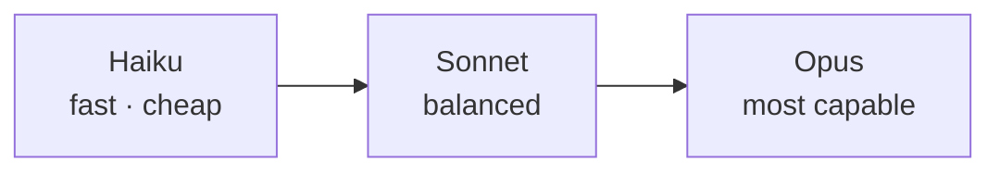

<LevelBadge level="beginner" />

A Anthropic oferece uma família de modelos em diferentes pontos de capacidade/custo/velocidade. Escolher bem é, em grande parte, uma questão de combinar o modelo à tarefa — e não pagar a mais por uma capacidade de que você não precisa.

## Os modelos atuais

<ModelTable />

## Experimente: qual modelo se encaixa?

Responda a três perguntas e obtenha uma recomendação inicial:

<ModelPicker />

## O modelo mental: uma escada de capacidade

- **Comece com o Sonnet.** Ele é o cavalo de batalha padrão — forte em raciocínio e codificação a um custo sensato. A maioria das tarefas deve começar aqui.
- **Suba para o Opus** apenas quando o Sonnet tiver dificuldades e a qualidade importar mais que o custo (raciocínio difícil, agentes complicados, código intrincado).
- **Desça para o Haiku** em trabalhos de alto volume, sensíveis à latência ou simples (classificação, extração, roteamento, subagentes baratos).

## Como escolher de verdade

1. **Use o Sonnet como padrão** e coloque em produção.
2. **Atingindo um teto de qualidade?** Experimente o Opus apenas no subconjunto difícil.
3. **Custo ou latência incomodando?** Veja se o Haiku é bom o suficiente para aquela etapa.
4. **Misture modelos.** Use o Haiku para pré/pós-processamento barato e o Sonnet/Opus para o núcleo difícil. Esse "escalonamento de modelos" é uma das maiores alavancas de custo — veja [Custo e Latência](/docs/foundations/cost-and-latency).

:::tip Não escolha apenas por benchmarks
Benchmarks públicos são um indício inicial, não um veredito para *a sua* tarefa. Rode uma pequena [eval](/docs/foundations/evals) em um punhado das suas entradas reais entre dois modelos — leva minutos e supera adivinhar.
:::

## Consultando o ID exato do modelo

Sempre passe o ID atual do modelo na API (por exemplo, na sua chamada `messages.create`). Obtenha-o na [tabela de modelos acima](/docs/whats-new/models-and-pricing) ou na página oficial de modelos — e prefira lê-lo a partir da configuração em vez de codificá-lo em vários lugares, para que atualizações de modelo sejam uma mudança de uma única linha.

## Próximo

- [Tokens, Contexto e Preços](/docs/api/tokens-and-pricing)
- [Sua Primeira Chamada à API](/docs/api/first-call)
- [Modelos e Preços Atuais](/docs/whats-new/models-and-pricing)
