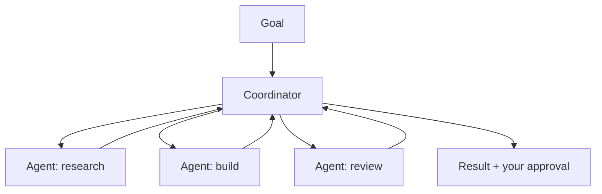

<LevelBadge level="advanced" />

<VerifyNote lastVerified="2026-06-20" source="https://docs.anthropic.com">
Cowork e Agent Teams são superfícies de 2026 em rápida evolução — nomes, disponibilidade e capacidades mudam com frequência. Confirme os detalhes atuais na documentação/anúncios oficiais da Anthropic.
</VerifyNote>

Para além de um único agente, a Anthropic vem lançando superfícies **de nível de produto** que permitem aos agentes realizar trabalho colaborativo e prolongado: o **Cowork** (um espaço de trabalho agêntico no desktop) e os **Agent Teams** (múltiplos agentes colaborando). Esta página é um mapa de alto nível — verifique as especificidades na documentação oficial, já que isso evolui rapidamente.

## Claude Cowork

Pense nele como um **espaço de trabalho onde um agente realiza trabalho real, de múltiplas etapas** ao seu lado — operando sobre arquivos e ferramentas em um horizonte mais longo que um único turno de chat, com você supervisionando. É o primo voltado ao consumidor/profissional de construir um agente na API: o loop é fornecido, você direciona os objetivos.

## Agent Teams

Quando um único agente não é suficiente, **múltiplos agentes colaboram** — dividindo um objetivo, cada um com um papel e ferramentas, coordenando-se rumo a um resultado. Conceitualmente, espelha os [subagentes](/docs/claude-code/subagents) do Claude Code, mas como uma superfície de produto para colaboração multiagente prolongada, em vez de uma única subtarefa delegada.

## Como isso se relaciona com o resto do site

- Construir você mesmo, programaticamente → [Construindo Agentes](/docs/api/building-agents) + o [Agent SDK](/docs/claude-code/headless-and-agent-sdk).
- Delegação dentro de uma sessão de codificação → [Subagentes](/docs/claude-code/subagents).
- Loop/estado/agendamento hospedados → [Agentes Gerenciados](/docs/api/managed-agents).

## A constante: supervisão

:::warning Mais autonomia, mais cuidado
Trabalho multiagente e de longo horizonte amplifica tanto o valor *quanto* o risco. Mantenha humanos no loop em ações consequentes, restrinja o acesso às ferramentas com rigor e verifique os resultados — veja [Uso Responsável](/docs/security/responsible-use) e [Protegendo Agentes](/docs/security/securing-agents).
:::

## Próximo

- [Subagentes e Agentes Paralelos](/docs/claude-code/subagents)
- [Agentes Gerenciados](/docs/api/managed-agents)
- [Uso Responsável, Ética e Verificação](/docs/security/responsible-use)
