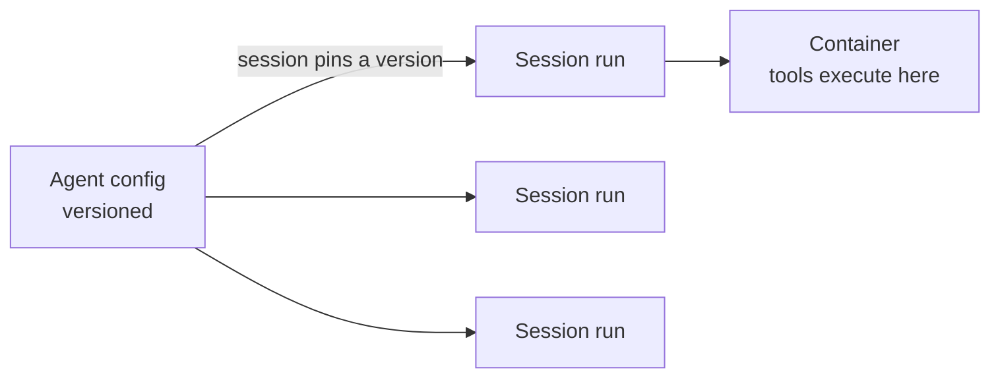

<LevelBadge level="advanced" />

<VerifyNote lastVerified="2026-07-21" source="https://platform.claude.com/docs/en/managed-agents/overview">
Os recursos e a disponibilidade dos agentes gerenciados mudam — a API está em beta. Confirme os endpoints, os nomes dos campos e o acesso na documentação oficial antes de construir em cima dela.
</VerifyNote>

<Callout type="objectives" items={["Entender o que um loop de agente gerenciado (hospedado pela Anthropic) faz por você", "Separar os dois objetos centrais: um Agent versionado vs uma Session por execução", "Injetar segredos com segurança usando Vaults — sem que o modelo jamais os veja", "Colocar um agente em um agendamento cron com Scheduled Deployments — sem agendador para hospedar", "Saber quando o gerenciado supera um loop personalizado, e as proteções que ainda se aplicam"]} />

Se [construir seu próprio loop de agente](/docs/api/building-agents) é mais infraestrutura do que você quer manter, um agente **gerenciado** (hospedado pela Anthropic) roda o loop por você — para que você foque na *tarefa* do agente, e não no encanamento das sessões, retentativas, estado e agendamento.

## Os dois objetos: Agent vs Session

Este é o modelo mental do qual tudo o mais depende. Eles são separados de propósito.

- Um **Agent** é uma *configuração persistida e versionada* — modelo, system prompt, ferramentas, servidores MCP e skills. Você o cria uma vez. Cada atualização cria uma nova versão imutável.
- Uma **Session** é uma *instância de runtime* — uma execução que aponta para um agente por ID. A configuração vive no agente, nunca na sessão.

<Callout type="tip">
As sessões **fixam** (pin) na versão do agente com a qual foram criadas: sessões em execução mantêm sua versão, novas sessões recebem a mais recente. É assim que você publica mudanças de configuração sem quebrar o trabalho em andamento.
</Callout>

## O que o "gerenciado" oferece a você

Em vez de construir e hospedar o loop manualmente, você ganha blocos de construção hospedados:

- **Sessions** — execuções persistentes que você cria por execução e retoma; transmitem eventos por SSE.
- **Environments** — infraestrutura de container, seja `cloud` (hospedado pela Anthropic) ou `self_hosted` (as ferramentas executam na sua própria VPC). Um container por sessão é o espaço de trabalho do agente.
- **Memory stores** — estado persistente entre sessões, com versionamento e redação, sem que você precise conectar um banco de dados.
- **Vaults** — segredos para autenticação MCP e outros serviços.
- **Scheduled deployments** — agentes que rodam em um agendamento cron, sem supervisão.

<PromptCard title="Crie um agente (configuração versionada) e depois rode uma sessão contra ele">{`# 1. Create the agent once
POST /v1/agents        -> returns $AGENT_ID
# 2. Each execution is a session pinned to that agent
POST /v1/sessions      { "agent": "$AGENT_ID" }`}</PromptCard>

## Vaults: segredos que o modelo nunca vê

Um agente autônomo muitas vezes precisa de uma chave de API — mas o *modelo* nunca deveria lê-la. As credenciais do Vault (`mcp_oauth`, `static_bearer`, `environment_variable`) são substituídas no egress: uma credencial `environment_variable` é injetada no sandbox no momento da execução e *nunca fica visível* para o modelo.

<Callout type="warning">
Este é o padrão seguro para dar a um agente acesso poderoso. Não cole chaves no system prompt ou em uma mensagem — elas passam a fazer parte do contexto que o modelo (e seus logs) podem ver. Coloque-as em um vault.
</Callout>

## Scheduled deployments: um agente em um cron

Um **deployment** anexa um agendamento cron a um agente. Quando o agendamento dispara, ele inicia uma sessão nova e completa sua tarefa — sem nenhum agendador para você construir ou hospedar. Bom para uma sincronização de dados noturna, uma varredura de conformidade semanal ou um resumo diário.

<Steps items={[
  {title: "Defina o agendamento", body: "POST /v1/deployments com agent, environment_id, initial_events (deve incluir um user.message) e um schedule: uma expressão cron POSIX mais um timezone IANA."},
  {title: "Cada disparo = uma execução", body: "Toda tentativa de trigger cria um registro de execução (prefixo drun_). O sucesso carrega um session_id; a falha carrega um error.type (ex.: environment_archived, session_rate_limited). Liste as execuções via GET /v1/deployment_runs?deployment_id=..."},
  {title: "Controle o ciclo de vida", body: "Pause suprime triggers futuros (execuções manuais ainda funcionam); unpause retoma na próxima ocorrência e NÃO recupera triggers perdidos; archive é terminal."},
  {title: "Dispare sob demanda", body: "POST /v1/deployments/{id}/run inicia uma sessão imediatamente — mesmo enquanto pausado — com trigger_context.type: manual."}
]} />

<PromptCard title="Uma varredura de conformidade semanal, às sextas-feiras às 20:00 no horário de Nova York">{`POST /v1/deployments
{
  "name": "Weekly compliance scan",
  "agent": "$AGENT_ID",
  "environment_id": "$ENVIRONMENT_ID",
  "initial_events": [
    {"type": "user.message", "content": [{"type": "text", "text": "Run the compliance scan and summarize findings."}]}
  ],
  "schedule": {"type": "cron", "expression": "0 20 * * 5", "timezone": "America/New_York"}
}`}</PromptCard>

<Callout type="tip">
Cron é `minute hour day-of-month month day-of-week`, com granularidade de minuto. O horário de verão (DST) usa semântica de relógio de parede: um horário que não existe na transição de adiantamento é pulado; um horário que ocorre duas vezes na transição de atraso dispara duas vezes. Escolha um timezone e uma hora que evitem essas bordas para qualquer coisa sensível.
</Callout>

## Quando escolher gerenciado vs personalizado

| Escolha **gerenciado** quando… | Escolha um **loop personalizado / SDK** quando… |
|---|---|
| Você quer hospedagem, estado, agendamento e segredos resolvidos | Você precisa de controle total sobre o loop e as ferramentas |
| Você está prototipando rapidamente | Você tem necessidades rígidas de infra/conformidade personalizadas |
| A simplicidade operacional importa mais que o controle | Você está integrando profundamente na sua própria stack |

É um espectro — chamada única → workflow → agente personalizado (SDK) → gerenciado. Comece tão simples quanto a tarefa permitir; suba de nível apenas quando precisar.

## As mesmas proteções se aplicam

Hospedado ou não, um agente autônomo ainda realiza ações. Mantenha **privilégio mínimo**, **custo/iterações limitados** e **aprovação humana para passos arriscados** — veja [Protegendo Agentes](/docs/security/securing-agents) e [Endurecendo Execuções Autônomas](/docs/security/hardening-autonomous-runs).

<Callout type="takeaways" items={["Agentes gerenciados entregam o loop, as sessões, os environments, a memória, os vaults e o agendamento para que você foque na tarefa", "Um Agent é configuração versionada; uma Session é uma execução que fixa em uma versão — a configuração vive no agente, não na sessão", "As credenciais environment_variable do Vault são injetadas na execução e nunca ficam visíveis para o modelo — a forma segura de dar segredos a um agente", "Um scheduled deployment é uma expressão cron + timezone IANA; cada disparo cria uma execução, e o unpause não recupera os triggers perdidos", "O gerenciado fica na ponta hospedada de chamada única -> workflow -> personalizado -> gerenciado; as proteções de autonomia ainda se aplicam"]} />

## Teste você mesmo

<Quiz title="Teste você mesmo" questions={[
  {
    q: "Qual é a diferença entre um Agent e uma Session?",
    options: [
      "São dois nomes para o mesmo objeto",
      "Um Agent é configuração versionada; uma Session é uma execução de runtime que fixa em uma versão do agente",
      "Uma Session contém o modelo e o system prompt; um Agent é apenas um ID",
      "Um Agent roda as ferramentas; uma Session armazena segredos"
    ],
    answer: 1,
    explain: "Um Agent é a configuração persistida e versionada (modelo, prompt, ferramentas, MCP, skills). Uma Session é uma instância por execução que referencia o agente e fixa na versão dele no momento da criação."
  },
  {
    q: "Como você deve dar a um agente gerenciado uma chave de API de que ele precisa?",
    options: [
      "Coloque no system prompt para que o agente possa lê-la",
      "Passe-a na primeira mensagem de usuário da sessão",
      "Armazene-a como uma credencial de vault, injetada na execução e nunca visível para o modelo",
      "Codifique-a diretamente na definição da ferramenta"
    ],
    answer: 2,
    explain: "As credenciais do Vault (ex.: um tipo environment_variable) são substituídas no egress e nunca ficam visíveis para o modelo — chaves no prompt ou em uma mensagem passam a fazer parte do contexto visível."
  },
  {
    q: "Um scheduled deployment ficou pausado por dois dias e depois foi reativado (unpause). O que acontece com os triggers que teriam disparado enquanto estava pausado?",
    options: [
      "Eles são recuperados (backfill) — toda execução perdida é executada no unpause",
      "Eles não são recuperados; o deployment simplesmente retoma na próxima ocorrência agendada",
      "O deployment é arquivado automaticamente",
      "Todas as execuções perdidas são enfileiradas e rodam com um minuto de intervalo"
    ],
    answer: 1,
    explain: "O unpause retoma na próxima ocorrência e não recupera os triggers perdidos. (Você ainda pode forçar uma execução a qualquer momento com o trigger manual, mesmo enquanto pausado.)"
  }
]} />

## Próximo

- [Construindo Agentes na API](/docs/api/building-agents)
- [Cowork & Equipes de Agentes](/docs/api/cowork-and-agent-teams)
- [Modo Headless & o Agent SDK](/docs/claude-code/headless-and-agent-sdk)
- [Protegendo Agentes](/docs/security/securing-agents)
