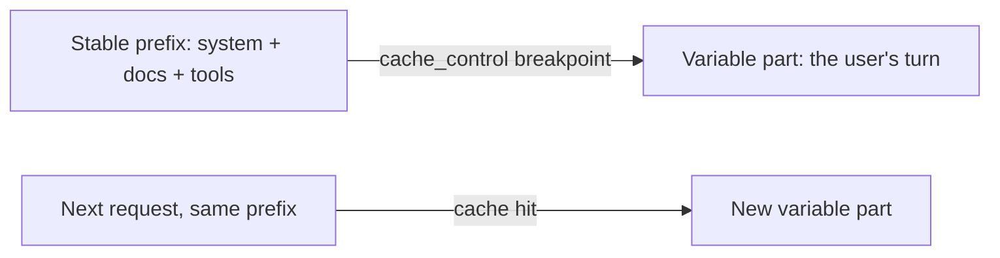

import Tabs from '@theme/Tabs';
import TabItem from '@theme/TabItem';

<LevelBadge level="advanced" />

<VerifyNote lastVerified="2026-06-21" source="https://platform.claude.com/docs/en/docs/build-with-claude/prompt-caching">
A mecânica do cache, a elegibilidade e o preço de tokens em cache vs. tokens novos mudam — confirme na documentação oficial de prompt-caching.
</VerifyNote>

Se muitas das suas requisições compartilham um trecho grande e imutável — um system prompt longo, um documento extenso, um catálogo de ferramentas — o **cache de prompt** permite que a API reaproveite o prefixo já processado em vez de relê-lo a cada chamada. Isso reduz tanto o **custo** quanto a **latência** na parte em cache.

<Callout type="objectives" items={["O modelo mental: um breakpoint de cache após um prefixo estável, reaproveitado entre chamadas","Como marcar o breakpoint em Python e TypeScript com cache_control","A única invariante que faz ou quebra tudo — o prefixo precisa ser idêntico byte a byte","Como ler os campos de uso (usage) para confirmar que você está de fato obtendo acertos de cache","Onde o cache compensa mais e como combiná-lo com batching e dimensionamento adequado"]} />

## Como funciona (o modelo mental)

Você marca um **breakpoint de cache** após o prefixo estável. Na primeira chamada ele é processado e armazenado em cache; chamadas subsequentes que compartilham o **exato mesmo prefixo** acertam o cache e pagam muito menos por ele.



<Flashcards title="Vocabulário de cache" cards={[{front:"Breakpoint de cache","back":"O marcador cache_control colocado após o prefixo estável. Tudo até o bloco marcado, inclusive, é armazenado em cache."},{front:"Gravação no cache (cache write)","back":"O pequeno custo extra da primeira chamada para popular o cache."},{front:"Leitura do cache (cache read)","back":"Toda chamada posterior com o mesmo prefixo o relê por uma fração do preço de input."},{front:"Invalidador silencioso","back":"Um valor que muda perto do topo do prompt (timestamp, nome de usuário, lista de ferramentas reordenada) que altera o prefixo e, sem alarde, derruba a taxa de acerto para zero."}]} />

## Marque o breakpoint (copiar e colar)

Adicione `cache_control` ao **último bloco estável** — aqui, um system prompt grande. A vez do usuário vem depois dele e varia livremente; tudo até o bloco marcado, inclusive, fica em cache.

<Steps items={[{title: "Identifique o prefixo estável", body: "Encontre o trecho grande e imutável — um system prompt longo, um documento extenso ou um catálogo de ferramentas reaproveitado em muitas requisições."},{title: "Anexe cache_control ao seu último bloco", body: "Marque o último bloco estável com cache_control do tipo ephemeral, para que o prefixo até ele, inclusive, fique em cache."},{title: "Deixe a parte variável vir em seguida", body: "Coloque a vez do usuário após o bloco marcado — ela varia livremente a cada chamada e é cobrada a preço cheio."},{title: "Confirme o acerto", body: "Leia cache_read_input_tokens no usage da resposta. Maior que zero significa que você teve um acerto de cache."}]} />

<Tabs groupId="lang">
<TabItem value="python" label="Python">

```python
import anthropic

client = anthropic.Anthropic()

message = client.messages.create(
    model="claude-sonnet-5",
    max_tokens=1024,
    system=[
        {
            "type": "text",
            "text": LARGE_STABLE_PROMPT,  # long, unchanging — the cached prefix
            "cache_control": {"type": "ephemeral"},
        }
    ],
    messages=[{"role": "user", "content": "Summarize the key points."}],  # varies per call
)

print(message.usage.cache_read_input_tokens)  # > 0 means you got a hit
```

</TabItem>
<TabItem value="ts" label="TypeScript">

```ts
import Anthropic from "@anthropic-ai/sdk";

const client = new Anthropic();

const message = await client.messages.create({
  model: "claude-sonnet-5",
  max_tokens: 1024,
  system: [
    {
      type: "text",
      text: LARGE_STABLE_PROMPT, // long, unchanging — the cached prefix
      cache_control: { type: "ephemeral" },
    },
  ],
  messages: [{ role: "user", content: "Summarize the key points." }], // varies per call
});

console.log(message.usage.cache_read_input_tokens); // > 0 means you got a hit
```

</TabItem>
</Tabs>

A primeira chamada paga um pequeno custo extra de **gravação** para popular o cache; toda chamada posterior com o mesmo prefixo o relê de volta por uma fração do preço de input. O prefixo precisa ser longo o suficiente para ser elegível — alguns milhares de tokens, dependendo do modelo — ou ele silenciosamente não será armazenado em cache.

## A invariante que faz ou quebra tudo

:::warning O cache é exato no prefixo
Um acerto de cache exige que o prefixo em cache seja **idêntico byte a byte**. O bug mais comum: um *invalidador silencioso* perto do topo do prompt — um timestamp, um nome de usuário que muda, uma lista de ferramentas reordenada — que altera o prefixo e silenciosamente derruba sua taxa de acerto para zero.
:::

**Coloque tudo o que é estável primeiro, tudo o que é variável por último,** e mantenha o prefixo verdadeiramente constante.

## Verifique se realmente está funcionando

Não presuma — leia de volta a partir do `usage` da resposta:

- **`cache_creation_input_tokens`** — tokens gravados no cache nesta chamada (a primeira requisição).
- **`cache_read_input_tokens`** — tokens servidos a partir do cache (a economia).
- **`input_tokens`** — o restante não cacheado, cobrado a preço cheio.

Se `cache_read_input_tokens` permanecer em **zero** em requisições repetidas que deveriam compartilhar um prefixo, há um invalidador silencioso em ação — compare os bytes do prompt renderizado entre duas chamadas para encontrá-lo.

## Onde compensa mais

- **System prompts** longos reaproveitados entre usuários.
- **RAG / perguntas e respostas sobre documentos** em que o mesmo texto-fonte é consultado repetidamente.
- **Agentes** com um catálogo de ferramentas e instruções fixos ao longo de muitos turnos.

Combine o cache com **batching** para cargas de trabalho offline, e com o dimensionamento adequado do modelo ([Escolhendo um Modelo](/docs/api/choosing-a-model)) para a maior economia combinada — veja [Custo e Latência](/docs/foundations/cost-and-latency).

<Quiz title="Teste seu conhecimento" questions={[{q:"O que um acerto de cache exige do prefixo em cache?",options:["Ele precisa ter pelo menos um token de comprimento","Ele precisa ser idêntico byte a byte ao prefixo anterior","Ele precisa vir depois da vez do usuário"],answer:1,explain:"Um acerto de cache exige que o prefixo em cache seja idêntico byte a byte. Qualquer mudança — um timestamp, uma lista de ferramentas reordenada — o invalida."},{q:"Qual campo de usage informa que tokens foram servidos a partir do cache (a sua economia)?",options:["input_tokens","cache_creation_input_tokens","cache_read_input_tokens"],answer:2,explain:"cache_read_input_tokens são os tokens servidos a partir do cache. cache_creation_input_tokens é o que foi gravado na primeira chamada; input_tokens é o restante não cacheado, cobrado a preço cheio."},{q:"Onde deve ficar o conteúdo variável, específico de cada chamada, em relação ao breakpoint de cache?",options:["Antes do prefixo estável","Por último — depois do bloco marcado","Intercalado ao longo de todo o system prompt"],answer:1,explain:"Coloque tudo o que é estável primeiro e tudo o que é variável por último. A vez do usuário vem depois do bloco marcado e varia livremente a cada chamada."}]} />

<Callout type="takeaways" items={["Marque um breakpoint de cache após o prefixo estável; a primeira chamada o grava, as chamadas posteriores o releem de forma barata.","Um acerto de cache precisa de um prefixo idêntico byte a byte — mantenha o conteúdo estável primeiro e o variável por último.","Invalidadores silenciosos perto do topo do prompt (timestamps, nomes, ferramentas reordenadas) derrubam, sem alarde, a taxa de acerto para zero.","Verifique com o usage: cache_read_input_tokens > 0 significa um acerto; zero em requisições repetidas significa que há um invalidador em ação.","O cache compensa mais para system prompts reaproveitados, RAG e agentes; combine-o com batching e dimensionamento adequado do modelo."]} />

## A seguir

- [Tokens, Contexto e Preços](/docs/api/tokens-and-pricing)
- [Streaming e Multi-Turno](/docs/api/streaming)
- [Construindo Agentes na API](/docs/api/building-agents)
