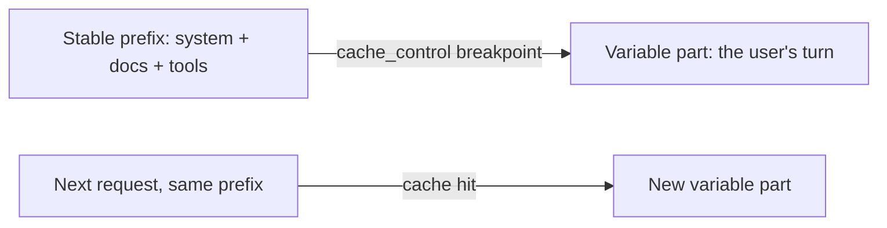

<LevelBadge level="advanced" />

<VerifyNote lastVerified="2026-06-20" source="https://docs.anthropic.com/en/docs/build-with-claude/prompt-caching">
A mecânica do cache, a elegibilidade e o preço de tokens em cache vs. tokens novos mudam — confirme na documentação oficial de cache de prompt.
</VerifyNote>

Se muitas das suas requisições compartilham um trecho grande e imutável — um system prompt longo, um documento extenso, um catálogo de ferramentas — o **cache de prompt** permite que a API reutilize o prefixo já processado em vez de relê-lo a cada chamada. Isso reduz tanto o **custo** quanto a **latência** na parte armazenada em cache.

## Como funciona (o modelo mental)

Você marca um **ponto de quebra de cache** após o prefixo estável. Na primeira chamada ele é processado e armazenado em cache; chamadas subsequentes que compartilham o **exato mesmo prefixo** acessam o cache e pagam muito menos por ele.

## A invariante que faz ou desfaz tudo

:::warning O cache é exato no prefixo
Um acerto de cache exige que o prefixo armazenado seja **idêntico byte a byte**. O bug mais comum: um *invalidador silencioso* perto do topo do prompt — um timestamp, um nome de usuário que muda, uma lista de ferramentas reordenada — que altera o prefixo e silenciosamente derruba sua taxa de acerto para zero.
:::

**Coloque tudo o que é estável primeiro, tudo o que é variável por último,** e mantenha o prefixo verdadeiramente constante.

## Onde ele compensa mais

- **System prompts** longos reutilizados entre usuários.
- **RAG / Q&A sobre documentos** em que o mesmo texto-fonte é consultado repetidamente.
- **Agentes** com um catálogo de ferramentas e instruções fixos ao longo de muitos turnos.

Combine o cache com o **processamento em lote** para cargas de trabalho offline, e com o dimensionamento adequado do modelo ([Escolhendo um Modelo](/docs/api/choosing-a-model)) para a maior economia combinada — veja [Custo e Latência](/docs/foundations/cost-and-latency).

## Próximo

- [Tokens, Contexto e Preços](/docs/api/tokens-and-pricing)
- [Streaming e Multi-Turno](/docs/api/streaming)
- [Construindo Agentes na API](/docs/api/building-agents)
