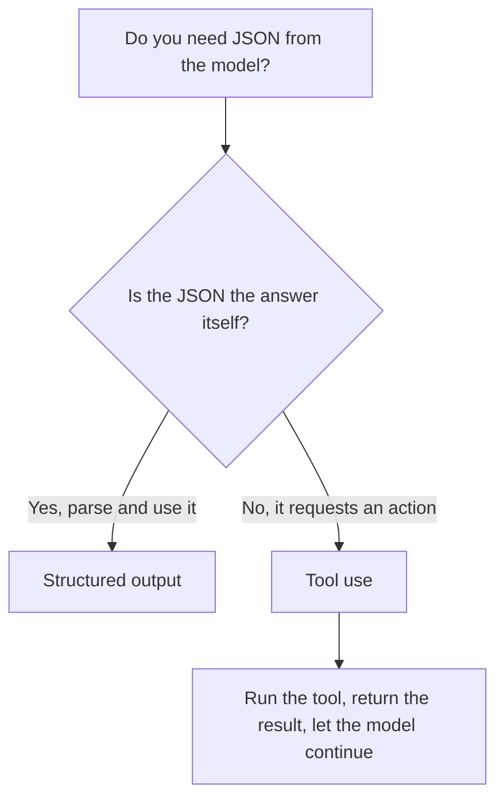

<LevelBadge level="intermediate" />

<VerifyNote lastVerified="2026-06-20" source="https://docs.anthropic.com/en/docs/build-with-claude/structured-outputs">
O mecanismo exato para impor um schema evolui — confirme a abordagem atual (configuração de saída / auxiliares de parsing) na documentação oficial.
</VerifyNote>

Quando a saída do Claude alimenta outro software, você precisa de **estrutura confiável** — JSON válido correspondendo a um formato conhecido, todas as vezes. Não confie em "responda em JSON" e torça; use o suporte a saída estruturada da plataforma.

## O jeito confiável

Forneça um **JSON Schema** para a saída e deixe a API/SDK impô-lo, depois faça o parsing para um objeto tipado (por exemplo, Pydantic em Python, Zod em TypeScript). Os auxiliares de parsing do SDK entregam um resultado tipado em vez de uma string que você mesmo teria que analisar com `JSON.parse` e validar.

```python
# Conceptual shape — see the official docs for the current API surface.
from pydantic import BaseModel

class Ticket(BaseModel):
    title: str
    priority: str   # "low" | "medium" | "high"
    tags: list[str]

# Request the model to return data conforming to Ticket's JSON schema,
# then parse the response into a Ticket instance.
```

## Por que não simplesmente pedir JSON no prompt?

Você *pode* pedir JSON no prompt, e para casos simples funciona — mas pode desviar: prosa solta, uma vírgula sobrando, um campo faltando. A saída imposta por schema elimina essa classe de bug, o que importa no exato momento em que um sistema downstream depende dela.

## Saída estruturada vs. uso de ferramentas

Ambos os recursos entregam ao modelo um **JSON Schema**, então parecem iguais — e as pessoas escolhem o errado. A diferença está na *intenção*, não no mecanismo:

| | **Saída estruturada** | **[Uso de ferramentas](/docs/api/tool-use)** |
|---|---|---|
| O que você quer | A **resposta final**, em um formato fixo | Que o modelo **invoque uma capacidade** (chame uma função, busque dados, execute uma ação) |
| Quem consome | Seu código, diretamente | Seu código executa a ferramenta e depois devolve o resultado ao modelo |
| Formato do turno | Uma resposta, pronto | Um laço: o modelo pede, você executa, o modelo continua |
| Uso típico | Extração, classificação, parsing | Agentes, consultas ao vivo, efeitos colaterais |

Uma regra prática rápida:



Se o JSON *é* o entregável, use saída estruturada. Se o JSON é o modelo pedindo ao seu código para *fazer* algo, isso é uso de ferramentas. Agentes frequentemente usam ambos: ferramentas para agir, saída estruturada para retornar um resultado final limpo.

## Dicas

- **Mantenha os schemas enxutos.** Use enums para escolhas fixas; marque os campos obrigatórios.
- **Descreva os campos.** Descrições de campos guiam o modelo como mini-prompts.
- **Valide mesmo assim** na fronteira — parsing defensivo é um seguro barato.
- Para tarefas de **extração**, saída estruturada + um schema claro supera o formato livre todas as vezes.

## Próximo

- [Uso de Ferramentas / Function Calling](/docs/api/tool-use) — ferramentas também usam JSON schemas
- [Sua Primeira Chamada à API](/docs/api/first-call)
- [Templates de Prompt Reutilizáveis](/docs/templates/prompts)
