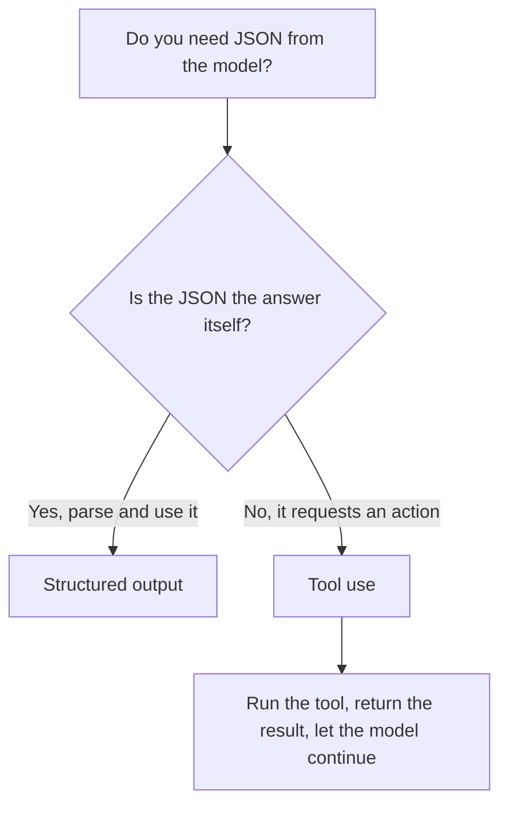

<LevelBadge level="intermediate" />

<VerifyNote lastVerified="2026-07-20" source="https://platform.claude.com/docs/en/build-with-claude/structured-outputs">
O mecanismo exato para impor um schema evolui — confirme a abordagem atual (configuração de saída / auxiliares de parsing) na documentação oficial.
</VerifyNote>

<Callout type="objectives" items={["Explicar por que a saída imposta por schema supera pedir JSON no prompt e torcer", "Fornecer um JSON Schema e fazer o parsing da resposta para um objeto tipado (Pydantic / Zod)", "Diferenciar saída estruturada de uso de ferramentas pela intenção, não pelo mecanismo", "Aplicar as quatro dicas para schemas enxutos e confiáveis", "Escolher a ferramenta certa com uma regra prática de uma pergunta só"]} />

Quando a saída do Claude alimenta outro software, você precisa de **estrutura confiável** — JSON válido correspondendo a um formato conhecido, todas as vezes. Não confie em "responda em JSON" e torça; use o suporte a saída estruturada da plataforma.

Esta lição leva você do *por que o prompt-e-reza falha* ao *como impor um schema e fazer o parsing dele para um objeto tipado* — e como diferenciar saída estruturada de uso de ferramentas quando parecem idênticos. Percorra-a de cima a baixo e depois teste-se com o quiz perto do final.

## O jeito confiável

Forneça um **JSON Schema** para a saída e deixe a API/SDK impô-lo, depois faça o parsing para um objeto tipado (por exemplo, Pydantic em Python, Zod em TypeScript). Os auxiliares de parsing do SDK entregam um resultado tipado em vez de uma string que você mesmo teria que analisar com `JSON.parse` e validar.

<Steps items={[
  {title: "Defina o formato", body: "Modele a saída de que você precisa como um JSON Schema — em Python via um Pydantic BaseModel, em TypeScript via um schema Zod."},
  {title: "Solicite saída em conformidade com o schema", body: "Peça ao modelo que retorne dados que estejam em conformidade com esse schema, para que a API/SDK o imponha em vez de deixar ao acaso."},
  {title: "Faça o parsing para um objeto tipado", body: "Use os auxiliares de parsing do SDK para obter um resultado tipado diretamente — sem JSON.parse manual mais validação feita à mão."}
]} />

```python
# Conceptual shape — see the official docs for the current API surface.
from pydantic import BaseModel

class Ticket(BaseModel):
    title: str
    priority: str   # "low" | "medium" | "high"
    tags: list[str]

# Request the model to return data conforming to Ticket's JSON schema,
# then parse the response into a Ticket instance.
```

Quer uma requisição concreta para adaptar? Aqui está o formato do que você entrega ao modelo — substitua o modelo pelo seu próprio schema.

<PromptCard title="Peça saída em conformidade com o schema">{`Return the data conforming to this JSON Schema:

{
  "title": "string",
  "priority": "low | medium | high",
  "tags": ["string"]
}

Do not include any prose outside the JSON.`}</PromptCard>

## Por que não simplesmente pedir JSON no prompt?

Você *pode* pedir JSON no prompt, e para casos simples funciona — mas pode desviar: prosa solta, uma vírgula sobrando, um campo faltando. A saída imposta por schema elimina essa classe de bug, o que importa no exato momento em que um sistema downstream depende dela.

<Callout type="warning" items={["JSON pedido no prompt funciona em demos e quebra em produção: a falha só aparece quando um sistema downstream faz o parsing dele.", "Três desvios clássicos para ficar de olho: prosa solta ao redor do JSON, uma vírgula sobrando e um campo obrigatório faltando."]} />

## Saída estruturada vs. uso de ferramentas

Ambos os recursos entregam ao modelo um **JSON Schema**, então parecem iguais — e as pessoas escolhem o errado. A diferença está na *intenção*, não no mecanismo:

| | **Saída estruturada** | **[Uso de ferramentas](/docs/api/tool-use)** |
|---|---|---|
| O que você quer | A **resposta final**, em um formato fixo | Que o modelo **invoque uma capacidade** (chame uma função, busque dados, execute uma ação) |
| Quem consome | Seu código, diretamente | Seu código executa a ferramenta e depois devolve o resultado ao modelo |
| Formato do turno | Uma resposta, pronto | Um laço: o modelo pede, você executa, o modelo continua |
| Uso típico | Extração, classificação, parsing | Agentes, consultas ao vivo, efeitos colaterais |

Uma regra prática rápida:



Se o JSON *é* o entregável, use saída estruturada. Se o JSON é o modelo pedindo ao seu código para *fazer* algo, isso é uso de ferramentas. Agentes frequentemente usam ambos: ferramentas para agir, saída estruturada para retornar um resultado final limpo.

## Dicas

<Callout type="tip" items={["Mantenha os schemas enxutos — use enums para escolhas fixas; marque os campos obrigatórios.", "Descreva os campos — descrições de campos guiam o modelo como mini-prompts.", "Valide mesmo assim na fronteira — parsing defensivo é um seguro barato.", "Para tarefas de extração, saída estruturada + um schema claro supera o formato livre todas as vezes."]} />

<Callout type="takeaways" items={["Entregue à API/SDK um JSON Schema e faça o parsing para um objeto tipado — não fique no prompt-e-reza.", "Pedir JSON no prompt pode desviar (prosa solta, vírgula sobrando, campo faltando); impor o schema elimina essa classe de bug.", "Saída estruturada vs. uso de ferramentas diferem pela intenção: o JSON É a resposta vs. o JSON solicita uma ação.", "Schemas enxutos, campos descritos e validação na fronteira tornam a extração e a classificação confiáveis."]} />

## Fixe os termos

<Flashcards cards={[
  {front: "Saída estruturada", back: "Você entrega à API/SDK um JSON Schema para a resposta final e faz o parsing da resposta para um objeto tipado (Pydantic / Zod). O JSON É o entregável."},
  {front: "Uso de ferramentas", back: "Você entrega ao modelo um JSON Schema para que ele possa invocar uma capacidade. Seu código executa a ferramenta e depois devolve o resultado — um laço, não uma resposta única."},
  {front: "JSON Schema", back: "O formato em que ambos os recursos se baseiam. Em Python você o modela com um Pydantic BaseModel; em TypeScript com um schema Zod."},
  {front: "Auxiliares de parsing", back: "Auxiliares do SDK que retornam um resultado tipado diretamente, para que você pule o JSON.parse manual mais a validação feita à mão."},
  {front: "Regra prática de uma pergunta só", back: "O JSON é a resposta em si? Sim → saída estruturada. Não, ele solicita uma ação → uso de ferramentas."}
]} />

<Quiz title="Teste-se" questions={[
  {
    q: "Qual é o jeito confiável de obter JSON estruturado do Claude?",
    options: [
      "Pedir 'responda em JSON' no prompt e tentar de novo em caso de falhas",
      "Fornecer um JSON Schema, deixar a API/SDK impô-lo e depois fazer o parsing para um objeto tipado",
      "Gerar texto livre e escrever uma regex para extrair os campos"
    ],
    answer: 1,
    explain: "Forneça um JSON Schema e deixe a API/SDK impô-lo, depois faça o parsing para um objeto tipado como Pydantic (Python) ou Zod (TypeScript)."
  },
  {
    q: "Por que pedir JSON no prompt é arriscado quando um sistema downstream depende dele?",
    options: [
      "É mais lento do que impor o schema",
      "Pode desviar — prosa solta, uma vírgula sobrando ou um campo faltando",
      "Custa mais tokens do que o uso de ferramentas"
    ],
    answer: 1,
    explain: "JSON pedido no prompt funciona para casos simples, mas pode desviar; a saída imposta por schema elimina essa classe de bug."
  },
  {
    q: "O que realmente distingue saída estruturada de uso de ferramentas?",
    options: [
      "Saída estruturada usa JSON Schema; uso de ferramentas não",
      "Intenção: saída estruturada é a resposta final em um formato fixo, uso de ferramentas invoca uma capacidade",
      "Uso de ferramentas é para Python e saída estruturada é para TypeScript"
    ],
    answer: 1,
    explain: "Ambos entregam ao modelo um JSON Schema, então parecem iguais. A diferença está na intenção, não no mecanismo — a resposta final vs. invocar uma capacidade."
  },
  {
    q: "Qual é um conselho sólido para projetar schemas?",
    options: [
      "Deixe os campos opcionais e pule os enums para ter flexibilidade",
      "Use enums para escolhas fixas, marque os campos obrigatórios e valide mesmo assim na fronteira",
      "Confie no schema e nunca valide a saída após o parsing"
    ],
    answer: 1,
    explain: "Mantenha os schemas enxutos (enums, campos obrigatórios), descreva os campos como mini-prompts e ainda assim valide na fronteira como um seguro barato."
  }
]} />

## Próximo

- [Uso de Ferramentas / Function Calling](/docs/api/tool-use) — ferramentas também usam JSON schemas
- [Sua Primeira Chamada à API](/docs/api/first-call)
- [Templates de Prompt Reutilizáveis](/docs/templates/prompts)
