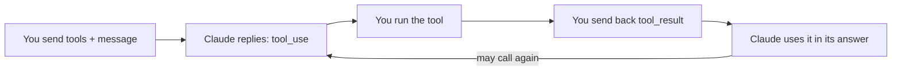

import Tabs from '@theme/Tabs';
import TabItem from '@theme/TabItem';

<LevelBadge level="intermediate" />

<VerifyNote lastVerified="2026-06-20" source="https://platform.claude.com/docs/en/build-with-claude/tool-use">
Os formatos de requisição/resposta do uso de ferramentas são estáveis, mas evoluem — confirme os campos na documentação oficial de uso de ferramentas.
</VerifyNote>

O **uso de ferramentas** permite que o Claude chame funções que *você* define — busca, uma calculadora, seu banco de dados, qualquer API — e use os resultados. É a base de todo [agente](/docs/api/building-agents).

<Callout type="objectives" items={["Como funciona o loop agêntico de quatro etapas, das definições de ferramentas até a resposta final","Como definir uma ferramenta em Python com nome, descrição e entrada em JSON-Schema","Por que as descrições de ferramentas funcionam como prompts que moldam quando e como o Claude as chama","Como validar entradas, retornar erros como resultados e usar ferramentas server-side com segurança"]} />

## O loop

O uso de ferramentas é uma conversa, não uma única chamada. Você entrega ao Claude um cardápio de ferramentas; o Claude escolhe uma e faz uma pausa; você a executa e reporta de volta; o Claude integra o resultado em sua resposta — repetindo conforme necessário.

<Steps items={[{title: "Envie o cardápio", body: "Você inclui uma lista de definições de ferramentas — cada uma com um nome, uma descrição e uma entrada em JSON-Schema."}, {title: "O Claude escolhe uma ferramenta", body: "Se o Claude decidir usar uma, ele retorna um bloco tool_use com argumentos e para."}, {title: "Você executa", body: "Você mesmo executa a ferramenta e envia a saída de volta como um tool_result."}, {title: "O Claude continua", body: "O Claude continua, possivelmente chamando mais ferramentas, até responder."}]} />

## Definindo uma ferramenta (Python)

A definição de uma ferramenta é apenas um nome, uma descrição em linguagem natural e um JSON-Schema para a entrada. Passe-a em `tools`, depois verifique `stop_reason` para saber quando o Claude quer agir.

<PromptCard title="ferramenta get_weather + primeira chamada">{`tools = [{
    "name": "get_weather",
    "description": "Get current weather for a city.",
    "input_schema": {
        "type": "object",
        "properties": {"city": {"type": "string"}},
        "required": ["city"],
    },
}]

msg = client.messages.create(
    model="claude-sonnet-5", max_tokens=1024,
    tools=tools,
    messages=[{"role": "user", "content": "What's the weather in Rome?"}],
)
# If msg.stop_reason == "tool_use": run the tool, then send a tool_result back.`}</PromptCard>

## Dicas

Pequenas escolhas em como você define e trata as ferramentas fazem uma enorme diferença na confiabilidade.

- **Descrições são prompts.** Uma `description` clara da ferramenta e a documentação dos parâmetros melhoram enormemente quando/como o Claude a chama.
- **Valide as entradas** que você recebe antes de executar — nunca confie nelas cegamente.
- **Retorne erros como resultados.** Se uma ferramenta falhar, envie um `tool_result` descrevendo o erro para que o Claude possa se recuperar.
- **Ferramentas server-side.** A Anthropic também oferece ferramentas integradas (por exemplo, busca na web, execução de código, uso do computador) — confira a documentação para o menu atual.

:::warning Ferramentas = ações = risco
Uma ferramenta que executa ações reais herda um modelo de segurança. Aplique o privilégio mínimo e mantenha um humano no loop para chamadas arriscadas — veja [Protegendo Agentes e Ferramentas](/docs/security/securing-agents).
:::

<Flashcards title="Vocabulário de uso de ferramentas" cards={[{front: "bloco tool_use", back: "O que o Claude retorna quando decide chamar uma ferramenta — inclui os argumentos — após o que ele para e espera por você."}, {front: "tool_result", back: "A mensagem que você envia de volta carregando a saída da ferramenta (ou uma descrição de erro para que o Claude possa se recuperar)."}, {front: "input_schema", back: "O JSON-Schema que descreve as entradas de uma ferramenta: tipos, propriedades e quais campos são obrigatórios."}, {front: "Ferramentas server-side", back: "Ferramentas integradas que a Anthropic oferece, por exemplo, busca na web, execução de código, uso do computador — confira a documentação para o menu atual."}]} />

<Quiz title="Teste seu conhecimento" questions={[{q: "Depois que o Claude retorna um bloco tool_use, quem executa a ferramenta?", options: ["O Claude a executa automaticamente nos servidores da Anthropic", "Você a executa e envia a saída de volta como um tool_result", "O JSON-Schema a executa"], answer: 1, explain: "O Claude retorna um bloco tool_use e para; você executa a ferramenta e envia o resultado de volta como um tool_result."}, {q: "Uma ferramenta que você definiu falha em tempo de execução. Qual é a atitude recomendada?", options: ["Tentar novamente silenciosamente até ter sucesso", "Enviar um tool_result descrevendo o erro para que o Claude possa se recuperar", "Encerrar a conversa"], answer: 1, explain: "Retorne erros como resultados — um tool_result descrevendo a falha permite que o Claude se recupere."}, {q: "Por que uma descrição clara da ferramenta importa tanto?", options: ["É apenas para documentação e o Claude a ignora", "Descrições são prompts — elas moldam quando e como o Claude chama a ferramenta", "Ela muda as regras de validação do JSON-Schema"], answer: 1, explain: "Descrições são prompts: uma descrição clara e a documentação dos parâmetros melhoram enormemente quando e como o Claude chama uma ferramenta."}]} />

<Callout type="takeaways" items={["O uso de ferramentas é um loop: envie as definições de ferramentas, o Claude retorna um bloco tool_use e para, você executa e retorna um tool_result, o Claude continua até responder.","A definição de uma ferramenta é um nome, uma descrição e uma entrada em JSON-Schema — passe-a em tools e verifique stop_reason == tool_use.","Descrições são prompts; valide as entradas antes de executar; retorne falhas como erros tool_result para que o Claude possa se recuperar.","A Anthropic também oferece ferramentas server-side, e qualquer ferramenta que executa ações reais precisa de privilégio mínimo mais um humano no loop."]} />

## Próximo

- [Construindo Agentes na API](/docs/api/building-agents)
- [Saída Estruturada](/docs/api/structured-output)
- [MCP e Conexão a Ferramentas](/docs/api/mcp)
