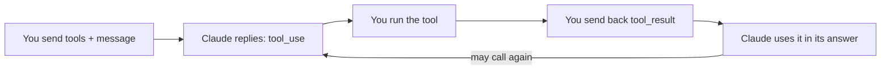

import Tabs from '@theme/Tabs';
import TabItem from '@theme/TabItem';

<LevelBadge level="intermediate" />

<VerifyNote lastVerified="2026-06-20" source="https://docs.anthropic.com/en/docs/build-with-claude/tool-use">
Os formatos de requisição/resposta do uso de ferramentas são estáveis, mas evoluem — confirme os campos na documentação oficial de uso de ferramentas.
</VerifyNote>

O **uso de ferramentas** permite que o Claude chame funções que *você* define — busca, uma calculadora, seu banco de dados, qualquer API — e use os resultados. É a base de todo [agente](/docs/api/building-agents).

## O loop



1. Você inclui uma lista de **definições de ferramentas** (nome, descrição, entrada em JSON-Schema).
2. Se o Claude decidir usar uma, ele retorna um bloco `tool_use` (com argumentos) e para.
3. **Você executa** a ferramenta e envia a saída de volta como um `tool_result`.
4. O Claude continua, possivelmente chamando mais ferramentas, até responder.

## Definindo uma ferramenta (Python)

```python
tools = [{
    "name": "get_weather",
    "description": "Get current weather for a city.",
    "input_schema": {
        "type": "object",
        "properties": {"city": {"type": "string"}},
        "required": ["city"],
    },
}]

msg = client.messages.create(
    model="claude-sonnet-4-6", max_tokens=1024,
    tools=tools,
    messages=[{"role": "user", "content": "What's the weather in Rome?"}],
)
# If msg.stop_reason == "tool_use": run the tool, then send a tool_result back.
```

## Dicas

- **Descrições são prompts.** Uma `description` clara da ferramenta e a documentação dos parâmetros melhoram enormemente quando/como o Claude a chama.
- **Valide as entradas** que você recebe antes de executar — nunca confie nelas cegamente.
- **Retorne erros como resultados.** Se uma ferramenta falhar, envie um `tool_result` descrevendo o erro para que o Claude possa se recuperar.
- **Ferramentas server-side.** A Anthropic também oferece ferramentas integradas (por exemplo, busca na web, execução de código, uso do computador) — confira a documentação para o menu atual.

:::warning Ferramentas = ações = risco
Uma ferramenta que executa ações reais herda um modelo de segurança. Aplique o privilégio mínimo e mantenha um humano no loop para chamadas arriscadas — veja [Protegendo Agentes e Ferramentas](/docs/security/securing-agents).
:::

## Próximo

- [Construindo Agentes na API](/docs/api/building-agents)
- [Saída Estruturada](/docs/api/structured-output)
- [MCP e Conexão a Ferramentas](/docs/api/mcp)
