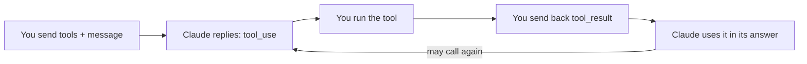

<LevelBadge level="intermediate" />

O **uso de ferramentas** permite que o Claude chame funções que *você* define — busca, uma calculadora, seu banco de dados, qualquer API — e use os resultados. É a base de todo [agente](/docs/api/building-agents).

A maioria dos tutoriais de uso de ferramentas para no loop de quatro etapas. O loop é a parte fácil. O que de fato quebra integrações em produção é mais específico e menos discutido: os formatos de mensagem que retornam `400`, o campo de erro que permite ao Claude se recuperar em vez de se desculpar, e o fato de que **forçar uma chamada de ferramenta não funciona mais nos modelos Claude mais recentes**. Esta página cobre tudo isso.

<Callout type="objectives" items={["Como funciona o loop agêntico de quatro etapas, das definições de ferramentas até a resposta final","Como escrever uma definição de ferramenta — e descrições que realmente direcionam quando o Claude a chama","As três regras de formato de mensagem que retornam um 400, e o texto de erro que diz qual delas você quebrou","Por que tool_choice \"any\" e \"tool\" agora falham nos modelos mais recentes, e os dois substitutos","Como garantir entradas de ferramenta válidas conforme o schema com strict: true","Por que os resultados de ferramentas são o lugar mais provável para uma prompt injection alcançar seu agente"]} />

<VerifyNote lastVerified="2026-09-29" source="https://platform.claude.com/docs/en/agents-and-tools/tool-use/define-tools">
Os campos de definição de ferramenta, a matriz de suporte de `tool_choice`, as regras de formatação de
`tool_result`, o comportamento de `is_error` e a semântica de `strict: true` foram verificados em 29 de
setembro de 2026 contra as páginas "Define tools", "Handle tool calls" e "Strict tool use" da Anthropic.
O suporte dos modelos ao uso forçado de ferramentas muda a cada lançamento — reconfira a matriz de suporte
na página Define tools antes de depender dela, e veja [Modelos e Preços Atuais](/docs/whats-new/models-and-pricing)
para a linha atual.
</VerifyNote>

## O loop

O uso de ferramentas é uma conversa, não uma única chamada. Você entrega ao Claude um cardápio de ferramentas; o Claude escolhe uma e faz uma pausa; você a executa e reporta de volta; o Claude integra o resultado em sua resposta — repetindo conforme necessário.


```mermaid
flowchart LR
  A[You send tools + message] --> B[Claude replies: tool_use]
  B --> C[You run the tool]
  C --> D[You send back tool_result]
  D --> E[Claude uses it in its answer]
  E -->|may call again| B
```

<Steps items={[{title: "Envie o cardápio", body: "Você inclui uma lista de definições de ferramentas — cada uma com um nome, uma descrição e uma entrada em JSON-Schema."}, {title: "O Claude escolhe uma ferramenta", body: "Se o Claude decidir usar uma, a resposta volta com stop_reason \"tool_use\" e um ou mais blocos tool_use, cada um carregando um id, um name e um objeto input."}, {title: "Você executa", body: "Você mesmo executa a ferramenta e envia a saída de volta como um tool_result que referencia o id do tool_use."}, {title: "O Claude continua", body: "O Claude continua, possivelmente chamando mais ferramentas, até responder com um stop_reason normal."}]} />

Note o plural na etapa 2: o Claude pode retornar **vários blocos `tool_use` em uma única resposta**. Faça o dispatch pelo campo `type` de cada bloco em vez de supor `content[0]` — uma resposta normalmente começa com um bloco `text` e, nos modelos mais recentes, pode começar com blocos `thinking`.

## Definindo uma ferramenta

A definição de uma ferramenta é um nome, uma descrição em linguagem natural e um JSON Schema para a entrada.

| Campo | Obrigatório | Observações |
| --- | --- | --- |
| `name` | sim | Deve corresponder à regex `^[a-zA-Z0-9_-]{1,128}$` |
| `description` | sim | O que ela faz, quando usá-la, quando *não* usá-la. Mire em no mínimo 3–4 frases |
| `input_schema` | sim | Um objeto JSON Schema que descreve os parâmetros |
| `input_examples` | não | Um array de objetos de entrada de exemplo, cada um válido conforme o schema |
| `strict` | não | Defina `true` para forçar entradas válidas conforme o schema — veja abaixo |
| `cache_control` | não | Faça cache da definição entre turnos (veja [Cache de Prompt](/docs/api/prompt-caching)) |

<PromptCard title="ferramenta get_weather + primeira chamada (Python)">{`tools = [{
    "name": "get_weather",
    "description": (
        "Get the current weather for a city. Use this when the user asks about "
        "present conditions or temperature in a named place. Returns temperature "
        "in the requested unit plus a one-word sky condition. It does NOT return "
        "forecasts — use get_forecast for anything in the future."
    ),
    "input_schema": {
        "type": "object",
        "properties": {
            "city": {"type": "string", "description": "City and region, e.g. 'Rome, IT'"},
            "unit": {"type": "string", "enum": ["celsius", "fahrenheit"]},
        },
        "required": ["city"],
        "additionalProperties": False,
    },
}]

msg = client.messages.create(
    model="claude-opus-5-5", max_tokens=1024,
    tools=tools,
    messages=[{"role": "user", "content": "What's the weather in Rome?"}],
)

if msg.stop_reason == "tool_use":
    for block in msg.content:            # iterate — never index content[0]
        if block.type == "tool_use":
            result = run_tool(block.name, block.input)
            # send back a tool_result carrying block.id`}</PromptCard>

### Descrições são prompts

O campo `description` é de longe a alavanca mais forte na qualidade do uso de ferramentas — ele é lido pelo modelo, não pelos seus colegas de equipe. A própria orientação da Anthropic é inequívoca sobre o que distingue uma boa descrição:

- **Diga quando *não* usá-la.** A maioria das seleções erradas é uma ferramenta sendo chamada para um trabalho que pertence a uma ferramenta vizinha.
- **Consolide em vez de multiplicar.** Em vez de `create_pr`, `review_pr`, `merge_pr`, entregue uma única ferramenta com um parâmetro `action`. Menos ferramentas, mais abrangentes, reduzem a ambiguidade de seleção.
- **Use namespaces entre serviços.** `github_list_prs` e `slack_send_message` são melhores que `list_prs` e `send_message` quando sua superfície de ferramentas cresce.
- **Retorne resultados de alto sinal.** Identificadores estáveis e semânticos (slugs, UUIDs) e somente os campos de que o Claude precisa para escolher o próximo passo. Saída de ferramenta inflada queima contexto e enterra o sinal.
- **Para entradas complicadas, adicione `input_examples`.** Exemplos validados contra o schema custam aproximadamente 20–50 tokens cada para objetos simples e 100–200 para objetos aninhados complexos, e um exemplo inválido retorna um 400.

## Tratando a resposta: as três regras que retornam 400

É aqui que código funcional normalmente quebra. Um `tool_result` é uma mensagem `user` comum, mas três regras de posicionamento são impostas pela API.

<Steps items={[{title: "Os resultados devem vir imediatamente após o tool_use correspondente", body: "Nenhuma mensagem pode ficar entre a mensagem tool_use do assistant e a sua mensagem tool_result. Quebre isso e a API reporta: tool_use ids were found without tool_result blocks immediately after."}, {title: "Os blocos tool_result vêm PRIMEIRO no array content", body: "Qualquer texto que você adicionar deve vir DEPOIS de todos os tool_result. Um bloco text antes de um tool_result é um 400."}, {title: "Se uma chamada de ferramenta server-side ainda estiver pendente, envie APENAS blocos tool_result", body: "Quando o mesmo turno do assistant também chamou uma ferramenta server-side que ainda não tem resultado, adicionar texto ao final encerra o turno prematuramente e a requisição falha com um 400 nomeando a ferramenta server-side pendente."}]} />

```json
// ❌ 400 — text before tool_result
{"role": "user", "content": [
  {"type": "text", "text": "Here are the results:"},
  {"type": "tool_result", "tool_use_id": "toolu_01", "content": "15 degrees"}
]}

// ✅ correct — results first, text after (client tools only)
{"role": "user", "content": [
  {"type": "tool_result", "tool_use_id": "toolu_01", "content": "15 degrees"},
  {"type": "text", "text": "What should I do next?"}
]}
```

O `content` de um `tool_result` pode ser uma string simples ou uma lista de blocos `text`, `image`, `document` ou `search_result`. Ele também pode ser omitido por completo para uma ferramenta que não retorna nada.

### Retorne falhas como resultados, não como exceções

Quando uma ferramenta lança uma exceção, não aborte o loop — devolva a falha com `is_error`:

```json
{"role": "user", "content": [{
  "type": "tool_result",
  "tool_use_id": "toolu_01A09q90qw90lq917835lq9",
  "content": "Rate limit exceeded. Retry after 60 seconds.",
  "is_error": true
}]}
```

Escreva a mensagem para um leitor que precisa decidir o que fazer em seguida. `"failed"` não diz nada ao Claude; `"Rate limit exceeded. Retry after 60 seconds."` diz a ele para esperar em vez de tentar novamente de imediato. Quando uma chamada de ferramenta é inválida ou está sem um parâmetro, o Claude normalmente tenta de novo duas ou três vezes com correções antes de desistir e se desculpar com o usuário — então um erro instrutivo é muitas vezes a diferença entre a recuperação e um beco sem saída.

## Garantindo entradas válidas conforme o schema: `strict: true`

Definir `strict: true` em uma definição de ferramenta restringe a amostragem de tokens do modelo a uma saída válida conforme o schema (amostragem restrita por gramática). O `input` de cada bloco `tool_use` passa então a corresponder comprovadamente ao seu `input_schema`, e o `name` é sempre uma ferramenta real — nenhum `"2"` onde você precisava de `2`, nenhum campo obrigatório faltando, nenhuma camada de validar-e-tentar-de-novo.

<PromptCard title="Definição de ferramenta estrita">{`{
  "name": "search_flights",
  "description": "Search bookable flights for a route and date.",
  "strict": true,
  "input_schema": {
    "type": "object",
    "properties": {
      "destination": {"type": "string"},
      "departure_date": {"type": "string", "format": "date"},
      "passengers": {"type": "integer", "enum": [1, 2, 3, 4, 5, 6]}
    },
    "required": ["destination", "departure_date"],
    "additionalProperties": false
  }
}`}</PromptCard>

Três ressalvas que vale conhecer antes de ativá-lo em tudo:

- O schema deve permanecer dentro do subconjunto suportado de JSON Schema — o mesmo que a [Saída Estruturada](/docs/api/structured-output) usa.
- As entradas de **toolset** de uso do computador e de uso do navegador rejeitam `strict: true`; uma requisição que o defina em qualquer uma das duas é rejeitada.
- Schemas compilados são armazenados em cache separadamente do conteúdo das mensagens por até 24 horas. A orientação da Anthropic é explícita: **não coloque informações de saúde protegidas em schemas** — nem em nomes de propriedades, nem em valores `enum`, valores `const` ou regexes `pattern`. PHI pertence ao conteúdo das mensagens, que carrega as salvaguardas da HIPAA que os schemas em cache não têm.

## `tool_choice` — e por que forçar uma ferramenta agora falha

`tool_choice` controla se o Claude *pode*, *deve* ou *não pode* chamar uma ferramenta. Ele aceita quatro valores:

| Valor | Significado |
| --- | --- |
| `auto` | O Claude decide. O padrão sempre que `tools` está presente |
| `any` | O Claude deve chamar uma das suas ferramentas, mas escolhe qual |
| `tool` | O Claude deve chamar a ferramenta indicada |
| `none` | O Claude não pode chamar nenhuma ferramenta. O padrão quando nenhuma `tools` está presente |

Aqui está a parte que todos os outros guias de uso de ferramentas estão atualmente deixando passar. **`any` e `tool` não são universalmente suportados e, nos modelos mais recentes, retornam um 400.**

| Modelo ou configuração | Restrição | Use em vez disso |
| --- | --- | --- |
| Raciocínio estendido manual (`thinking` do tipo `enabled`) | `any` e `tool` dão erro | `auto` ou `none`. O raciocínio adaptativo por si só *não* bloqueia o uso forçado de ferramentas |
| Claude Opus 5.5, Sonnet 5.5, Fable 5.1, Mythos 5.1 | `any` e `tool` retornam um 400, independentemente das configurações de raciocínio | `auto` mais `strict: true`, ou [Saída Estruturada](/docs/api/structured-output). `none` continua funcionando |

O erro é explícito:

```text
tool_choice: type "tool" and "any" are not supported for this model.
```

A mesma validação se aplica ao endpoint de contagem de tokens, então uma requisição que passa na contagem de tokens não vai te surpreender depois.

### O que fazer em vez disso

Separar as duas motivações torna a migração óbvia, porque o uso forçado de ferramentas estava fazendo dois trabalhos não relacionados:

- **"Preciso de JSON válido conforme o schema."** Isso nunca foi realmente sobre forçar uma chamada. Mantenha `tool_choice` em `auto` e defina `strict: true`, ou mova o schema para a [Saída Estruturada](/docs/api/structured-output) se você quer uma resposta em vez de uma chamada.
- **"Preciso que ele chame a ferramenta, não que converse comigo."** Diga isso no prompt. Nomear quando a ferramenta se aplica — "Use `get_weather` para qualquer pergunta sobre condições atuais" — ainda direciona qual ferramenta o `auto` escolhe.

Há um bônus em abandonar o uso forçado de ferramentas: `any` e `tool` funcionavam preenchendo previamente a mensagem do assistant, o que suprimia qualquer preâmbulo em linguagem natural antes dos blocos `tool_use`. Sob `auto`, o Claude pode explicar o que está a ponto de fazer — o que normalmente é o que você quer em um agente voltado ao usuário.

:::tip Pegadinha do cache
Mudar `tool_choice` no meio da conversa **invalida os blocos de mensagem em cache**. As definições de ferramentas e os system prompts permanecem em cache, mas o conteúdo das mensagens precisa ser reprocessado. Se você estava alternando `tool_choice` a cada turno, isso estava silenciosamente te custando dinheiro — veja [Cache de Prompt](/docs/api/prompt-caching).
:::

## Ferramentas client-side vs. ferramentas server-side

Nem toda ferramenta precisa de um handler na sua base de código.

- **Ferramentas client-side** — as suas. Você define o schema, você executa, você retorna um `tool_result`. O loop acima.
- **Ferramentas client-side com schema da Anthropic** — bash, editor de texto, memória. O schema é predefinido, mas é *o seu* app que ainda as executa.
- **Ferramentas server-side** — busca na web, fetch na web, execução de código, busca de ferramentas. Elas rodam na infraestrutura da Anthropic sem nenhum código de handler do seu lado, e os erros são tratados de forma transparente: você nunca retorna `is_error` para uma ferramenta server-side.
- **Toolsets client-side** — uso do computador e uso do navegador são uma única entrada sem `name` que declara um conjunto fixo de ferramentas membros. Seus blocos `tool_use` carregam um campo extra `toolset_name` (`"computer"` ou `"browser"`), e o `name` é o membro sendo chamado, como `screenshot` ou `navigate`. **Faça o dispatch pelos dois campos** e devolva `toolset_name` no resultado — um resultado de membro que o omita é rejeitado.

## Erros comuns

- **Indexar `content[0]`** em vez de iterar e ramificar por `type`. As respostas comumente começam com um bloco `text` e, nos modelos mais recentes, com blocos `thinking`.
- **Tratar apenas um `tool_use` por resposta.** O Claude pode chamar várias ferramentas em um turno; um loop que responde à primeira e descarta as demais deixa ids de `tool_use` sem resultados, o que é um 400 na requisição seguinte.
- **Colocar seus comentários antes dos resultados.** Os blocos `tool_result` vêm primeiro, sempre.
- **Engolir exceções de ferramentas.** Uma exceção no seu handler encerra o loop; um resultado com `is_error` permite que o Claude se adapte.
- **Recorrer a `tool_choice: "any"` por hábito.** Nos modelos de ponta atuais isso é um 400 — e `strict: true` era a melhor resposta de qualquer forma.
- **Tratar a saída de ferramentas como confiável.** Veja abaixo.

:::warning Os resultados de ferramentas são a maior superfície de injeção do seu agente
Os resultados de ferramentas rotineiramente carregam conteúdo que você não controla: páginas web, e-mails recebidos, uploads de usuários, APIs de terceiros. Um atacante que consiga influenciar qualquer um deles pode embutir instruções dirigidas ao seu modelo — prompt injection indireta. Mantenha o conteúdo não confiável **dentro de blocos `tool_result`**, nunca enxertado no prompt `system` nem em um bloco `text` comum do usuário, e leia [Prompt Injection](/docs/security/prompt-injection) e [Protegendo Agentes e Ferramentas](/docs/security/securing-agents). Uma ferramenta que executa ações reais também herda um modelo de segurança: privilégio mínimo e um humano no loop para qualquer coisa irreversível.
:::

<Flashcards title="Vocabulário de uso de ferramentas" cards={[{front: "bloco tool_use", back: "O que o Claude retorna quando decide chamar uma ferramenta — carrega id, name e input — após o que ele para e espera por você. Uma resposta pode conter vários."}, {front: "tool_result", back: "Um bloco de mensagem user que carrega a saída de uma ferramenta, vinculado ao id do tool_use. Deve vir primeiro no array content, imediatamente após a mensagem tool_use do assistant."}, {front: "is_error", back: "Booleano opcional em um tool_result que marca a chamada como falha. O Claude lê a mensagem e se adapta — normalmente tentando de novo duas ou três vezes antes de se desculpar."}, {front: "strict: true", back: "Amostragem restrita por gramática em uma definição de ferramenta: a entrada da ferramenta corresponde comprovadamente ao seu input_schema. Requer additionalProperties false; é rejeitada nas entradas de toolset de computador/navegador; mantenha PHI fora do schema."}, {front: "tool_choice", back: "auto | any | tool | none. auto é o padrão quando há tools; none quando não há. any e tool retornam um 400 no Opus 5.5, Sonnet 5.5, Fable 5.1 e Mythos 5.1."}, {front: "toolset_name", back: "Campo extra nos blocos membros de uso do computador e de uso do navegador (\"computer\" ou \"browser\"). Faça o dispatch por ele junto com name e devolva-o no resultado, ou o resultado é rejeitado."}]} />

<Quiz title="Teste seu conhecimento" questions={[{q: "Você define tool_choice como {\"type\": \"tool\", \"name\": \"get_weather\"} no claude-opus-5-5. O que acontece?", options: ["O Claude é forçado a chamar get_weather", "A requisição retorna um 400 — o uso forçado de ferramentas não é suportado nesse modelo", "O Claude ignora tool_choice e responde em texto"], answer: 1, explain: "No Opus 5.5, Sonnet 5.5, Fable 5.1 e Mythos 5.1, os tipos \"any\" e \"tool\" de tool_choice retornam um 400 independentemente das configurações de raciocínio. Use auto com strict: true, ou saída estruturada."}, {q: "Sua mensagem user contém um bloco text explicando os resultados, seguido por dois blocos tool_result. O que a API faz?", options: ["Aceita — a ordem não importa", "Retorna um 400: os blocos tool_result devem vir primeiro, o texto depois", "Descarta silenciosamente o bloco text"], answer: 1, explain: "Os blocos tool_result devem vir PRIMEIRO no array content; qualquer texto deve vir depois de todos eles."}, {q: "Uma ferramenta que você definiu lança um erro de conexão em tempo de execução. Qual é a atitude recomendada?", options: ["Lançar a exceção e encerrar a conversa", "Tentar novamente silenciosamente até ter sucesso", "Enviar um tool_result com is_error true e uma mensagem instrutiva como 'Rate limit exceeded. Retry after 60 seconds.'"], answer: 2, explain: "Retorne a falha como um tool_result com is_error true. Uma mensagem instrutiva diz ao Claude o que fazer em seguida; um 'failed' genérico não diz nada."}, {q: "Por que conteúdo web não confiável deve ficar dentro de um bloco tool_result em vez de ser colado no system prompt?", options: ["Os blocos tool_result são mais baratos em tokens", "Isso limita a prompt injection indireta — conteúdo em um tool_result é enquadrado como dado, não como instrução", "O system prompt tem um limite de tamanho"], answer: 1, explain: "Os resultados de ferramentas carregam conteúdo que você não controla. Mantê-lo em blocos tool_result em vez do system prompt ou de texto comum do usuário é a contenção recomendada pela Anthropic para a prompt injection indireta."}]} />

<Callout type="takeaways" items={["O uso de ferramentas é um loop: envie as definições de ferramentas, o Claude retorna um ou mais blocos tool_use e para, você executa e retorna tool_results, o Claude continua. Itere pelos blocos de content por type — nunca indexe content[0].","Três regras de posicionamento causam a maioria dos 400s: os resultados devem vir imediatamente após o tool_use correspondente, os blocos tool_result vêm primeiro no array content, e uma chamada de ferramenta server-side pendente significa apenas resultados.","O uso forçado de ferramentas acabou nos modelos mais recentes: tool_choice \"any\" e \"tool\" retornam um 400 no Opus 5.5, Sonnet 5.5, Fable 5.1 e Mythos 5.1. Use auto com strict: true, ou saída estruturada, e direcione a seleção de ferramentas pelo prompt.","strict: true garante entradas válidas conforme o schema via amostragem restrita por gramática — mas mantenha PHI fora dos schemas e não o defina nas entradas de toolset de computador/navegador.","Retorne falhas como tool_results com is_error e uma mensagem instrutiva para que o Claude possa se adaptar em vez de se desculpar.","Os resultados de ferramentas são o caminho mais provável para uma prompt injection indireta alcançar seu agente — mantenha o conteúdo não confiável dentro deles, aplique privilégio mínimo e condicione ações irreversíveis a um humano."]} />

## Próximo

- [Chamada Programática de Ferramentas](/docs/api/programmatic-tool-calling) — deixe o Claude chamar essas mesmas ferramentas a partir de Python dentro de um sandbox, reduzindo idas e voltas e mantendo resultados intermediários fora do contexto
- [Saída Estruturada](/docs/api/structured-output) — a outra metade do substituto do uso forçado de ferramentas, quando você quer uma resposta em JSON em vez de uma chamada
- [Construindo Agentes na API](/docs/api/building-agents) — envolva o loop em um agente de verdade
- [Claude Opus 5.5: O Guia de Campo](/docs/models/opus-5-5-field-guide) — a história completa da migração por trás da remoção do uso forçado de ferramentas
- [MCP e Conexão a Ferramentas](/docs/api/mcp) — obtenha ferramentas de um servidor em vez de defini-las você mesmo
