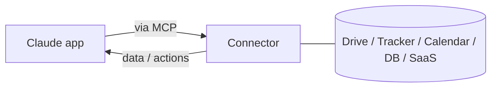

<LevelBadge level="intermediate" />

<VerifyNote lastVerified="2026-06-20" source="https://platform.claude.com/docs">
Quais conectores existem, e a disponibilidade por plano, mudam com frequência — confirme as opções atuais no aplicativo / central de ajuda.
</VerifyNote>

Os **conectores** permitem que os aplicativos do Claude alcancem **fora da conversa** — chegando às suas ferramentas e dados (drives, rastreadores de issues, calendários, bancos de dados e mais) — para que o Claude possa responder a partir de, e agir sobre, sistemas reais. Por baixo dos panos, eles são impulsionados pelo **[Model Context Protocol (MCP)](/docs/claude-code/mcp)** aberto.

## O que eles fazem

Sem conectores, o Claude só conhece o que está na conversa. Com um conector, ele pode (com sua permissão) puxar informações relevantes de um serviço conectado — por exemplo, encontrar um documento, ler issues recentes, consultar um calendário — e usá-las em sua resposta.

## O mesmo padrão, em todos os lugares

Os conectores são a forma **voltada para o aplicativo** do MCP. O mesmíssimo protocolo impulsiona o [MCP no Claude Code](/docs/claude-code/mcp) e [na API](/docs/api/mcp). Aprenda o conceito uma vez; ele se aplica em todas as superfícies.

## Configurar e usar

1. **Conecte** o serviço (autorize via OAuth, onde houver suporte).
2. **Conceda o privilégio mínimo** — apenas o acesso que a tarefa exige.
3. **Pergunte naturalmente** — "encontre meu documento de planejamento do Q3 e resuma os riscos."

## Segurança

:::warning Um conector é acesso + (às vezes) ações
- Autorize apenas serviços e escopos em que você confia.
- Conteúdo puxado de fontes externas pode carregar [injeção de prompt](/docs/security/prompt-injection) — tenha cautela quando um conector lê material não confiável.
- Revise o que um conector de terceiros pode fazer antes de habilitá-lo ([Revisando código de terceiros](/docs/security/reviewing-third-party-code)).
:::

## A seguir

- [Servidores MCP no Claude Code](/docs/claude-code/mcp)
- [MCP e Conexão com Ferramentas (API)](/docs/api/mcp)
- [IA nas suas ferramentas existentes](/docs/claude-app/ai-in-your-tools)
