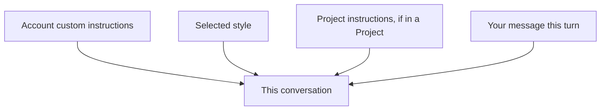

<LevelBadge level="beginner" />

<VerifyNote lastVerified="2026-06-20" source="https://www.anthropic.com">
Os nomes e locais exatos das instruções personalizadas e dos estilos nos aplicativos do Claude mudam — confirme no aplicativo / central de ajuda.
</VerifyNote>

Cansado de repetir "seja conciso" ou "sou enfermeiro, explique levando isso em conta" a cada conversa? As **instruções personalizadas** e os **estilos** permitem que você defina seus padrões uma única vez e os aplique em todo lugar.

## Instruções personalizadas = seu system prompt pessoal

Defina fatos e preferências permanentes — quem você é, o que você faz, como gosta das respostas — e o Claude os aplica em todas as conversas. É a versão de aplicativo de consumo de um [system prompt](/docs/foundations/roles) (e a prima do [CLAUDE.md](/docs/claude-code/claude-md) para desenvolvedores).

Boas coisas para incluir:
- **Contexto sobre você** ("eu administro uma pequena padaria"; "eu programo em Python").
- **Preferências de saída** ("por padrão, respostas curtas em tópicos"; "sempre mostre seu raciocínio").
- **Regras rígidas** ("nunca use emoji"; "unidades métricas").

## Estilos = predefinições de apresentação

Os **estilos** mudam o tom/formato (conciso, formal, explicativo etc.) e podem ser alternados por conversa. Use um estilo quando quiser uma *voz diferente para esta conversa* sem reescrever suas instruções permanentes.

## Como eles se combinam

Contexto mais específico/mais recente tende a prevalecer quando há um conflito — então as instruções de um [Projeto](/docs/claude-app/projects) ou um pedido explícito na sua mensagem podem sobrepor seus padrões globais. Mantenha-os consistentes para evitar surpresas.

## Dicas

- **Mantenha as instruções curtas e verdadeiras** — assim como no CLAUDE.md, o inchaço e regras desatualizadas atrapalham.
- **Não coloque segredos** nas instruções personalizadas.
- **Revise-as** ocasionalmente, conforme suas necessidades mudam.

## A seguir

- [Papéis de System, User e Assistant](/docs/foundations/roles)
- [Projetos: espaços de trabalho persistentes](/docs/claude-app/projects)
- [CLAUDE.md e arquivos de memória](/docs/claude-code/claude-md)
