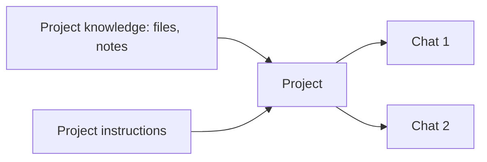

<LevelBadge level="beginner" />

<VerifyNote lastVerified="2026-06-20" source="https://www.anthropic.com">
Os recursos e limites dos projetos variam por plano e mudam — confirme o comportamento atual no aplicativo / central de ajuda.
</VerifyNote>

Um **Projeto** é um espaço de trabalho dedicado no Claude.ai que reúne **seus próprios arquivos, conhecimento e instruções**. Em vez de reenviar os mesmos documentos e reexplicar o contexto a cada conversa, você o configura uma vez — e toda conversa dentro do Projeto já começa informada.

## Por que usar um Projeto

- **Respostas fundamentadas.** Adicione seus documentos (um manual, especificações, anotações) e o Claude responde *a partir deles* — uma versão embutida e sem código de [RAG](/docs/foundations/rag).
- **Contexto persistente.** As instruções do projeto agem como um [system prompt](/docs/foundations/roles) com escopo definido para tudo dentro dele.
- **Organizado.** Todas as conversas sobre um tema/cliente/iniciativa ficam juntas.

## Configure um

1. **Crie um Projeto** e dê a ele um propósito claro.
2. **Adicione conhecimento** — os arquivos/textos que ele deve sempre conhecer.
3. **Escreva as instruções do projeto** — papel, convenções, o que fazer/evitar.
4. **Comece a conversar** — toda conversa herda o conhecimento + as instruções.

## Ótimos casos de uso

- Um espaço de trabalho de **cliente/conta** (os documentos deles + suas anotações).
- Uma base de conhecimento de uma **base de código ou produto** para perguntas e respostas.
- Um **projeto de escrita** com seu guia de estilo e textos anteriores (para que os rascunhos correspondam à sua voz).
- **Estudo** para um curso, com a ementa e os materiais carregados.

## Dicas

- **Selecione o conhecimento com cuidado** — arquivos relevantes e atuais superam despejar tudo (ruído prejudica a recuperação).
- **Mantenha as instruções enxutas e verdadeiras** (mesma regra das [instruções personalizadas](/docs/claude-app/custom-instructions)).
- **Não adicione dados sensíveis** que você não se sinta confortável em armazenar — veja [Privacidade](/docs/foundations/privacy).

## A seguir

- [Instruções personalizadas e estilos](/docs/claude-app/custom-instructions)
- [Memória entre conversas](/docs/claude-app/memory)
- [Geração Aumentada por Recuperação (RAG)](/docs/foundations/rag)
