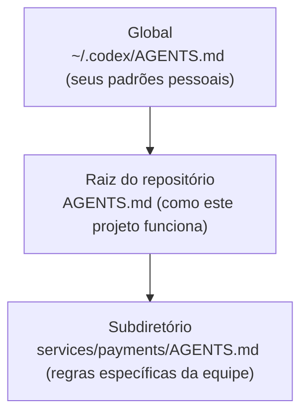

<LevelBadge level="intermediate" />

<VerifyNote lastVerified="2026-06-27" source="https://agents.md/">
A lista de adotantes do AGENTS.md e o comportamento de importação/symlink do Claude Code evoluem rapidamente — confirme os detalhes no site oficial do AGENTS.md e na documentação de memória do Claude Code.
</VerifyNote>

Você já conhece o [CLAUDE.md](/docs/claude-code/claude-md) — o briefing de projeto do Claude Code. Mas seu repositório provavelmente é tocado por *mais* de um agente: um colega usa o Codex, a CI usa um bot de código, alguém abre o repositório no Cursor. O `AGENTS.md` é o padrão aberto que essas ferramentas concordam em ler, então você escreve as instruções do seu projeto **uma única vez** em vez de manter um arquivo diferente por ferramenta.

<Callout type="objectives" items={["O que é o AGENTS.md e quem o administra", "Por que o Claude Code lê o CLAUDE.md e não o AGENTS.md", "Três formas confiáveis de manter uma única fonte de verdade entre ferramentas", "Como arquivos AGENTS.md aninhados e globais se combinam", "O que pertence ao arquivo — e o que deixar de fora"]} />

## O que é o AGENTS.md

O `AGENTS.md` é um arquivo Markdown simples na raiz do seu repositório — pense nele como um **README escrito para agentes em vez de humanos**. Ele diz a um agente de código como compilar, testar e contribuir com o projeto. O formato não tem campos obrigatórios: os agentes simplesmente leem a prosa.

É um padrão aberto administrado pela **Agentic AI Foundation (AAIF) sob a Linux Foundation** e, em meados de 2026, é usado por mais de 60 mil projetos open-source e lido por mais de 30 ferramentas — incluindo OpenAI Codex, Jules e Gemini CLI do Google, Cursor, Windsurf, Devin, Zed, Warp, Aider, goose, Amp e o agente de código do GitHub Copilot.

<Callout type="info" items={["O AGENTS.md é uma convenção, não um runtime: cada ferramenta decide como descobre, combina e injeta o arquivo.", "Nenhum schema é imposto — prosa clara vence estrutura rígida.", "Ele complementa seu README; não o substitui."]} />

## O detalhe do Claude Code

Aqui está a parte em que as pessoas tropeçam: **o Claude Code lê o `CLAUDE.md`, não o `AGENTS.md`.** Se seu repositório tiver apenas um `AGENTS.md`, o Claude Code o ignora por padrão. Isso não é um bug — é anterior ao padrão —, mas significa que um repositório multiferramenta precisa de uma estratégia de sincronização deliberada, ou suas instruções vão silenciosamente divergir.

<Callout type="warning" items={["Não presuma que o Claude Code recorre ao AGENTS.md — ele não o lê automaticamente.", "Dois arquivos mantidos à mão (CLAUDE.md e AGENTS.md) vão divergir. Escolha uma única fonte de verdade.", "Verifique o comportamento atual na documentação oficial de memória antes de confiar em qualquer alegação de fallback."]} />

## Mantenha uma única fonte de verdade

Três padrões mantêm o CLAUDE.md e o AGENTS.md sincronizados sem duplicar conteúdo. Escolha conforme a plataforma da sua equipe.

<Steps items={[{title: "Symlink (o mais simples)", body: "Faça do CLAUDE.md um symlink para o AGENTS.md. O Claude Code segue symlinks e lê o destino byte por byte — um único arquivo real, zero lógica de combinação. Ressalva: no Windows, criar um symlink exige o Modo Desenvolvedor ou direitos de administrador, então equipes multiplataforma podem preferir o método de importação."}, {title: "@import (multiplataforma)", body: "Mantenha um CLAUDE.md minúsculo cuja única função é puxar o arquivo padrão com uma importação @AGENTS.md. O Claude Code expande o arquivo importado no contexto ao iniciar, então o AGENTS.md continua sendo a única fonte e não há symlink para quebrar no Windows."}, {title: "/init (migração)", body: "Inicializando o Claude Code em um repositório que já tem um AGENTS.md (ou .cursorrules / .windsurfrules)? Execute /init — ele lê esses arquivos e incorpora as partes relevantes a um CLAUDE.md gerado."}]} />

<PromptCard title="Faça um symlink do CLAUDE.md para o padrão compartilhado (macOS / Linux)">{`ln -s AGENTS.md CLAUDE.md`}</PromptCard>

<PromptCard title="Ou mantenha um CLAUDE.md de uma linha que o importa">{`@AGENTS.md`}</PromptCard>

<Callout type="tip" items={["Use symlink quando toda a equipe estiver no macOS/Linux — é o que menos exige manutenção.", "Use @import quando houver colaboradores no Windows.", "Faça o commit do que escolher para que toda a equipe tenha o mesmo comportamento."]} />

## Como arquivos aninhados e globais se combinam

Os agentes mais robustos tratam o AGENTS.md de forma hierárquica — o mesmo modelo mental da [hierarquia de memória do CLAUDE.md](/docs/claude-code/claude-md). O Codex, por exemplo, percorre desde um arquivo global no seu diretório pessoal, passando pela raiz do Git, até a pasta atual, concatenando à medida que avança:

Arquivos mais próximos do trabalho prevalecem, porque são concatenados **por último** e sobrescrevem as orientações anteriores. Assim, um `services/payments/AGENTS.md` herda as instruções da raiz do repositório e adiciona regras que se aplicam apenas dentro daquele serviço — coloque orientações especializadas o mais perto possível do código especializado.

<Flashcards title="Interoperabilidade num relance" cards={[{front: "Quem lê o AGENTS.md?", back: "Mais de 30 ferramentas — Codex, Cursor, Windsurf, Devin, Zed, Gemini CLI, o agente de código do Copilot e outras. Não o Claude Code por padrão."}, {front: "Quem lê o CLAUDE.md?", back: "O Claude Code — e só o Claude Code. Ele não lê o AGENTS.md automaticamente."}, {front: "Melhor sincronização para uma equipe Mac/Linux", back: "Symlink do CLAUDE.md → AGENTS.md. Um único arquivo real, sem divergência."}, {front: "Melhor sincronização com colaboradores no Windows", back: "Um CLAUDE.md de uma linha contendo @AGENTS.md — sem necessidade de symlink."}, {front: "Ordem de combinação dos arquivos aninhados", back: "Global → raiz do repositório → subdiretório. Arquivos mais próximos do trabalho sobrescrevem, porque são concatenados por último."}]} />

## O que colocar nele

A mesma disciplina de um bom CLAUDE.md — o padrão apenas sugere algumas seções comuns:

- **Visão geral do projeto** — o que é isto, em duas frases.
- **Comandos de build e teste** — como executar, testar e fazer lint.
- **Estilo de código** — convenções que um agente não consegue inferir.
- **Instruções de teste** — o que "concluído" significa.
- **Considerações de segurança** — o que nunca tocar ou commitar.
- **Diretrizes de commit / PR** — formato de mensagem, regras de branch.

<Callout type="warning" items={["Os agentes seguem o arquivo ao pé da letra — instruções desatualizadas ou idealizadas atrapalham ativamente, exatamente como no CLAUDE.md.", "Mantenha-o curto e verdadeiro; descreva como o projeto funciona hoje.", "Nunca faça commit de segredos; referencie documentos extensos em vez de colá-los."]} />

## Teste-se

<Quiz title="Teste-se" questions={[{q: "O Claude Code lê o AGENTS.md automaticamente?", options: ["Sim, ele recorre ao AGENTS.md", "Não — ele lê apenas o CLAUDE.md", "Apenas no Windows"], answer: 1, explain: "O Claude Code lê o CLAUDE.md e ignora um AGENTS.md isolado por padrão, então repositórios multiferramenta precisam de uma estratégia de sincronização deliberada."}, {q: "Sua equipe está totalmente no macOS e Linux. Qual é a forma de menor manutenção para compartilhar um único arquivo de instruções entre o Claude Code e o Codex?", options: ["Manter o CLAUDE.md e o AGENTS.md à mão", "Fazer um symlink do CLAUDE.md para o AGENTS.md", "Colar o AGENTS.md em um comentário"], answer: 1, explain: "Fazer um symlink do CLAUDE.md → AGENTS.md dá a você um único arquivo real; o Claude Code segue o symlink e lê o destino byte por byte."}, {q: "Quando os agentes combinam um AGENTS.md global, um da raiz do repositório e um de subdiretório, qual prevalece nos conflitos?", options: ["O arquivo global", "O arquivo da raiz do repositório", "O arquivo de subdiretório mais próximo do trabalho"], answer: 2, explain: "Os arquivos são concatenados global → raiz → subdiretório, então o arquivo mais próximo do trabalho aparece por último e sobrescreve as orientações anteriores."}]} />

<Callout type="takeaways" items={["O AGENTS.md é o padrão aberto, administrado pela Linux Foundation, que mais de 30 agentes de código leem — um README para agentes.", "O Claude Code lê o CLAUDE.md, não o AGENTS.md, então repositórios multiferramenta precisam mantê-los sincronizados.", "Faça um symlink do CLAUDE.md → AGENTS.md no Mac/Linux, ou use uma importação @AGENTS.md de uma linha para equipes multiplataforma.", "Arquivos aninhados se combinam global → raiz → subdiretório, com o arquivo mais próximo prevalecendo.", "Preencha-o como um ótimo CLAUDE.md: visão geral, comandos de build/teste, convenções, segurança e proteções — curto e verdadeiro."]} />

## A seguir

- [CLAUDE.md & Arquivos de Memória](/docs/claude-code/claude-md) — o lado Claude Code da mesma ideia
- [Modelos de CLAUDE.md](/docs/templates/claude-md) — pontos de partida prontos que você pode reutilizar como AGENTS.md
- [Comandos de Barra](/docs/claude-code/slash-commands) — incluindo o /init para migrar arquivos de instruções existentes

## Fontes e leitura adicional

- [AGENTS.md — site oficial e especificação](https://agents.md/)
- [OpenAI Codex — Instruções personalizadas com AGENTS.md](https://developers.openai.com/codex/guides/agents-md)
- [Documentação de memória do Claude Code](https://code.claude.com/docs/en/memory)
