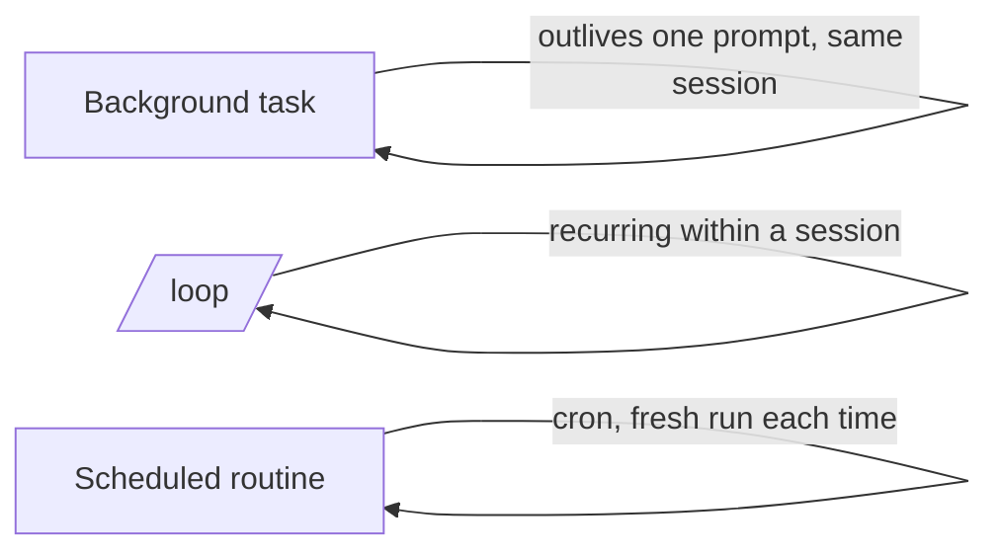

<LevelBadge level="advanced" />

<VerifyNote lastVerified="2026-06-20" source="https://docs.anthropic.com/en/docs/claude-code">
Os comandos exatos e a disponibilidade de tarefas em segundo plano, /loop e agendamento mudam entre versões — confirme na documentação oficial.
</VerifyNote>

Nem tudo é uma edição rápida. O Claude Code pode executar trabalhos que **sobrevivem a um único prompt**: comandos longos em segundo plano, loops recorrentes e execuções agendadas.

## Tarefas em segundo plano

Inicie um comando de longa duração (um servidor de desenvolvimento, um observador de testes, um build) **sem bloquear** a sessão. O Claude continua trabalhando e é notificado quando a tarefa produz saída ou termina. Use isso para qualquer coisa que você normalmente colocaria em segundo plano com `&` — mas gerenciado, para que o Claude possa ler a saída depois.

:::tip Não fique em espera ocupada
Inicie a tarefa em segundo plano e continue; deixe a notificação de conclusão trazê-lo de volta, em vez de ficar consultando em um loop apertado.
:::

## Loops recorrentes (`/loop`)

O `/loop` executa um prompt ou comando em um **intervalo recorrente** dentro de uma sessão — por exemplo, "a cada 5 minutos, verifique o status do deploy." Dê a ele um intervalo, ou deixe o Claude definir o próprio ritmo. Ótimo para acompanhar uma execução de CI ou consultar um job externo sobre o qual o harness não conseguiria notificá-lo de outra forma.

## Agentes na nuvem agendados

Para trabalhos que devem acontecer **em horários definidos, de forma contínua** — "todas as manhãs, resuma as novas issues", "de hora em hora, verifique novidades e atualize a documentação" — use **tarefas agendadas / rotinas** (estilo cron). Cada execução começa do zero, então suas instruções devem ser **autocontidas**.

## Como escolher entre eles

| Necessidade | Use |
|---|---|
| Executar um comando longo e continuar trabalhando | Tarefa em segundo plano |
| Consultar algo a cada N minutos nesta sessão | `/loop` |
| Fazer algo em um horário definido, indefinidamente | Rotina agendada |

:::warning Autonomia exige proteções
Qualquer coisa que aja sem supervisão em um horário definido deve ter escopo restrito e ser reversível. Combine isso com [permissões](/docs/claude-code/permissions) estritas e leia [Fortalecendo Execuções Autônomas](/docs/security/hardening-autonomous-runs).
:::

## Próximos passos

- [Modo Headless e o Agent SDK](/docs/claude-code/headless-and-agent-sdk)
- [Permissões e Modos](/docs/claude-code/permissions)
- [Fortalecendo Execuções Autônomas](/docs/security/hardening-autonomous-runs)
