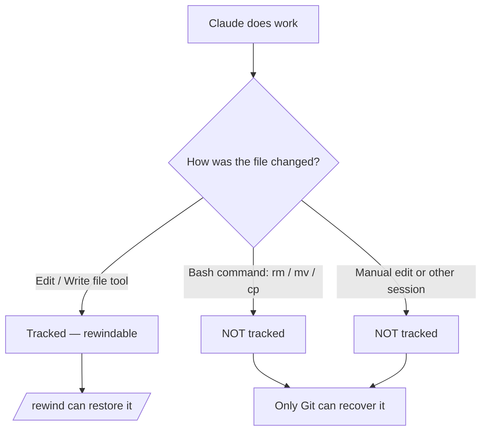

<LevelBadge level="intermediate" />

<Callout type="objectives" items={["Entender o que um checkpoint captura — e o que ele silenciosamente não captura", "Abrir o menu de rewind de duas formas e escolher a ação de restauração certa toda vez", "Distinguir 'restaurar' (desfazer estado) de 'resumir' (comprimir contexto)", "Saber exatamente por que os checkpoints complementam o Git, mas nunca o substituem"]} />

<VerifyNote lastVerified="2026-07-09" source="https://code.claude.com/docs/en/checkpointing">
O comportamento dos checkpoints, as ações do menu de rewind, a retenção e os requisitos de versão (por exemplo, retomar além de um `/clear` exige o Claude Code v2.1.191+) mudam entre releases — confirme na documentação oficial.
</VerifyNote>

## A grande ideia

Quando você libera o Claude para uma mudança ambiciosa e de larga escala, a pergunta mais assustadora é "e se der errado três edições adiante?" O **checkpointing** é a resposta: o Claude Code tira automaticamente um snapshot do seu código antes de cada edição, para que você possa reverter a qualquer estado anterior em vez de desembaraçar manualmente uma refatoração pela metade.

Pense nisso como um **desfazer local para a sessão inteira** — uma rede de segurança que permite dizer "sim, tente a abordagem ousada" sem medo.

## Como os checkpoints são criados

Você não cria checkpoints — eles acontecem automaticamente.

<Steps items={[{title: "Cada prompt = um checkpoint", body: "Cada prompt do usuário captura o estado do seu código antes de as ferramentas de edição de arquivos do Claude rodarem. Sem comando, sem configuração, sem cerimônia."}, {title: "Eles persistem entre sessões", body: "Os checkpoints sobrevivem ao encerramento e à retomada de uma conversa, então você pode reverter em uma sessão retomada, não apenas na sessão ao vivo."}, {title: "Eles se limpam sozinhos", body: "Os checkpoints são removidos junto com sua sessão após 30 dias (configurável). Eles são recuperação de nível de sessão, não um arquivo permanente."}]} />

## Abrindo o menu de rewind

Há duas formas de entrar:

<Steps items={[{title: "Executar /rewind", body: "Digite o slash command a partir do prompt. Sempre funciona."}, {title: "Pressionar Esc duas vezes — mas apenas com a entrada vazia", body: "O Esc duplo abre o menu de rewind quando a caixa de prompt está vazia. Se houver texto nela, o Esc duplo limpa esse texto em vez disso (o texto limpo é salvo no histórico de entrada, então pressione Para Cima para recuperá-lo depois)."}]} />

<PromptCard title="Open the rewind menu">{`/rewind`}</PromptCard>

O menu lista **cada prompt que você enviou nesta sessão**. Escolha o ponto sobre o qual quer agir e então selecione uma ação.

## Restaurar vs. resumir: a distinção-chave

É aqui que as pessoas se confundem. O menu oferece dois *tipos* de ação:

- As ações de **restaurar** mudam o estado no disco e/ou na conversa — elas desfazem.
- As ações de **resumir** nunca tocam nos seus arquivos — elas comprimem a conversa para liberar espaço na janela de contexto.

<Callout type="warning" items={["Restaurar = desfazer (reverte código, conversa ou ambos). Resumir = comprimir contexto (os arquivos no disco ficam intocados).", "Recorra ao restaurar quando uma edição quebrou algo. Recorra ao resumir quando a sessão está inchada mas o código está bem."]} />

### As ações de restaurar

<Steps items={[{title: "Restaurar código e conversa", body: "Reverte tanto seus arquivos quanto o histórico do chat para o ponto selecionado — um 'voltar no tempo' limpo até aquele momento."}, {title: "Restaurar conversa", body: "Reverte o chat até aquela mensagem, mas mantém seu código atual. Útil para refazer uma pergunta sem perder edições que você quer manter."}, {title: "Restaurar código", body: "Reverte as mudanças de arquivo, mas mantém a conversa. Desfaz as edições, mantém a discussão sobre elas."}]} />

Depois de restaurar a conversa (ou de escolher "Resumir a partir daqui"), o prompt original da mensagem selecionada é colocado de volta no campo de entrada para que você possa reenviá-lo ou editá-lo.

### As ações de resumir

Ambas comprimem parte da conversa em um resumo gerado por IA — como um **`/compact` direcionado** em que você escolhe qual lado da mensagem selecionada comprimir.

<Steps items={[{title: "Resumir a partir daqui", body: "As mensagens ANTES da mensagem selecionada permanecem intactas. A mensagem selecionada e tudo que vem depois dela viram um resumo. Use isso para descartar uma discussão paralela mantendo o contexto inicial em detalhe completo."}, {title: "Resumir até aqui", body: "As mensagens ANTES da mensagem selecionada viram um resumo; a mensagem selecionada e tudo que vem depois permanecem intactas. Você continua ao final da conversa. Use isso para comprimir a conversa inicial de configuração mantendo o trabalho recente na íntegra."}]} />

As mensagens originais permanecem na transcrição da sessão de qualquer forma, então o Claude ainda pode consultar os detalhes. Você pode digitar instruções opcionais para orientar o foco do resumo.

Para o fluxo completo, veja [Gerenciamento de Contexto](/docs/claude-code/context-management) — as ações de resumir do `/rewind` são um bisturi, enquanto o `/compact` é um pincel largo.

## Revertendo além de um `/clear`

Se você executou `/clear` mais cedo no mesmo processo do Claude Code, o menu de rewind mostra uma entrada extra no topo: `/resume <session-id> (previous session)`. Selecione-a para saltar de volta à conversa que estava ativa antes do `/clear`.

<VerifyNote lastVerified="2026-07-09" source="https://code.claude.com/docs/en/checkpointing">
Retomar além de um `/clear` a partir do menu de rewind exige o Claude Code v2.1.191 ou posterior. Em versões anteriores, execute `/resume` e escolha a sessão anterior na lista em vez disso.
</VerifyNote>

## Onde os checkpoints param — os limites que mordem

Os checkpoints parecem mágicos até que deixem de ser. Três lacunas importam:

<Steps items={[{title: "Mudanças via bash são invisíveis", body: "Arquivos alterados por comandos de shell que o Claude executa — rm, mv, cp, geradores de código, formatadores — NÃO são rastreados. Apenas edições diretas pelas ferramentas de edição de arquivos do Claude entram em checkpoint. Um arquivo deletado por rm está perdido no que diz respeito ao rewind."}, {title: "Mudanças externas e concorrentes são invisíveis", body: "Edições manuais que você faz fora do Claude Code, e edições de outras sessões concorrentes, normalmente não são capturadas — a menos que por acaso toquem nos mesmos arquivos que a sessão atual editou."}, {title: "É de nível de sessão, não histórico", body: "Os checkpoints são recuperação rápida e local. Eles não são commits, não são branches e não são compartilháveis com sua equipe."}]} />

## Checkpoints vs. Git: use ambos

Eles resolvem problemas diferentes, então combine-os.

| | Checkpoints (`/rewind`) | Git |
|---|---|---|
| Escopo | Uma sessão | Histórico do projeto inteiro |
| Granularidade | Por prompt, automático | Por commit, deliberado |
| Rastreia mudanças feitas via bash? | Não | Sim (uma vez em stage/commit) |
| Duração | ~30 dias, depois some | Permanente |
| Compartilhável / colaborativo | Não | Sim |
| Modelo mental | "Desfazer local" | "Histórico permanente" |

<Callout type="tip" items={["Faça commit de estados funcionais com o Git antes de uma execução arriscada e de larga escala — esse é o seu piso durável.", "Use o /rewind para recuperação rápida dentro da sessão entre commits, sem poluir seu histórico do Git.", "Se o Claude for executar bash destrutivo (rm/mv) ou geradores, apoie-se no Git — o rewind não salvará esses arquivos."]} />

## Quando recorrer a ele

<Steps items={[{title: "Explorar alternativas", body: "Tente uma implementação ousada e, se não gostar, restaure código e conversa até o ponto de bifurcação e tente outra."}, {title: "Recuperar-se de uma edição ruim", body: "Uma edição introduziu um bug três prompts atrás? Restaure o código para logo antes dela em vez de depurar os destroços."}, {title: "Iterar sobre uma funcionalidade", body: "Experimente variações, sempre sabendo que um estado bom conhecido está a um /rewind de distância."}, {title: "Liberar espaço de contexto", body: "Um desvio verboso de depuração consumiu sua janela de contexto? Resuma do ponto médio em diante e mantenha suas instruções originais em detalhe completo."}]} />

<Quiz title="Check yourself" questions={[{q: "O Claude executou `rm config.old.json` via um comando bash e você quer o arquivo de volta. O `/rewind` pode restaurá-lo?", options: ["Sim — toda mudança que o Claude faz entra em checkpoint", "Não — mudanças feitas via bash não são rastreadas; apenas edições diretas por ferramentas de arquivo são", "Só se você executar /rewind dentro de 30 segundos"], answer: 1, explain: "O checkpointing só captura edições feitas pelas ferramentas de edição de arquivos do Claude. Arquivos alterados por comandos bash (rm, mv, cp) não são rastreados — é exatamente para isso que serve o Git."}, {q: "Seu código está bem, mas uma longa tangente de depuração encheu a janela de contexto. Qual ação se encaixa?", options: ["Restaurar código e conversa para antes da tangente", "Restaurar código", "Resumir a partir daqui no início da tangente"], answer: 2, explain: "As ações de resumir comprimem a conversa sem tocar nos arquivos. 'Resumir a partir daqui' transforma a tangente em um resumo mantendo seu contexto anterior intacto — liberando espaço de contexto com zero mudanças de código."}, {q: "Como um checkpoint é criado?", options: ["Você executa /checkpoint manualmente", "Automaticamente, antes de cada edição — cada prompt cria um", "Apenas quando você faz commit no Git"], answer: 1, explain: "O checkpointing é automático: cada prompt do usuário captura o estado do seu código antes da edição. Não há passo manual."}]} />

<Flashcards title="Checkpoints & rewind vocabulary" cards={[{front: "Checkpoint", back: "Um snapshot automático do seu código tirado antes de cada edição, uma vez por prompt. Escopo de sessão, mantido por ~30 dias."}, {front: "/rewind", back: "Abre o menu de rewind listando cada prompt desta sessão, para que você possa restaurar ou resumir a partir de qualquer ponto. Também acessível via Esc duplo com a entrada vazia."}, {front: "Ação de restaurar", back: "Reverte o estado — código, conversa ou ambos — para o ponto selecionado. Isto é 'desfazer'."}, {front: "Ação de resumir", back: "Comprime parte da conversa em um resumo por IA para liberar contexto. Os arquivos no disco nunca são tocados."}, {front: "Ponto cego do bash", back: "Arquivos alterados por comandos de shell (rm/mv/cp) NÃO entram em checkpoint — apenas edições diretas por ferramentas de arquivo entram. Use o Git para esses."}]} />

<Callout type="takeaways" items={["Os checkpoints são snapshots automáticos do seu código, por prompt — um desfazer local para a sessão inteira, mantido por cerca de 30 dias.", "Abra o menu de rewind com /rewind ou Esc duplo com a entrada vazia; ele lista cada prompt que você enviou.", "As ações de restaurar desfazem o estado (código, conversa ou ambos); as ações de resumir comprimem o contexto e nunca tocam nos arquivos.", "Mudanças feitas via bash, externas e concorrentes NÃO são rastreadas — apenas edições diretas por ferramentas de arquivo são.", "Os checkpoints complementam o Git, não o substituem: pense em 'desfazer local' vs. 'histórico permanente e compartilhável'."]} />

## A seguir

- [Gerenciamento de Contexto](/docs/claude-code/context-management) — `/compact`, `/clear` e como o resumir se encaixa no quadro maior
- [Modo de Planejamento](/docs/claude-code/plan-mode) — investigue e aprove um plano antes de as edições rodarem, para reverter com menos frequência
- [Permissões](/docs/claude-code/permissions) — a outra metade de executar tarefas ambiciosas com segurança
