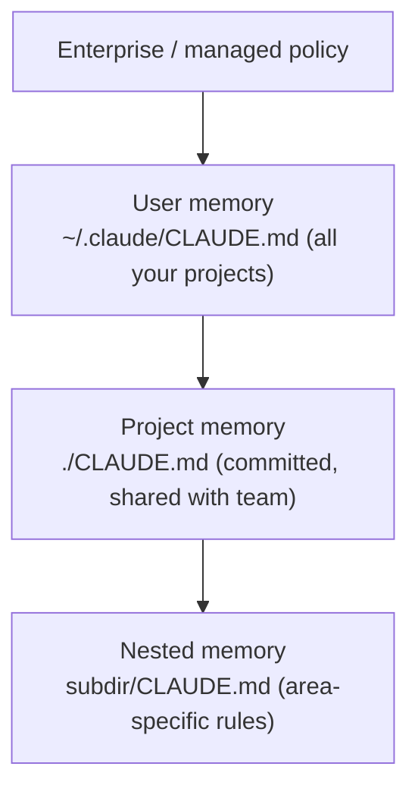

<LevelBadge level="beginner" />

<VerifyNote lastVerified="2026-06-20" source="https://docs.anthropic.com/en/docs/claude-code/memory">
As localizações dos arquivos de memória e a sintaxe de importação podem mudar — confirme os detalhes na documentação oficial de memória do Claude Code.
</VerifyNote>

Se você fizer **uma** coisa para melhorar o [Claude Code](/docs/claude-code/what-is-claude-code), faça esta. O `CLAUDE.md` é um arquivo de texto simples que o Claude lê no início de cada sessão — o briefing permanente do seu projeto.

## Por que é a configuração de maior alavancagem

Sem ele, você reexplica seu projeto a cada sessão ("usamos pnpm, os testes ficam em `__tests__`, não mexa em `/generated`…"). Com ele, o Claude já sabe. Boas instruções aqui melhoram *todas* as interações futuras de uma só vez.

## A hierarquia de memória

O Claude Code lê a memória de vários lugares e os mescla, aproximadamente do mais global ao mais específico:

- **Memória de usuário** — suas preferências pessoais em todos os projetos.
- **Memória de projeto** (`./CLAUDE.md`, versionada) — como *este* repositório funciona. Compartilhada com sua equipe.
- **Aninhada** — coloque um `CLAUDE.md` em uma subpasta para regras que se aplicam apenas ali.

## Gere um ponto de partida

Execute `/init` em um projeto e o Claude esboça um `CLAUDE.md` inspecionando o código. Depois **enxugue-o** — o rascunho é um ponto de partida, não a linha de chegada.

## O que colocar nele

- O que é o projeto, em duas frases.
- A stack tecnológica e como **executar / testar / fazer lint**.
- Convenções que o Claude não consegue inferir (nomenclatura, estrutura, estilo de commit).
- **Proteções**: "execute os testes antes de declarar concluído", "nunca edite `/vendor`", "nunca faça commit de segredos".

Pegue um modelo pronto em [Modelos de CLAUDE.md](/docs/templates/claude-md).

## O que NÃO colocar nele

:::warning Curto e verdadeiro vence longo e aspiracional
O Claude segue o `CLAUDE.md` *literalmente*. Instruções desatualizadas, vagas ou idealizadas prejudicam ativamente. Descreva como o projeto **realmente** funciona hoje, mantenha-o enxuto e revise-o periodicamente.
:::

Evite: documentos gigantes colados (use `@imports` para referenciar arquivos), segredos e regras que você não segue de fato.

## Importações

Traga documentos existentes em vez de duplicá-los — por exemplo, referencie seu guia de estilo com uma importação `@caminho/para/arquivo` para que haja uma única fonte da verdade. Veja a [documentação oficial de memória](https://docs.anthropic.com/en/docs/claude-code/memory) para a sintaxe exata.

## Próximos passos

- [Modo Plano](/docs/claude-code/plan-mode) — primeiras mudanças seguras
- [Permissões e Modos](/docs/claude-code/permissions) — o que o Claude pode fazer sem supervisão
- [Passo a passo: Personalize o Claude Code para um repositório real](/docs/walkthroughs/customize-claude-code)
