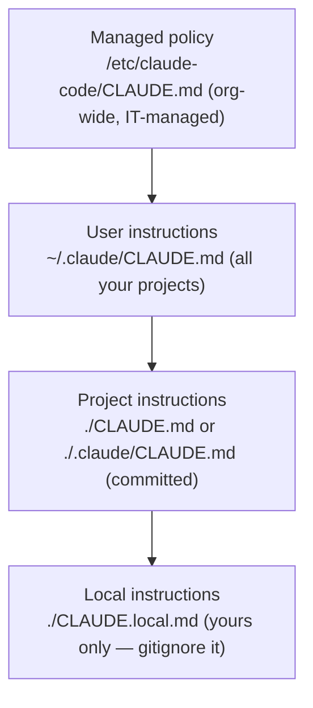

<LevelBadge level="beginner" />

<VerifyNote lastVerified="2026-10-06" source="https://code.claude.com/docs/en/memory">
As localizações, a ordem de carregamento e a sintaxe de importação vêm da documentação oficial de memória ("Como o Claude lembra do seu projeto"), que agora descreve **dois** mecanismos: os arquivos CLAUDE.md que você escreve e a **memória automática** que o próprio Claude escreve. As importações são resolvidas até uma profundidade máxima de quatro saltos. Confirme os detalhes lá — eles mudam.
</VerifyNote>

Se você fizer **uma** coisa para melhorar o [Claude Code](/docs/claude-code/what-is-claude-code), faça esta. O `CLAUDE.md` é um arquivo de texto simples que o Claude lê no início de cada sessão — o briefing permanente do seu projeto.

<Callout type="objectives" items={["Por que o CLAUDE.md é a configuração de maior alavancagem do Claude Code", "Como a hierarquia de memória é carregada, da política gerenciada até o CLAUDE.local.md", "Como a memória automática difere do CLAUDE.md que você escreve", "Como gerar um arquivo inicial com /init e enxugá-lo", "O que vai no CLAUDE.md — e o que deixar de fora", "Como as @imports permitem referenciar documentos sem duplicá-los"]} />

## Por que é a configuração de maior alavancagem

Sem ele, você reexplica seu projeto a cada sessão ("usamos pnpm, os testes ficam em `__tests__`, não mexa em `/generated`…"). Com ele, o Claude já sabe. Boas instruções aqui melhoram *todas* as interações futuras de uma só vez.

## A hierarquia de memória

O Claude Code carrega a memória de vários locais e os mescla na ordem de carregamento, do escopo mais amplo primeiro — então uma instrução de projeto entra no contexto *depois* de uma instrução de usuário:

```mermaid
flowchart TD
  A["Managed policy<br/>/etc/claude-code/CLAUDE.md (org-wide, IT-managed)"] --> B["User instructions<br/>~/.claude/CLAUDE.md (all your projects)"]
  B --> C["Project instructions<br/>./CLAUDE.md or ./.claude/CLAUDE.md (committed)"]
  C --> D["Local instructions<br/>./CLAUDE.local.md (yours only — gitignore it)"]
```

- **Política gerenciada** — instruções em nível de organização que sua equipe de TI/DevOps distribui. O caminho varia por sistema operacional: `/Library/Application Support/ClaudeCode/CLAUDE.md` no macOS, `/etc/claude-code/CLAUDE.md` no Linux e no WSL, `C:\Program Files\ClaudeCode\CLAUDE.md` no Windows.
- **Instruções de usuário** (`~/.claude/CLAUDE.md`) — suas preferências pessoais em todos os projetos.
- **Instruções de projeto** (`./CLAUDE.md` *ou* `./.claude/CLAUDE.md`, versionadas) — como *este* repositório funciona. Compartilhadas com sua equipe. Se o seu repositório usa [`AGENTS.md`](/docs/claude-code/agents-md), ele pode ser carregado em vez destes arquivos ou junto com eles.
- **Instruções locais** (`./CLAUDE.local.md`) — anotações específicas do projeto só para você, como a URL de um sandbox. Adicione-o ao `.gitignore`.

Arquivos na hierarquia de diretórios *acima* do seu diretório de trabalho são carregados na inicialização; arquivos em **subdiretórios são carregados sob demanda**, quando o Claude mexe em algo naquela área.

<Callout type="tip" items={["Um arquivo só já não basta? Divida as instruções em .claude/rules/*.md — um tópico por arquivo, descobertos recursivamente. Regras sem o frontmatter paths são carregadas na inicialização com a mesma prioridade do .claude/CLAUDE.md; adicione o frontmatter paths para carregar uma regra apenas quando o Claude trabalhar em arquivos correspondentes, o que economiza contexto."]} />

<Flashcards title="Conheça suas camadas de memória" cards={[{front: "Política gerenciada", back: "CLAUDE.md em nível de organização, administrado pela TI — a camada mais ampla, carregada antes das instruções de usuário e de projeto."}, {front: "Instruções de usuário", back: "~/.claude/CLAUDE.md — suas preferências pessoais que valem para todos os projetos."}, {front: "Instruções de projeto", back: "./CLAUDE.md ou ./.claude/CLAUDE.md — versionadas e compartilhadas com a equipe; descrevem como este repositório funciona."}, {front: "Instruções locais", back: "./CLAUDE.local.md — preferências pessoais específicas do projeto. Coloque no gitignore."}, {front: ".claude/rules/*.md", back: "Instruções com um tópico por arquivo, para projetos maiores. Com o frontmatter paths, são carregadas apenas para os arquivos correspondentes."}, {front: "CLAUDE.md em subdiretório", back: "Carregado sob demanda — quando o Claude trabalha naquela parte da árvore — e não na inicialização."}]} />

## A outra metade: a memória automática

O CLAUDE.md é a metade da memória que *você* escreve. O Claude Code também mantém a **memória automática** — anotações que o próprio Claude escreve a partir das suas correções e preferências, armazenadas por repositório e carregadas em cada sessão junto com os seus arquivos CLAUDE.md.

| | Arquivos CLAUDE.md | Memória automática |
| --- | --- | --- |
| **Quem escreve** | Você | O Claude |
| **O que contém** | Instruções e regras | Aprendizados e padrões |
| **Escopo** | Projeto, usuário ou organização | Por repositório, compartilhada entre worktrees |

As duas são *contexto*, não imposição: o Claude as trata como orientação que pode ponderar, não como configuração que precisa obedecer. Para bloquear uma ação de forma definitiva, independentemente do que o Claude decidir, use um [hook PreToolUse](/docs/claude-code/hooks).

<Callout type="warning" items={["A memória automática carrega apenas as primeiras 200 linhas ou 25 KB — um MEMORY.md inflado é truncado silenciosamente. Veja Auditoria de Orçamento de Contexto para o detalhamento completo do custo de inicialização."]} />

## Gere um ponto de partida

<Steps items={[{title: "Execute /init no projeto", body: "O Claude inspeciona o código e esboça um CLAUDE.md para você automaticamente."}, {title: "Enxugue-o", body: "O rascunho é um ponto de partida, não a linha de chegada. Reduza-o ao que é verdadeiro e útil."}, {title: "Aproveite um modelo", body: "Pegue um modelo pronto na página de Modelos de CLAUDE.md e adapte-o ao seu repositório."}]} />

<PromptCard title="Gerar um rascunho de CLAUDE.md">{`/init`}</PromptCard>

Pegue um modelo pronto em [Modelos de CLAUDE.md](/docs/templates/claude-md).

## O que colocar nele

- O que é o projeto, em duas frases.
- A stack tecnológica e como **executar / testar / fazer lint**.
- Convenções que o Claude não consegue inferir (nomenclatura, estrutura, estilo de commit).
- **Proteções**: "execute os testes antes de declarar concluído", "nunca edite `/vendor`", "nunca faça commit de segredos".

## O que NÃO colocar nele

<Callout type="warning" items={["O Claude segue o CLAUDE.md literalmente — instruções desatualizadas, vagas ou idealizadas prejudicam ativamente.", "Descreva como o projeto realmente funciona hoje; curto e verdadeiro vence longo e aspiracional.", "Evite documentos gigantes colados (use @imports em vez disso), segredos e regras que você não segue de fato.", "Revise-o periodicamente para que continue preciso à medida que o projeto evolui."]} />

## Importações

Traga documentos existentes em vez de duplicá-los — por exemplo, referencie seu guia de estilo com uma importação `@path/to/file` para que haja uma única fonte da verdade. Caminhos relativos e absolutos funcionam; os relativos são resolvidos a partir do arquivo que contém a importação, e **não** do seu diretório de trabalho. Arquivos importados podem importar outros, até uma profundidade máxima de **quatro saltos**.

Duas armadilhas de sintaxe que vale conhecer antes de cair nelas:

- **Espaços exigem barras invertidas.** `@Design\ Docs/api-conventions.md` funciona; sem a barra invertida o caminho para no primeiro espaço. Envolvê-lo em aspas não importa o arquivo de jeito nenhum.
- **Backticks cancelam a importação.** A análise de importações ignora trechos de código e blocos cercados, então `` `@README` `` permanece texto literal, enquanto `@README` sozinho importa o arquivo. É assim que você *menciona* um caminho sem carregá-lo.

Veja a [documentação oficial de memória](https://code.claude.com/docs/en/memory) para a referência completa.

<Callout type="tip" items={["Uma única fonte da verdade: referencie um arquivo com @imports em vez de colar o conteúdo dele no CLAUDE.md.", "Se um documento já existe, faça um link para ele — não o copie. Cópias ficam desatualizadas."]} />

## Teste seus conhecimentos

<Quiz title="Teste seus conhecimentos" questions={[{q: "Qual arquivo o Claude Code lê no início de cada sessão como o briefing permanente do seu projeto?", options: ["README.md", "CLAUDE.md", "package.json"], answer: 1, explain: "O CLAUDE.md é o arquivo de memória em texto simples que o Claude lê no início de cada sessão."}, {q: "O que executar /init faz em um projeto?", options: ["Faz commit do CLAUDE.md no repositório da sua equipe", "Esboça um CLAUDE.md inspecionando o código, que você depois enxuga", "Apaga arquivos de memória desatualizados"], answer: 1, explain: "/init esboça um CLAUDE.md inicial a partir do código — o rascunho é um ponto de partida, então você o enxuga depois."}, {q: "Qual é a maneira recomendada de incluir um documento grande já existente, como um guia de estilo?", options: ["Colar o documento inteiro no CLAUDE.md", "Referenciá-lo com uma importação @path/to/file", "Armazená-lo como um segredo"], answer: 1, explain: "Use @imports para apontar para o arquivo, de modo que haja uma única fonte da verdade em vez de uma cópia duplicada e desatualizada."}, {q: "Onde ficam as anotações pessoais e específicas do projeto — aquelas que você não quer versionar?", options: ["~/.claude/CLAUDE.md", "./CLAUDE.local.md", "./.claude/CLAUDE.md"], answer: 1, explain: "O ./CLAUDE.local.md é a camada local: específica do projeto, mas só sua. Coloque no gitignore. O ~/.claude/CLAUDE.md vale para todos os seus projetos, e o ./.claude/CLAUDE.md são as instruções versionadas da equipe."}, {q: "Quem escreve a memória automática?", options: ["Você, à mão", "O Claude, a partir das suas correções e preferências", "Seu administrador de TI"], answer: 1, explain: "A memória automática é a metade que o próprio Claude escreve — aprendizados e padrões, armazenados por repositório. O CLAUDE.md é a metade que você escreve."}, {q: "Um CLAUDE.md em um subdiretório é carregado quando?", options: ["Na inicialização, junto com todos os outros arquivos de memória", "Sob demanda, quando o Claude trabalha naquela parte da árvore", "Somente se você fizer @import dele"], answer: 1, explain: "Arquivos acima do seu diretório de trabalho são carregados na inicialização; arquivos em subdiretórios são carregados sob demanda, quando o Claude mexe em algo naquela área."}]} />

<Callout type="takeaways" items={["O CLAUDE.md é a configuração de maior alavancagem: melhora todas as sessões futuras de uma só vez.", "A memória carrega do escopo mais amplo primeiro: política gerenciada, depois usuário (~/.claude/CLAUDE.md), projeto (./CLAUDE.md ou ./.claude/CLAUDE.md) e por fim local (./CLAUDE.local.md). Arquivos em subdiretórios são carregados sob demanda.", "A memória automática é a outra metade — as anotações do próprio Claude, por repositório, carregadas em cada sessão. As duas são contexto, não imposição: use um hook para bloquear algo de forma definitiva.", "Um arquivo só já não basta? Divida-o em .claude/rules/*.md e delimite as regras com o frontmatter paths.", "Comece com /init, depois enxugue o rascunho para o que é de fato verdadeiro.", "Mantenha-o curto e verdadeiro — use @imports (máximo de quatro saltos) para documentos grandes e nunca faça commit de segredos."]} />

## Próximos passos

- [AGENTS.md e Interoperabilidade Entre Ferramentas](/docs/claude-code/agents-md) — compartilhe um único arquivo de instruções com todos os agentes de código
- [Modo Plano](/docs/claude-code/plan-mode) — primeiras mudanças seguras
- [Permissões e Modos](/docs/claude-code/permissions) — o que o Claude pode fazer sem supervisão
- [Passo a passo: Personalize o Claude Code para um repositório real](/docs/walkthroughs/customize-claude-code)
