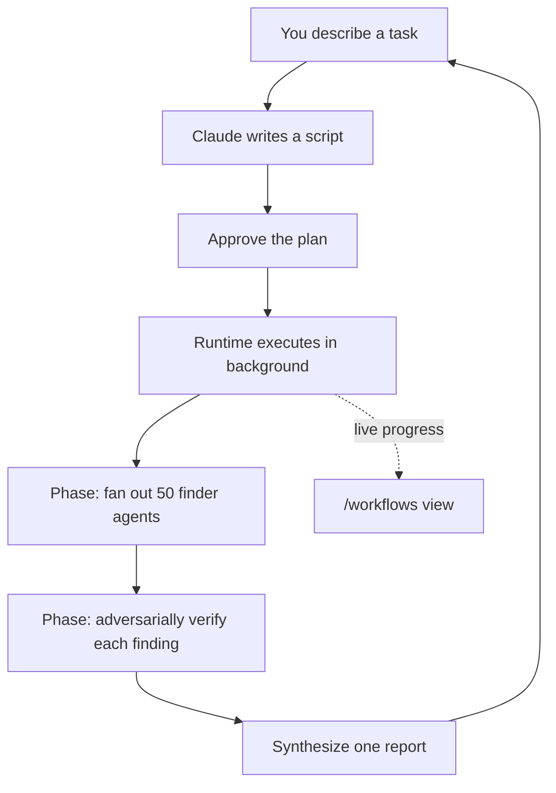

<LevelBadge level="advanced" />

<VerifyNote lastVerified="2026-06-28" source="https://code.claude.com/docs/en/workflows">
Os workflows dinâmicos são um recurso em rápida evolução: a palavra-chave de acionamento, as opções de aprovação, os limites de agentes e a disponibilidade mudam entre as versões do Claude Code — confirme os detalhes na documentação oficial. Eles exigem Claude Code v2.1.154+ e um plano pago.
</VerifyNote>

<Callout type="objectives" items={["Distinguir um workflow de subagentes, skills e equipes de agentes pela pergunta de quem detém o plano", "Ver um em 30 segundos com o comando /deep-research incluído", "Iniciar o seu próprio de três formas: a palavra-chave ultracode, /effort ultracode ou um comando salvo", "Saber do que o prompt de aprovação está protegendo você antes de apertar Sim", "Manter o custo e as execuções não supervisionadas sob controle com fatiamento e a allowlist"]} />

Um **workflow dinâmico** é um script JavaScript que orquestra [subagentes](/docs/claude-code/subagents) em escala. Você descreve uma tarefa; o Claude *escreve o script*; um runtime o executa em segundo plano enquanto sua sessão continua responsiva. Enquanto uma tarefa multietapas normal vive turno a turno na janela de contexto do Claude, um workflow move o **plano para dentro do código** — o laço, as ramificações e cada resultado intermediário vivem em variáveis do script, então seu contexto guarda apenas a resposta final.

Essa única mudança é o que faz os workflows escalarem para *dezenas ou centenas* de agentes em uma execução, onde a delegação comum se esgota em um punhado.

## Quando recorrer a um workflow

O Claude Code oferece quatro formas de executar trabalho multietapas. A verdadeira pergunta é **quem detém o plano**:

| | [Subagentes](/docs/claude-code/subagents) | [Skills](/docs/claude-code/skills) | Equipes de agentes | **Workflows** |
| :-- | :-- | :-- | :-- | :-- |
| O que é | Um worker que o Claude cria | Instruções que o Claude segue | Um líder supervisionando sessões pares | Um script que o runtime executa |
| Quem decide o que roda em seguida | O Claude, turno a turno | O Claude, conforme o prompt | O líder, turno a turno | **O script** |
| Onde os resultados vivem | Janela de contexto | Janela de contexto | Uma lista de tarefas compartilhada | **Variáveis do script** |
| Escala | Alguns por turno | O mesmo que subagentes | Um punhado de pares | **Dezenas a centenas** |
| Em caso de interrupção | Reinicia o turno | Reinicia o turno | Os colegas continuam rodando | **Retomável na sessão** |

Use um workflow quando uma tarefa precisar de **mais agentes do que uma conversa consegue coordenar**, ou quando você quiser a orquestração **codificada como um script que você pode ler e reexecutar**. Casos canônicos:

- Uma **varredura de bugs em toda a base de código** — espalhe um localizador por cada módulo e depois faça agentes independentes verificarem cada achado de forma adversarial antes de ser reportado.
- Uma **migração de 500 arquivos** — um agente por arquivo, cada um em seu próprio worktree, com uma etapa de verificação.
- Uma **pergunta de pesquisa** em que as fontes devem ser **verificadas de forma cruzada entre si**, não apenas resumidas.
- Um **plano difícil** que vale a pena rascunhar a partir de vários ângulos independentes e depois ponderar entre si antes de você se comprometer.

Esse último ponto é o subestimado: um workflow pode aplicar um *padrão de qualidade repetível* (revisão adversarial, rascunho de múltiplos ângulos, verificação por voto majoritário), de modo que você obtém um resultado mais confiável do que uma única passagem — não apenas mais agentes.



## A forma mais rápida de ver um: /deep-research

O Claude Code já vem com um workflow embutido para que você não precise escrever um só para experimentar o modelo. Execute-o em qualquer pergunta:

<PromptCard title="Experimente um workflow em um comando">{`/deep-research What changed in the Node.js permission model between v20 and v22?`}</PromptCard>

Ele espalha buscas na web por vários ângulos, busca e **verifica de forma cruzada** as fontes, vota em cada afirmação e retorna um **relatório com citações e com as afirmações que não sobreviveram à verificação cruzada filtradas**. Aprove quando solicitado e depois acompanhe o trabalho com `/workflows`. (Ele precisa que a ferramenta WebSearch esteja disponível.)

## Três formas de iniciar o seu próprio

**1. Peça em um único prompt.** Inclua a palavra-chave `ultracode`, ou apenas peça com palavras simples ("use um workflow", "execute um workflow"). O Claude escreve um script para essa única tarefa sem alterar o nível de esforço da sua sessão:

<PromptCard title="Execute uma tarefa como um workflow">{`ultracode: audit every API endpoint under src/routes/ for missing auth checks`}</PromptCard>

A palavra-chave fica destacada na sua entrada. Não era essa a intenção? Pressione `Option+W` (macOS) ou `Alt+W` (Windows/Linux) para descartar o destaque desse prompt.

:::note Histórico da palavra-chave
Antes da v2.1.160, a palavra de acionamento literal era `workflow`; ela foi renomeada para `ultracode` para que a palavra comum "workflow" não disparasse uma execução. Pedidos em linguagem natural ("execute um workflow") funcionam em **ambas** as versões.
:::

**2. Deixe o Claude decidir — esforço ultracode.** Configure a sessão para ultracode e o Claude planeja um workflow para *cada* tarefa substancial, decidindo por conta própria quando um é justificado:

<PromptCard title="Ative a orquestração automática para a sessão">{`/effort ultracode`}</PromptCard>

O ultracode combina o `xhigh` de [esforço de raciocínio](/docs/api/thinking-and-effort) com orquestração automática. Um único pedido pode se tornar vários workflows em sequência — um para entender o código, um para fazer a mudança, um para verificá-la. Cada tarefa passa a usar mais tokens e leva mais tempo, então volte para `/effort high` no trabalho de rotina. Ele dura apenas a sessão atual.

**3. Execute um comando salvo ou incluído.** O `/deep-research`, ou qualquer workflow que você tenha salvo (abaixo), aparece no autocomplete de `/` como qualquer comando de barra.

## Aprove antes de executar

Os workflows podem criar muitos agentes, então a CLI mostra a você as fases planejadas e pergunta primeiro:

- **Sim, execute** — inicia a execução
- **Sim, e não pergunte de novo para `[name]` em `[path]`** — inicia e pula o prompt para este workflow neste projeto
- **Ver script bruto** (`Ctrl+G` o abre no seu editor) — leia antes de decidir
- **Não** — cancela (`Tab` permite ajustar o prompt primeiro)

Se você é ou não solicitado depende do seu [modo de permissão](/docs/claude-code/permissions): **Default / accept-edits** pergunta a cada execução (a menos que você tenha optado por não ser perguntado para aquele workflow); **Auto** pergunta apenas no primeiro lançamento; **bypass / `claude -p` / Agent SDK** nunca perguntam — a execução começa imediatamente.

:::warning Os subagentes não herdam o modo da sua sessão
Qualquer que seja o modo de permissão da sua sessão, os agentes que um workflow cria sempre rodam em **`acceptEdits`** e herdam sua [allowlist de ferramentas](/docs/claude-code/permissions) — as edições de arquivos são aprovadas automaticamente. Comandos de shell, buscas na web e ferramentas MCP que *não* estão na sua allowlist ainda podem pausar a execução para perguntar a você. Em uma execução longa e não supervisionada, **adicione os comandos de que os agentes precisam à sua allowlist antes de começar** para que ela não fique travada esperando por você. Veja [Endurecendo execuções autônomas](/docs/security/hardening-autonomous-runs).
:::

## Como uma execução roda

O runtime roda o script em um **ambiente isolado**, separado da sua conversa — os resultados intermediários permanecem em variáveis do script, nunca tocando o contexto do Claude. O próprio script **não tem acesso direto ao sistema de arquivos nem ao shell**: os *agentes* leem, escrevem e executam comandos; o script apenas os coordena.

Toda execução grava seu script em um arquivo no diretório da sua sessão em `~/.claude/projects/`, e o Claude recebe o caminho. Assim você pode pedir o script ao Claude, ler a orquestração que ele escreveu, compará-la com uma execução anterior ou editá-la e pedir ao Claude que relance a partir da sua versão editada.

O runtime impõe alguns limites para que um script ruim não saia do controle:

| Restrição | Por quê |
| :-- | :-- |
| Sem entrada do usuário durante a execução (apenas os prompts de permissão de agentes a pausam) | Para aprovação entre etapas, execute cada etapa como seu próprio workflow |
| O script não tem acesso direto ao sistema de arquivos/shell | Os agentes fazem o trabalho; o script coordena |
| Até **16 agentes concorrentes** (menos em máquinas com poucos núcleos) | Limita o uso de recursos locais |
| **1.000 agentes no total** por execução | Evita laços descontrolados |

## Acompanhe e gerencie execuções

Execute `/workflows` para listar execuções em andamento e concluídas, depois selecione uma para abrir sua visão de progresso — cada fase com sua contagem de agentes, total de tokens e tempo decorrido. Aprofunde-se em uma fase e depois em um agente para ler seu prompt, suas chamadas de ferramenta recentes e seu resultado. Controles principais:

| Tecla | Ação |
| :-- | :-- |
| `↑` / `↓` | Seleciona uma fase ou agente |
| `Enter` / `→` | Aprofunda; `Esc` recua |
| `f` | Filtra agentes por status (v2.1.186+) |
| `p` | Pausa ou retoma a execução |
| `x` | Interrompe o agente selecionado — ou a execução inteira quando o foco está sobre ela |
| `r` | Reinicia o agente em execução selecionado |
| `s` | **Salva** o script desta execução como um comando |

Um resumo de progresso de uma linha também aparece no painel de tarefas abaixo da sua caixa de entrada; pressione a seta para baixo para focá-lo e Enter para expandir.

**Retomar:** interrompa uma execução e retome-a depois (`p`) — os agentes que já terminaram retornam resultados em cache, o restante roda ao vivo. Retomar funciona **dentro da mesma sessão**; saia do Claude Code durante a execução e a próxima sessão a inicia do zero.

## Salve um workflow para reutilizar

Quando o Claude escreve uma boa orquestração para algo que você vai repetir — uma revisão que você roda em cada branch — pressione `s` em `/workflows` para salvar o script daquela execução. `Tab` alterna o destino:

- `.claude/workflows/` no seu projeto — compartilhado com todos que clonam o repositório
- `~/.claude/workflows/` na sua home — disponível em todo lugar, só você o vê

Ele então roda como `/[name]` em sessões futuras. Um workflow salvo pode receber entrada por meio de uma global `args`, então você o parametriza no momento da chamada em vez de editar o script:

```text
> Run /triage-issues on issues 1024, 1025, and 1030
```

O Claude passa a lista como dados estruturados, então o script chama métodos de array/objeto diretamente em `args`.

## Atenção ao custo

Um workflow cria muitos agentes, então uma única execução pode usar **significativamente mais tokens** do que fazer a mesma tarefa em conversa, e isso conta para o uso e os limites de taxa do seu plano. Dois hábitos mantêm isso sob controle:

- **Fatie primeiro.** Execute em um diretório (não no repositório inteiro) ou em uma pergunta restrita primeiro para avaliar o gasto; o `/workflows` mostra o uso de tokens por agente ao vivo, e você pode parar a qualquer momento sem perder o trabalho concluído.
- **Dimensione o modelo corretamente.** Cada agente usa o modelo da sua sessão, a menos que o script roteie uma etapa para outro. Verifique `/model` antes de uma execução grande e, ao descrever a tarefa, peça ao Claude para usar um **modelo menor nas etapas que não precisam do mais forte**. Veja [Custo e latência](/docs/foundations/cost-and-latency) e [Escolhendo um modelo](/docs/api/choosing-a-model).

## Erros comuns

- **Esperar um humano no laço durante a execução.** Não há entrada durante a execução. Se uma tarefa precisa da sua aprovação entre etapas, divida-a em workflows separados.
- **Esquecer a allowlist em execuções não supervisionadas.** Um workflow longo trava no momento em que um agente esbarra em um comando de shell que não está na allowlist. Pré-autorize o que os agentes precisam.
- **Recorrer a um workflow quando um subagente bastaria.** Algumas tarefas delegadas por turno é para isso que existem os [subagentes](/docs/claude-code/subagents). Os workflows justificam seu custo extra em escala de *frota* ou quando você quer a orquestração salva como um script reexecutável.
- **Rodar o esforço ultracode a sessão inteira para edições de rotina.** Ele planeja um workflow para tudo — ótimo para trabalho difícil, desperdício para uma correção de uma linha. Volte para `/effort high`.

<Quiz title="Teste seus conhecimentos" questions={[{q: "Qual é a diferença que define um workflow em relação a subagentes, skills ou equipes de agentes?", options: ["Um workflow pode criar agentes; os outros não", "O plano vive em um script que o runtime executa, e não turno a turno no contexto do Claude", "Os workflows são os únicos que rodam em segundo plano"], answer: 1, explain: "Todos os quatro podem executar trabalho multietapas. Em um workflow, o laço, as ramificações e os resultados intermediários vivem em variáveis do script — o contexto do Claude guarda apenas a resposta final — o que é o que permite escalar para dezenas ou centenas de agentes."}, {q: "Você executa um workflow longo e não supervisionado e os agentes precisam de um comando de shell que não está na sua allowlist. O que acontece?", options: ["Os agentes o aprovam automaticamente porque rodam em acceptEdits", "A execução trava esperando sua aprovação", "A execução pula esse comando e continua"], answer: 1, explain: "Os agentes de workflow rodam em acceptEdits, então as edições de arquivos são aprovadas automaticamente, mas comandos de shell, buscas na web e ferramentas MCP que não estão na sua allowlist ainda pausam a execução para perguntar a você. Pré-autorize o que os agentes precisam antes de uma execução não supervisionada."}, {q: "Qual é a forma mais barata de avaliar quanto um workflow grande vai custar antes de se comprometer?", options: ["Ler o script salvo primeiro", "Executá-lo em uma fatia restrita — um diretório ou uma pergunta — e acompanhar os tokens por agente em /workflows", "Trocar a sessão inteira para um modelo menor"], answer: 1, explain: "Fatie primeiro: execute em um diretório ou uma pergunta restrita, acompanhe o uso de tokens por agente ao vivo em /workflows e pare a qualquer momento sem perder o trabalho concluído."}]} />

<Callout type="takeaways" items={["Um workflow move o plano para dentro do código — o script guarda o laço e os resultados intermediários, então as execuções escalam para dezenas ou centenas de agentes.", "Experimente um instantaneamente com /deep-research; inicie o seu próprio com a palavra-chave ultracode, /effort ultracode ou um /comando salvo.", "O prompt de aprovação existe porque uma execução pode criar muitos agentes — Default e accept-edits perguntam a cada execução; Auto pergunta uma vez; bypass e headless nunca perguntam.", "Os agentes criados rodam em acceptEdits com sua allowlist, então pré-autorize os comandos de que precisam antes de uma execução não supervisionada.", "Os workflows custam significativamente mais tokens — fatie primeiro, dimensione o modelo por etapa e volte o esforço ultracode para /effort high em edições de rotina."]} />

## Desligar os workflows

Desative os **Workflows dinâmicos** em `/config`, defina `"disableWorkflows": true` em `~/.claude/settings.json`, ou defina a variável de ambiente `CLAUDE_CODE_DISABLE_WORKFLOWS=1`. As organizações podem desativá-los nas [configurações gerenciadas](/docs/claude-code/settings). Quando desligados, os comandos de workflow incluídos desaparecem e `ultracode` não dispara mais uma execução nem aparece no menu `/effort`.

## A seguir

- [Subagentes e agentes paralelos](/docs/claude-code/subagents) — a primitiva de worker que os workflows orquestram
- [Projete um workflow com múltiplos subagentes (passo a passo)](/docs/walkthroughs/multi-subagent-workflow)
- [Harnesses de agentes de longa duração](/docs/frontiers/long-running-agent-harnesses) — os princípios de design por trás de execuções multiagentes duráveis
- [Endurecendo execuções autônomas](/docs/security/hardening-autonomous-runs)
