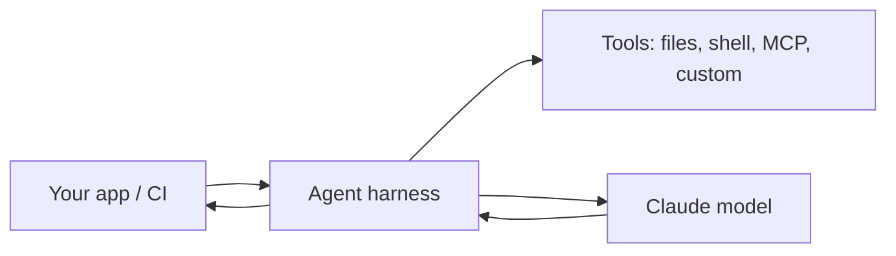

<LevelBadge level="advanced" />

<VerifyNote lastVerified="2026-06-20" source="https://docs.anthropic.com/en/docs/claude-code/sdk">
Nomes de SDK, nomes de pacotes e flags de modo headless evoluem — confirme na documentação oficial do Claude Agent SDK / Claude Code.
</VerifyNote>

O Claude Code não é apenas interativo. Você pode executá-lo de forma **headless** (não interativa, automatizável por scripts) e pode construir seus **próprios agentes** sobre o mesmo harness subjacente com o **Agent SDK**.

## Modo headless

Execute um único prompt de forma não interativa e capture a saída — perfeito para scripts, hooks de pre-commit e CI:

```bash
claude -p "Review the staged diff and list any bugs as a Markdown checklist"
```

Forneça a entrada via pipe, obtenha um resultado de volta. Combine com [permissões](/docs/claude-code/permissions) definidas em uma postura segura e não interativa para que nunca trave esperando aprovação — e **restrinja-o** para que uma execução automatizada não consiga tocar em segredos (veja [Fortalecendo Execuções Autônomas](/docs/security/hardening-autonomous-runs)).

Um uso clássico: um job de CI que faz o Claude revisar cada pull request — veja o [passo a passo de revisão de PR](/docs/walkthroughs/pr-review-action).

## O Agent SDK

O **Claude Agent SDK** (Python e TypeScript) permite construir agentes de produção sobre o mesmo loop que alimenta o Claude Code — uso de ferramentas, acesso a arquivos/shell, permissões, gerenciamento de contexto — mas integrado à *sua* aplicação.



Recorra a ele quando você tiver superado uma única chamada de API ou um loop feito à mão e quiser um runtime de agente completo. Para o espectro de opções — chamada única → workflow → agente personalizado → gerenciado — veja [Construindo Agentes sobre a API](/docs/api/building-agents).

## Headless/SDK vs interativo

| Modo | Para |
|---|---|
| Claude Code interativo | Desenvolvimento do dia a dia com um humano no loop |
| Headless (`claude -p`) | Scripts, pre-commit, execuções pontuais em CI |
| Agent SDK | Agentes de produção embutidos no seu software |

## Próximos passos

- [GitHub Action que Revisa Cada PR (passo a passo)](/docs/walkthroughs/pr-review-action)
- [Construindo Agentes sobre a API](/docs/api/building-agents)
- [Fortalecendo Execuções Autônomas](/docs/security/hardening-autonomous-runs)
