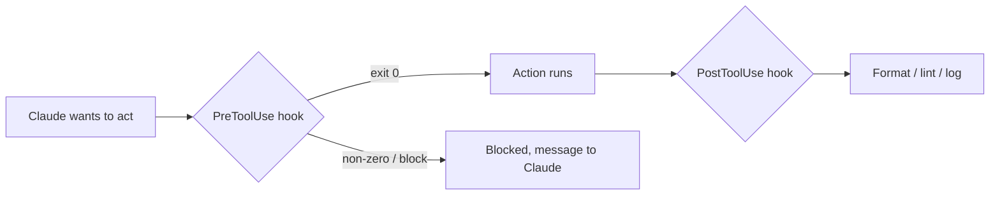

<LevelBadge level="advanced" />

<VerifyNote lastVerified="2026-06-20" source="https://docs.anthropic.com/en/docs/claude-code/hooks">
Os nomes exatos dos eventos de hook e o schema de configuração evoluem — confirme na documentação oficial de hooks antes de depender de um evento específico.
</VerifyNote>

Hooks são **comandos de shell que o Claude Code executa automaticamente** em pontos definidos do seu ciclo de vida. Onde as [permissões](/docs/claude-code/permissions) decidem *se* uma ação é permitida, os hooks permitem que *você* execute uma lógica determinística em torno dela — formatação, validação, registro de logs, gates. É assim que você torna o comportamento garantido em vez de "por favor, lembre-se de".

## Quando recorrer a um hook

- **Formatar / fazer lint automaticamente** após cada edição de arquivo (`PostToolUse`).
- **Bloquear** uma ação que viola uma regra antes que ela seja executada (`PreToolUse`).
- **Notificar ou registrar em log** quando uma sessão termina ou uma tarefa é concluída (`Stop`).
- **Injetar contexto** no início da sessão.

## Como funcionam

Você registra hooks em [`settings.json`](/docs/claude-code/settings), associando um **evento** (e, muitas vezes, um matcher de ferramenta). Quando o evento dispara, o Claude executa seu comando e lê o resultado — uma saída diferente de zero ou uma saída específica pode **bloquear** a ação e devolver uma mensagem ao Claude.

```json
{
  "hooks": {
    "PostToolUse": [
      {
        "matcher": "Edit|Write",
        "hooks": [
          { "type": "command", "command": "npx prettier --write \"$CLAUDE_FILE_PATH\"" }
        ]
      }
    ]
  }
}
```

O hook recebe contexto (por exemplo, o caminho do arquivo, o nome da ferramenta) via ambiente/stdin — veja a documentação para o payload exato, que varia por evento.

## O modelo mental



## Boas práticas

- **Mantenha os hooks rápidos e idempotentes** — eles rodam muito.
- **Falhe de forma ruidosa em problemas reais**, mas não bloqueie por questões cosméticas.
- **Trate a saída do hook como feedback para o Claude** — uma mensagem clara o ajuda a se autocorrigir.
- Hooks rodam com os privilégios do seu shell — revise qualquer hook que você não escreveu ([Revisando Código de Terceiros](/docs/security/reviewing-third-party-code)).

Modelos prontos para copiar e colar estão em [Receitas de Hooks e settings.json](/docs/templates/hooks-settings).

## Próximos passos

- [settings.json](/docs/claude-code/settings) · [Permissões](/docs/claude-code/permissions)
- [Skills](/docs/claude-code/skills) — expertise vs automação
- [Fortalecendo Execuções Autônomas](/docs/security/hardening-autonomous-runs)
