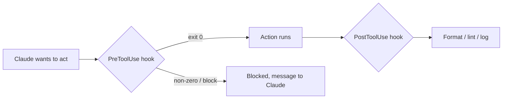

<LevelBadge level="advanced" />

<VerifyNote lastVerified="2026-06-23" source="https://code.claude.com/docs/en/hooks">
Os nomes exatos dos eventos de hook, o payload de stdin e o protocolo de bloqueio evoluem — confirme na documentação oficial de hooks antes de depender de um evento ou campo específico.
</VerifyNote>

Hooks são **comandos de shell que o Claude Code executa automaticamente** em pontos definidos do seu ciclo de vida. Onde as [permissões](/docs/claude-code/permissions) decidem *se* uma ação é permitida, os hooks permitem que *você* execute uma lógica determinística em torno dela — formatação, validação, registro de logs, gates. É assim que você torna o comportamento garantido em vez de "por favor, lembre-se de".

## Quando recorrer a um hook

- **Formatar / fazer lint automaticamente** após cada edição de arquivo (`PostToolUse`).
- **Bloquear** uma ação que viola uma regra antes que ela seja executada (`PreToolUse`).
- **Notificar ou registrar em log** quando uma sessão termina ou uma tarefa é concluída (`Stop`).
- **Injetar contexto** no início da sessão.

## Como funcionam

Você registra hooks em [`settings.json`](/docs/claude-code/settings), associando um **evento** (e, muitas vezes, um matcher de ferramenta). Quando o evento dispara, o Claude executa seu comando, passando um **payload JSON no stdin** (o nome da ferramenta, suas entradas, a sessão). O código de saída e a saída do seu comando decidem o que acontece em seguida.

```json
{
  "hooks": {
    "PostToolUse": [
      {
        "matcher": "Edit|Write",
        "hooks": [
          { "type": "command", "command": "jq -r '.tool_input.file_path' | xargs npx prettier --write" }
        ]
      }
    ]
  }
}
```

O hook acima lê o caminho do arquivo editado a partir do JSON de stdin (`.tool_input.file_path`) e o formata. Não presuma que uma variável de ambiente contém o caminho — **leia-o do stdin.** Placeholders de caminho úteis como `${CLAUDE_PROJECT_DIR}` *estão* disponíveis para localizar scripts.

## Como um hook bloqueia

Duas formas, dependendo do evento:

- **Código de saída 2** — o hook faz a ação falhar e o que quer que ele tenha escrito no **stderr** se torna a mensagem que o Claude vê. Simples e funciona para hooks de comando.
- **JSON no stdout (saída 0)** — retorne uma decisão estruturada. Para `PreToolUse`, isso é uma `permissionDecision` de `deny`; para `PostToolUse`/`Stop`/etc. é `{"decision": "block", "reason": "…"}`.

```bash
#!/usr/bin/env bash
# PreToolUse hook on the Bash tool: refuse to delete things.
command=$(jq -r '.tool_input.command' < /dev/stdin)
if [[ "$command" == rm\ * || "$command" == *"rm -rf"* ]]; then
  echo "Blocked: destructive 'rm' is not allowed by policy." >&2
  exit 2
fi
exit 0
```

## O modelo mental



## Boas práticas

- **Mantenha os hooks rápidos e idempotentes** — eles rodam muito.
- **Falhe de forma ruidosa em problemas reais**, mas não bloqueie por questões cosméticas.
- **Trate a saída do hook como feedback para o Claude** — uma mensagem clara o ajuda a se autocorrigir.
- Hooks rodam com os privilégios do seu shell — revise qualquer hook que você não escreveu ([Revisando Código de Terceiros](/docs/security/reviewing-third-party-code)).

## Erros comuns

- **Ler o caminho do arquivo a partir de uma variável de ambiente.** O caminho vive no JSON de stdin (`.tool_input.file_path`), não em `$CLAUDE_FILE_PATH`. Encaminhe o stdin através do `jq`.
- **Bloqueios silenciosos.** Se um hook `PreToolUse` sai com código 2 sem nada no stderr, o Claude é bloqueado, mas não sabe *por quê* e não consegue se adaptar. Sempre escreva uma razão clara.
- **Hooks lentos.** Um hook `PostToolUse` roda após *cada* edição correspondente. Um linter de 3 segundos faz toda a sessão parecer lenta — mantenha os hooks rápidos e, idealmente, atue apenas sobre o que mudou.
- **Matchers excessivamente amplos.** `matcher: ".*"` dispara em cada ferramenta. Restrinja com um nome exato, uma lista `Edit|Write`, ou o campo `if` por handler (ex.: `"if": "Bash(git push *)"`).
- **Confiar em hooks que você não escreveu.** Um hook executa shell arbitrário com os seus privilégios. Revise primeiro qualquer hook vindo de um plugin ou template — veja [Revisando Código de Terceiros](/docs/security/reviewing-third-party-code).

Modelos prontos para copiar e colar estão em [Receitas de Hooks e settings.json](/docs/templates/hooks-settings).

## Próximos passos

- [settings.json](/docs/claude-code/settings) · [Permissões](/docs/claude-code/permissions)
- [Skills](/docs/claude-code/skills) — expertise vs automação
- [Fortalecendo Execuções Autônomas](/docs/security/hardening-autonomous-runs)
