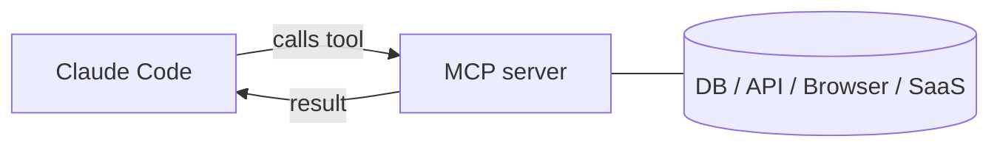

<LevelBadge level="advanced" />

<VerifyNote lastVerified="2026-06-20" source="https://docs.anthropic.com/en/docs/claude-code/mcp">
A sintaxe de configuração, os escopos e os transportes do MCP evoluem — confirme na documentação oficial de MCP do Claude Code e em modelcontextprotocol.io.
</VerifyNote>

O **Model Context Protocol (MCP)** é um padrão aberto para conectar a IA a ferramentas e dados externos. Um **servidor MCP** expõe capacidades (consultar um banco de dados, abrir um PR no GitHub, controlar um navegador); o Claude Code se conecta a ele e pode **chamar essas ferramentas** durante uma sessão. É assim que você estende o Claude para além do seu sistema de arquivos e shell.

## O formato disso



Você declara os servidores que o Claude pode usar; cada servidor publica um conjunto de ferramentas com schemas; o Claude as escolhe e chama como qualquer outra ferramenta.

## Transportes

- **stdio** — um processo local que o Claude inicia (ótimo para ferramentas/CLIs locais).
- **Remoto (HTTP/SSE)** — um servidor hospedado, frequentemente com OAuth.

## Configurando servidores

Os servidores são configurados (comumente em um `.mcp.json` e/ou via configurações) com um comando/URL e qualquer autenticação. Os escopos controlam onde um servidor está disponível (apenas para você ou compartilhado com o projeto). Veja [Configuração de MCP e Esqueletos de Servidor](/docs/templates/mcp-config) para modelos prontos para copiar e colar.

```json
{
  "mcpServers": {
    "github": { "command": "npx", "args": ["-y", "@modelcontextprotocol/server-github"] }
  }
}
```

## Confiança e segurança

:::warning Trate servidores MCP como instalar software
Um servidor MCP executa código e pode ler dados e tomar ações. Conecte apenas servidores em que você confia, dê a eles o **menor privilégio** necessário e lembre-se de que qualquer conteúdo externo que eles retornem pode carregar [injeção de prompt](/docs/security/prompt-injection). Revise servidores de terceiros primeiro — veja [Revisando Código de Terceiros](/docs/security/reviewing-third-party-code).
:::

## MCP também nos apps

O MCP também alimenta os **Conectores** nos apps do Claude — mesmo padrão, superfície diferente. Veja [Conectores (MCP) nos Apps](/docs/claude-app/connectors) e, para a API, [MCP e Conexão com Ferramentas](/docs/api/mcp).

## Próximos passos

- [Construa e Conecte Seu Primeiro Servidor MCP (passo a passo)](/docs/walkthroughs/first-mcp-server)
- [Configuração de MCP e Esqueletos de Servidor](/docs/templates/mcp-config)
- [Protegendo Agentes e Ferramentas](/docs/security/securing-agents)
