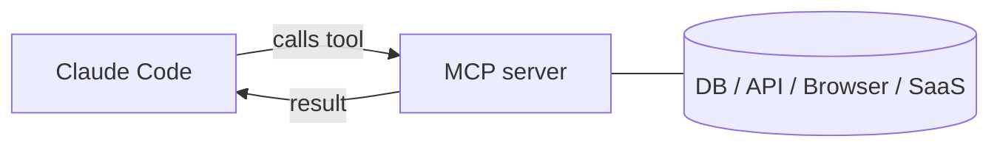

<LevelBadge level="advanced" />

<VerifyNote lastVerified="2026-06-23" source="https://code.claude.com/docs/en/mcp">
Os comandos `claude mcp`, os escopos de configuração e os transportes evoluem — confirme na documentação oficial de MCP do Claude Code e em modelcontextprotocol.io.
</VerifyNote>

O **Model Context Protocol (MCP)** é um padrão aberto para conectar a IA a ferramentas e dados externos. Um **servidor MCP** expõe capacidades (consultar um banco de dados, abrir um PR no GitHub, controlar um navegador); o Claude Code se conecta a ele e pode **chamar essas ferramentas** durante uma sessão. É assim que você estende o Claude para além do seu sistema de arquivos e shell.

## O formato disso



Você declara os servidores que o Claude pode usar; cada servidor publica um conjunto de ferramentas com schemas; o Claude as escolhe e chama como qualquer outra ferramenta.

## Transportes

- **stdio** — um processo local que o Claude inicia (ótimo para ferramentas/CLIs locais).
- **Remoto (HTTP/SSE)** — um servidor hospedado, frequentemente com OAuth.

## Configurando servidores

O caminho mais rápido é o comando `claude mcp add` — ele escreve a configuração para você:

```bash
# Um servidor stdio local (tudo após -- é o comando de inicialização)
claude mcp add github -- npx -y @modelcontextprotocol/server-github

# Um servidor HTTP remoto, compartilhado com todos no projeto
claude mcp add --transport http --scope project linear https://mcp.linear.app/mcp
```

Por baixo dos panos, isso é apenas JSON. Um servidor com escopo **project** vai para um `.mcp.json` na raiz do repositório — faça o commit dele e toda a sua equipe recebe as mesmas ferramentas:

```json
{
  "mcpServers": {
    "github": { "command": "npx", "args": ["-y", "@modelcontextprotocol/server-github"] }
  }
}
```

**O escopo decide quem enxerga o servidor:**

| Escopo | Onde fica | Use para |
|---|---|---|
| `local` (padrão) | suas configurações de usuário, apenas neste projeto | experimentos pessoais, segredos |
| `project` | `.mcp.json` no repositório (com commit) | ferramentas que toda a equipe deve compartilhar |
| `user` | suas configurações de usuário, todos os projetos | servidores que você quer em todo lugar |

Execute `claude mcp list` para ver o que está conectado e `/mcp` dentro de uma sessão para inspecionar ferramentas e autenticar servidores remotos. Veja [Configuração de MCP e Esqueletos de Servidor](/docs/templates/mcp-config) para modelos prontos para copiar e colar.

## Exemplo prático: dê ao Claude seu banco de dados

Digamos que você queira que o Claude responda perguntas consultando um Postgres local em vez de você colar os resultados das consultas. Adicione o servidor (escopo project, para que os colegas o herdem):

```bash
claude mcp add --scope project db -- npx -y @modelcontextprotocol/server-postgres "postgresql://localhost/app"
```

Agora, em uma sessão, você pode perguntar: *"Quantos usuários se cadastraram na semana passada? Consulte o BD."* O Claude chama a ferramenta `query` do servidor, recebe as linhas de volta e responde — sem o ciclo de copiar e colar. Como o escopo é project, um colega que fizer pull do repositório ganha a mesma capacidade no momento em que abrir o Claude Code. Mantenha a string de conexão somente leitura se você quiser apenas leituras.

## Confiança e segurança

:::warning Trate servidores MCP como instalar software
Um servidor MCP executa código e pode ler dados e tomar ações. Conecte apenas servidores em que você confia, dê a eles o **menor privilégio** necessário e lembre-se de que qualquer conteúdo externo que eles retornem pode carregar [injeção de prompt](/docs/security/prompt-injection). Revise servidores de terceiros primeiro — veja [Revisando Código de Terceiros](/docs/security/reviewing-third-party-code).
:::

## MCP também nos apps

O MCP também alimenta os **Conectores** nos apps do Claude — mesmo padrão, superfície diferente. Veja [Conectores (MCP) nos Apps](/docs/claude-app/connectors) e, para a API, [MCP e Conexão com Ferramentas](/docs/api/mcp).

## Erros comuns

- **Escopo errado.** Um servidor adicionado no escopo `local` não aparecerá para os colegas; um que você queria apenas para si mesmo não deveria ter commit no escopo `project`. Escolha deliberadamente.
- **Servidores demais, ferramentas demais.** Cada servidor conectado adiciona os schemas de suas ferramentas ao contexto. Conecte o que a tarefa exige, não todo o seu catálogo.
- **Conexões com privilégios excessivos.** Dê a um servidor de banco de dados um papel somente leitura, a menos que o Claude realmente precise escrever. O MCP torna as capacidades reais — restrinja-as.
- **Esquecer o risco de injeção.** Qualquer coisa que um servidor retorne (uma página web, o corpo de uma issue, uma linha) é texto não confiável que pode carregar [injeção de prompt](/docs/security/prompt-injection). Não conecte um servidor poderoso com capacidade de escrita ao lado de um servidor não confiável com capacidade de leitura sem pensar bem nisso.

## Próximos passos

- [Construa e Conecte Seu Primeiro Servidor MCP (passo a passo)](/docs/walkthroughs/first-mcp-server)
- [Configuração de MCP e Esqueletos de Servidor](/docs/templates/mcp-config)
- [Protegendo Agentes e Ferramentas](/docs/security/securing-agents)
