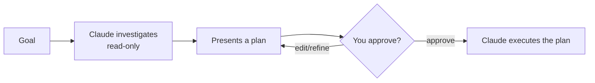

<LevelBadge level="beginner" />

<VerifyNote lastVerified="2026-06-20" source="https://code.claude.com/docs/en">
A forma como você entra no Modo Plano (atalho/flag) pode mudar entre versões — verifique a documentação oficial do Claude Code.
</VerifyNote>

O **Modo Plano** torna o Claude Code **somente leitura**: ele pode explorar sua base de código, executar buscas e raciocinar — mas **não vai editar arquivos nem executar comandos que alterem o estado**. Em vez disso, ele produz um plano e aguarda sua aprovação.

## Por que é a forma mais segura de começar

Para qualquer coisa grande, arriscada ou desconhecida, você quer ver *o que* o Claude pretende fazer antes que ele toque no seu repositório. O Modo Plano separa **pensar** de **fazer**:

Você pega suposições erradas *antes* que elas virem código errado.

## Quando usá-lo

- **Sempre** para mudanças grandes ou em múltiplos arquivos, migrações ou refatorações.
- Quando estiver trabalhando em uma base de código que você ainda não conhece totalmente.
- Quando você quiser um plano revisável para compartilhar com um colega de equipe.

Para edições pequenas e óbvias, você pode pulá-lo — mas, na dúvida, planeje primeiro.

## Como funciona na prática

1. Entre no Modo Plano e declare seu objetivo.
2. O Claude lê os arquivos relevantes e faz perguntas esclarecedoras.
3. Ele retorna um plano passo a passo: arquivos a mudar, a abordagem e como verificar.
4. Você aprova (ou refina). Só então ele muda para fazer as alterações.

:::tip Combine com o CLAUDE.md
Um bom [CLAUDE.md](/docs/claude-code/claude-md) torna os planos mais precisos — o Claude planeja já tendo em mente suas convenções e proteções.
:::

## Modo Plano vs Permissões

Eles resolvem problemas diferentes e funcionam juntos:

- **Modo Plano** = "investigue e proponha, não aja ainda." (Esta página.)
- **[Permissões](/docs/claude-code/permissions)** = uma vez agindo, *quais* ações são permitidas sem perguntar.

## Próximos passos

- [Permissões e Modos de Permissão](/docs/claude-code/permissions)
- [Gerenciamento de Contexto](/docs/claude-code/context-management) — mantenha sessões longas eficazes
- [Passo a passo: Personalize o Claude Code para um repositório real](/docs/walkthroughs/customize-claude-code)
