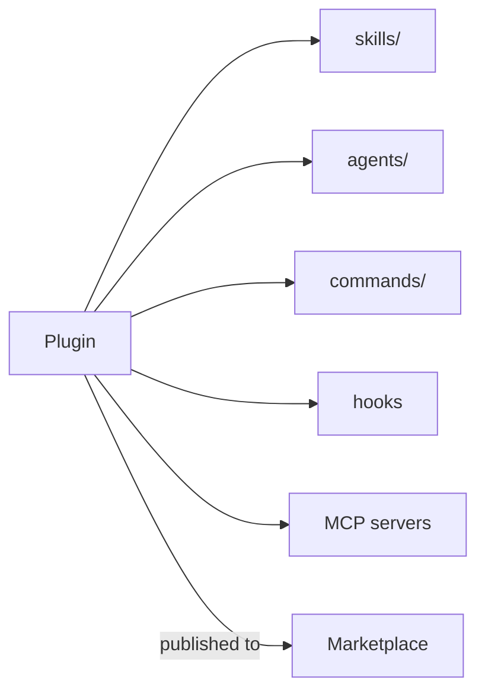

<LevelBadge level="advanced" />

<VerifyNote lastVerified="2026-06-20" source="https://docs.anthropic.com/en/docs/claude-code">
A estrutura de plugins e a mecânica de marketplaces estão evoluindo rapidamente — confirme os detalhes na documentação oficial do Claude Code.
</VerifyNote>

Um **plugin** agrupa várias personalizações — [skills](/docs/claude-code/skills), [subagentes](/docs/claude-code/subagents), [comandos slash](/docs/claude-code/slash-commands), [hooks](/docs/claude-code/hooks) e [servidores MCP](/docs/claude-code/mcp) — em uma única unidade versionada e instalável. Um **marketplace** é um catálogo de plugins que as pessoas podem descobrir e instalar.

## Por que os plugins importam

- **Distribua um kit de ferramentas da equipe em um só passo.** Em vez de pedir que todos copiem cinco arquivos, publique um plugin; os colegas o instalam e obtêm os mesmos comandos, hooks, agentes e conexões MCP.
- **Versionamento.** Atualize o plugin e todos recebem a nova versão.
- **Distribuição.** Um marketplace torna seu kit de ferramentas (ou o de outros) descobrível.

## O que normalmente há dentro

Um plugin é uma pasta estruturada (um manifesto mais as peças que ele entrega). No mínimo, ele pode conter apenas skills; no máximo, o conjunto completo acima. Mantenha cada plugin **coeso** — um plugin de "convenções da equipe", um plugin de "kit Python" — em vez de uma miscelânea.

## Confie antes de instalar

:::warning Plugins podem entregar código executável
Hooks e servidores MCP em um plugin rodam com os seus privilégios. Instale a partir de fontes em que você confia e revise primeiro o que um plugin faz — veja [Revisando Código de Terceiros](/docs/security/reviewing-third-party-code).
:::

## Um caminho para escalar sua configuração

A progressão natural: um `CLAUDE.md` → algumas [skills](/docs/claude-code/skills) e [comandos](/docs/claude-code/slash-commands) → agrupá-los em um plugin → publicar em um marketplace para sua equipe ou a comunidade. Esse último passo faz parte de como o AILmanac quer ajudar o ecossistema a crescer.

## Próximos passos

- [Skills](/docs/claude-code/skills) · [Subagentes](/docs/claude-code/subagents) · [MCP](/docs/claude-code/mcp)
- [Revisando Código de Terceiros](/docs/security/reviewing-third-party-code)
- Os [pacotes de skills](/docs/templates/skills) do AILmanac
