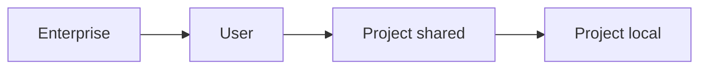

<LevelBadge level="intermediate" />

<VerifyNote lastVerified="2026-06-20" source="https://docs.anthropic.com/en/docs/claude-code/settings">
As chaves exatas e as localizações dos arquivos são melhor confirmadas na documentação oficial de configurações do Claude Code.
</VerifyNote>

O `settings.json` é onde mora a configuração do Claude Code — [permissões](/docs/claude-code/permissions), [hooks](/docs/claude-code/hooks), variáveis de ambiente, padrões de modelo e mais. Entender as **camadas** é a chave.

## As camadas (mais global → mais específica)

Camadas posteriores (mais específicas) substituem as anteriores:

1. **Enterprise / gerenciada** — política definida por um administrador da organização. Vence sobre tudo.
2. **Usuário** — `~/.claude/settings.json`. Seus padrões em todos os projetos.
3. **Projeto (compartilhada)** — `.claude/settings.json`, versionada no repositório. Para toda a equipe.
4. **Projeto (pessoal)** — `.claude/settings.local.json`, ignorada pelo git. Suas substituições para este repositório.

:::tip Versione o arquivo compartilhado, ignore o local
Coloque as convenções da equipe em `.claude/settings.json` (versionado). Coloque ajustes pessoais e caminhos específicos da máquina em `.claude/settings.local.json` (ignorado pelo git). Isso mantém a equipe consistente sem impor suas preferências aos outros.
:::

## O que você comumente vai definir

- **`permissions`** — regras allow/ask/deny. Veja [Permissões](/docs/claude-code/permissions).
- **`hooks`** — comandos que rodam em eventos do ciclo de vida. Veja [Hooks](/docs/claude-code/hooks).
- **`env`** — variáveis de ambiente para a sessão.
- **Padrões de modelo / comportamento** — por exemplo, o modelo preferido.

## Editando com segurança

- Mantenha um JSON válido (uma vírgula sobrando vai quebrá-lo).
- Prefira regras de permissão **restritas** a regras amplas.
- Nunca coloque segredos em um arquivo versionado — use referências de `env` ou um gerenciador de segredos.

Arquivos iniciais prontos para copiar estão em [Receitas de Hooks e settings.json](/docs/templates/hooks-settings).

## Próximos passos

- [Permissões e Modos de Permissão](/docs/claude-code/permissions)
- [Hooks: Automação Determinística](/docs/claude-code/hooks)
- [Comandos Slash Personalizados](/docs/claude-code/slash-commands)
