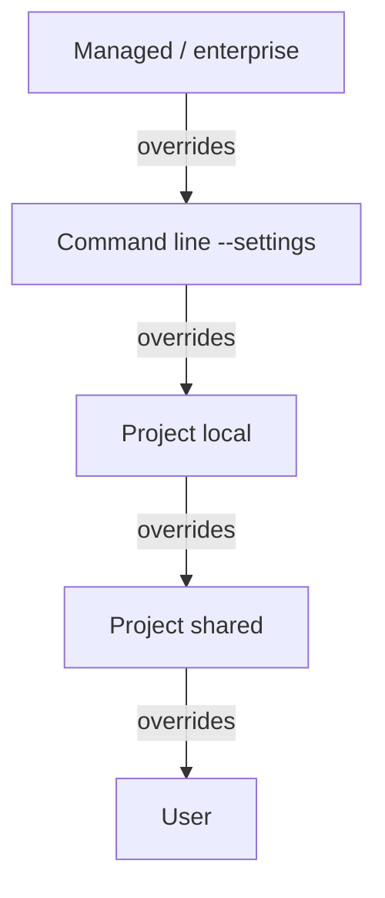

<LevelBadge level="intermediate" />

<VerifyNote lastVerified="2026-09-23" source="https://code.claude.com/docs/en/settings">
Pilha de precedência de cinco camadas (gerenciado → linha de comando → projeto local → projeto compartilhado → usuário) e a regra "variáveis de ambiente não são uma camada" da página oficial [Settings files and precedence](https://code.claude.com/docs/en/settings). As substituições por chave estão listadas na [referência de configurações](https://code.claude.com/docs/en/settings-reference).
</VerifyNote>

O `settings.json` é onde mora a configuração do Claude Code — [permissões](/docs/claude-code/permissions), [hooks](/docs/claude-code/hooks), variáveis de ambiente, padrões de modelo e mais. Entender as **camadas** é a chave.

## As camadas (maior precedência primeiro)

Quando a mesma chave é definida em mais de um lugar, o Claude Code usa o valor da camada mais alta que a define:

1. **Gerenciado / enterprise** — `managed-settings.json`, uma política MDM ou as configurações gerenciadas pelo servidor no console do claude.ai. Nada que você definir as substitui (fora algumas exceções sensíveis à segurança).
2. **Linha de comando** — `claude --settings '<json-or-path>'`, apenas para uma sessão. Fica acima de qualquer arquivo, exceto o gerenciado, e não escreve em arquivo algum.
3. **Projeto (pessoal)** — `.claude/settings.local.json`, ignorado pelo git. Suas substituições para este repositório.
4. **Projeto (compartilhado)** — `.claude/settings.json`, versionado no repositório. Para todo o time.
5. **Usuário** — `~/.claude/settings.json`. Seus padrões em todos os projetos.

```mermaid
flowchart TB
  M[Managed / enterprise] -->|overrides| C[Command line --settings]
  C -->|overrides| L[Project local]
  L -->|overrides| P[Project shared]
  P -->|overrides| U[User]
```

:::note Variáveis de ambiente não são uma camada
Elas ficam fora desta pilha e são resolvidas chave a chave. Por exemplo, `ANTHROPIC_MODEL` prevalece sobre a chave `model` de qualquer arquivo, enquanto `ANTHROPIC_DEFAULT_MODEL` só se aplica quando nenhum arquivo define `model`.
:::

:::tip Versione o arquivo compartilhado, ignore o local
Coloque as convenções da equipe em `.claude/settings.json` (versionado). Coloque ajustes pessoais e caminhos específicos da máquina em `.claude/settings.local.json` (ignorado pelo git). Isso mantém a equipe consistente sem impor suas preferências aos outros.
:::

## O que você comumente vai definir

- **`permissions`** — regras allow/ask/deny. Veja [Permissões](/docs/claude-code/permissions).
- **`hooks`** — comandos que rodam em eventos do ciclo de vida. Veja [Hooks](/docs/claude-code/hooks).
- **`env`** — variáveis de ambiente para a sessão.
- **Padrões de modelo / comportamento** — por exemplo, o modelo preferido.

## Editando com segurança

- Mantenha um JSON válido (uma vírgula sobrando vai quebrá-lo).
- Prefira regras de permissão **restritas** a regras amplas.
- Nunca coloque segredos em um arquivo versionado — use referências de `env` ou um gerenciador de segredos.

Arquivos iniciais prontos para copiar estão em [Receitas de Hooks e settings.json](/docs/templates/hooks-settings).

## Próximos passos

- [Permissões e Modos de Permissão](/docs/claude-code/permissions)
- [Hooks: Automação Determinística](/docs/claude-code/hooks)
- [Comandos Slash Personalizados](/docs/claude-code/slash-commands)
