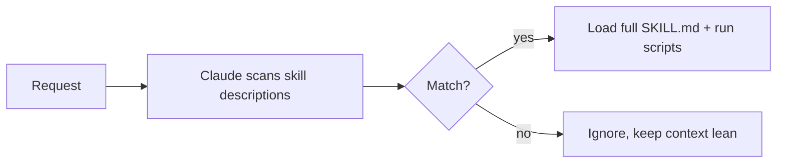

<LevelBadge level="advanced" />

<VerifyNote lastVerified="2026-06-20" source="https://docs.anthropic.com/en/docs/claude-code/skills">
O layout de arquivo de skill e onde as skills rodam (Claude Code, Claude.ai, Cowork) estão evoluindo — confirme na documentação oficial de Skills.
</VerifyNote>

Uma **Skill** empacota expertise — instruções mais scripts e recursos opcionais — que o Claude carrega **apenas quando relevante**. Em vez de enfiar tudo no [CLAUDE.md](/docs/claude-code/claude-md), você dá ao Claude uma biblioteca de capacidades que ele puxa sob demanda.

## Anatomia

Uma skill é uma pasta com um `SKILL.md`: frontmatter YAML + instruções.

```markdown
---
name: pdf-forms
description: Use when the user needs to fill, read, or generate PDF forms.
---

# PDF Forms
Steps and rules for working with PDF forms…
(optionally reference scripts/ or resources/ in this folder)
```

A **`description` é o gatilho** — o Claude a lê para decidir *quando* ativar a skill. Escreva-a como "Use quando…", específica o suficiente para que ela carregue no momento certo e não em outros casos.

## Divulgação progressiva (por que as skills escalam)

O Claude não carrega o corpo completo de cada skill de antemão — ele vê o leve `name` + `description` e só puxa as instruções completas (e roda scripts) quando uma solicitação corresponde. Isso mantém o contexto enxuto mesmo com muitas skills instaladas.



## Onde elas ficam

- Pessoal: `~/.claude/skills/<name>/SKILL.md`
- Projeto (compartilhável): `.claude/skills/<name>/SKILL.md`
- Empacotada em um [plugin](/docs/claude-code/plugins-marketplaces) para distribuição na equipe.

O AILmanac fornece [7 pacotes de skills prontos](/docs/templates/skills) — copie um para experimentar.

## Skill vs comando vs subagente vs MCP

| Ferramenta | O que é | Quem aciona: você vs Claude |
|---|---|---|
| [Comando slash](/docs/claude-code/slash-commands) | Um prompt salvo | **Você** o invoca |
| **Skill** | Expertise sob demanda + scripts | O **Claude** a carrega quando relevante |
| [Subagente](/docs/claude-code/subagents) | Um agente delegado com seu próprio contexto | O Claude delega |
| [MCP](/docs/claude-code/mcp) | Uma conexão com ferramentas/dados externos | Fornece ferramentas para chamar |

## Próximos passos

- [Escreva Sua Primeira Skill (passo a passo)](/docs/walkthroughs/first-skill)
- [Modelos de SKILL.md](/docs/templates/skills)
- [Plugins e Marketplaces](/docs/claude-code/plugins-marketplaces)
