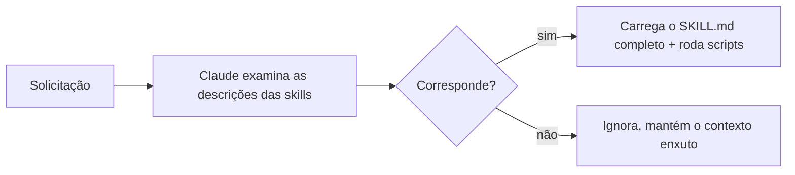

<LevelBadge level="advanced" />

<VerifyNote lastVerified="2026-06-23" source="https://code.claude.com/docs/en/skills">
O layout de arquivos de uma Skill, a divulgação progressiva e onde as skills rodam (Claude Code, Claude.ai, Cowork) estão evoluindo — confirme na documentação oficial de Skills.
</VerifyNote>

Uma **Skill** empacota expertise — instruções mais scripts e recursos opcionais — que o Claude carrega **apenas quando relevante**. Em vez de enfiar tudo no [CLAUDE.md](/docs/claude-code/claude-md), você dá ao Claude uma biblioteca de capacidades que ele puxa sob demanda.

## Anatomia

Uma skill é uma pasta com um `SKILL.md`: frontmatter YAML + instruções.

```markdown
---
name: pdf-forms
description: Use when the user needs to fill, read, or generate PDF forms.
---

# PDF Forms
Steps and rules for working with PDF forms…
(optionally reference scripts/ or resources/ in this folder)
```

A **`description` é o gatilho** — o Claude a lê para decidir *quando* ativar a skill. Escreva-a como "Use when…", específica o suficiente para que ela carregue no momento certo e não em outros casos.

## Divulgação progressiva (por que as skills escalam)

O Claude não carrega o corpo completo de cada skill de antemão — ele vê o leve `name` + `description` e só puxa as instruções completas (e roda scripts) quando uma solicitação corresponde. Isso mantém o contexto enxuto mesmo com muitas skills instaladas.



## Onde elas ficam

- Pessoal: `~/.claude/skills/<name>/SKILL.md`
- Projeto (compartilhável): `.claude/skills/<name>/SKILL.md`
- Empacotada em um [plugin](/docs/claude-code/plugins-marketplaces) para distribuição na equipe.

O AILmanac fornece [7 pacotes de skills prontos](/docs/templates/skills) — copie um para experimentar.

## Exemplo prático: uma skill que aciona a si mesma

Crie `~/.claude/skills/release-notes/SKILL.md`:

```markdown
---
name: release-notes
description: Use when the user asks to write release notes or a changelog from git history.
---

# Release Notes
1. Run `git log <last-tag>..HEAD --oneline` to get the commits.
2. Group them into Features / Fixes / Breaking changes.
3. Write user-facing notes — what changed for *users*, not commit messages.
4. Output Markdown ready to paste into a GitHub release.
```

Mais tarde você digita: *"Rascunhe as notas de versão desde a v1.4."* O Claude nunca teve essas etapas no contexto — mas a solicitação corresponde à `description`, então ele puxa o `SKILL.md` completo, roda o `git log` e produz notas agrupadas. Você não invocou nada pelo nome; a **description fez o roteamento**. Adicione um arquivo `scripts/` na mesma pasta e a skill pode executá-lo como parte do passo 1.

## Skill vs comando vs subagente vs MCP

| Ferramenta | O que é | Quem aciona: você vs Claude |
|---|---|---|
| [Comando slash](/docs/claude-code/slash-commands) | Um prompt salvo | **Você** o invoca |
| **Skill** | Expertise sob demanda + scripts | O **Claude** a carrega quando relevante |
| [Subagente](/docs/claude-code/subagents) | Um agente delegado com seu próprio contexto | O Claude delega |
| [MCP](/docs/claude-code/mcp) | Uma conexão com ferramentas/dados externos | Fornece ferramentas para chamar |

Regra prática: **você** quer dispará-la sob demanda → comando slash. O **Claude** deve conhecer o procedimento e aplicá-lo quando relevante → skill. O trabalho deve acontecer em um contexto separado → subagente. Você precisa alcançar um sistema externo → MCP.

## Erros comuns

- **Uma descrição que não aciona.** "Helps with PDFs" é vago demais; "Use when the user needs to fill, read, or generate PDF forms" diz ao Claude exatamente quando carregá-la. A descrição é todo o mecanismo de ativação — escreva-a para correspondência, não para humanos.
- **Colocar tudo no CLAUDE.md em vez disso.** O [CLAUDE.md](/docs/claude-code/claude-md) carrega em *toda* sessão e custa contexto sempre; uma skill carrega *apenas quando relevante*. Mova procedimentos situacionais para skills e mantenha o CLAUDE.md para regras de projeto que são sempre verdadeiras.
- **Uma única skill gigante.** Muitas skills pequenas e descritas com precisão roteiam melhor do que uma que tenta abarcar tudo — a divulgação progressiva só ajuda se cada descrição for específica.
- **Esquecer que é compartilhável.** Uma skill de projeto em `.claude/skills/` com commit no git dá a capacidade a toda a equipe; uma pessoal em `~/.claude/skills/` permanece sua.

## Próximos passos

- [Escreva Sua Primeira Skill (passo a passo)](/docs/walkthroughs/first-skill)
- [Modelos de SKILL.md](/docs/templates/skills)
- [Plugins e Marketplaces](/docs/claude-code/plugins-marketplaces)
