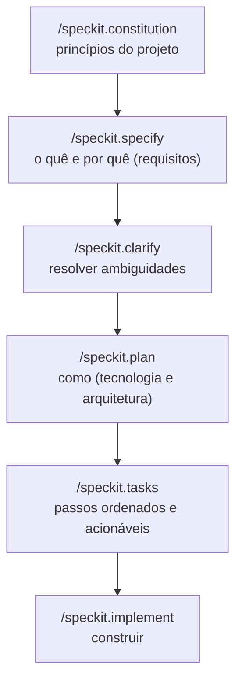

<LevelBadge level="intermediate" />

# Desenvolvimento Orientado a Especificações com Spec Kit

O vibe coding — "construa um dashboard para mim", aceite o que vier de volta — funciona muito bem até a feature crescer. Aí o agente começa a desviar: ele esquece uma decisão anterior, reinventa uma função ou entrega algo que tecnicamente roda mas não é o que você queria. O **Desenvolvimento Orientado a Especificações (SDD, Spec-Driven Development)** é a solução que pegou entre a comunidade de agentic-coding em 2026: em vez de tratar o prompt como descartável, você faz de uma **especificação escrita e revisável a fonte da verdade** e deixa o agente gerar código *a partir* dela.

O **[Spec Kit](https://github.com/github/spec-kit)**, de código aberto do GitHub, transforma essa ideia em um fluxo de trabalho concreto que você pode executar dentro do Claude Code hoje.

<Callout type="objectives" items={["Entender o que é o desenvolvimento orientado a especificações e o problema que ele resolve", "Percorrer as fases do Spec Kit: constitution → specify → plan → tasks → implement", "Instalar a CLI Specify e integrá-la ao Claude Code", "Conhecer os portões de qualidade opcionais (clarify, analyze, checklist)", "Decidir quando o SDD vale o overhead e quando pular"]} />

<VerifyNote lastVerified="2026-06-28" source="https://github.com/github/spec-kit">
O Spec Kit está evoluindo rápido (~116k★, licenciado sob MIT). Os nomes dos comandos, a flag de seleção de agente do `specify init` e as ferramentas suportadas mudam entre as releases — confirme o quickstart atual no README do repositório antes de depender de uma sintaxe exata. Os nomes dos slash commands abaixo usam o namespace `/speckit.*` introduzido em releases recentes.
</VerifyNote>

## Por que especificações, não apenas prompts

Um prompt some no momento em que o turno termina. Uma **especificação é um artefato**: ela pode ser lida, revisada em um PR, corrigida e reexecutada. Essa única mudança corrige as três formas pelas quais grandes builds agênticos dão errado:

- **Desvio (drift)** — o agente contradiz uma decisão anterior porque nada foi registrado. A especificação é a memória.
- **Ambiguidade** — "deixe bonito" significa dez coisas diferentes. Forçar os requisitos para a prosa expõe as lacunas *antes* de o código existir, onde elas são baratas de corrigir.
- **Diffs não revisáveis** — um PR gerado de 2.000 linhas é difícil de avaliar. Uma especificação + plano revisados tornam o diff *esperado* em vez de surpreendente.

O modelo mental: **a intenção é a coisa de alto valor e durável; o código é um artefato downstream e regenerável.** O SDD é o primo disciplinado do próprio [Plan Mode](/docs/claude-code/plan-mode) do Claude Code — planeje primeiro, construa depois — ampliado para uma feature inteira e persistido em arquivos no seu repositório.

## O fluxo de trabalho do Spec Kit

O Spec Kit estrutura uma feature como um pequeno pipeline de slash commands. Cada um escreve artefatos Markdown no seu repositório (em `.specify/`), de modo que cada fase é inspecionável e versionada.

<Steps items={[{title: "Constitution", body: "Rode /speckit.constitution uma vez por projeto. Ele escreve princípios norteadores — estilo de código, padrão de testes, não-negociáveis de arquitetura — em .specify/memory/constitution.md. Toda fase posterior é verificada contra ele, então este é seu guarda-corpo durável (pense nele como um CLAUDE.md focado em princípios)."}, {title: "Specify", body: "Rode /speckit.specify e descreva O QUÊ você está construindo e POR QUÊ — user stories, requisitos, critérios de sucesso. Deliberadamente NÃO a stack tecnológica. O agente produz uma especificação estruturada que você lê e corrige antes de prosseguir."}, {title: "Plan", body: "Rode /speckit.plan com suas escolhas técnicas — framework, armazenamento de dados, restrições. Agora o COMO é escrito: arquitetura, componentes e como eles satisfazem a especificação. As decisões técnicas ficam aqui, não na especificação, para que a especificação permaneça agnóstica de implementação."}, {title: "Tasks", body: "Rode /speckit.tasks para quebrar o plano em uma lista numerada e ordenada de passos pequenos, revisáveis individualmente. É isso que torna o build auditável — você pode ver a sequência antes de qualquer código ser escrito."}, {title: "Implement", body: "Rode /speckit.implement e o agente executa a lista de tarefas, construindo a feature contra o plano e a constitution. Como cada fase anterior foi revisada, o diff resultante é esperado, não uma surpresa."}]} />

### Portões de qualidade opcionais

Mais três comandos apertam o ciclo quando uma feature é de alto risco:

- **`/speckit.clarify`** — interroga a especificação em busca de áreas pouco especificadas e faz perguntas direcionadas a você *antes* do planejamento. Melhor rodar logo após o `specify`.
- **`/speckit.analyze`** — faz uma verificação cruzada da especificação, do plano e das tarefas em busca de consistência e lacunas de cobertura.
- **`/speckit.checklist`** — gera uma lista de validação para que "concluído" seja definido e testável.

<Callout type="tip" items={["Rode /speckit.clarify antes de /speckit.plan — corrigir ambiguidade é mais barato antes de a arquitetura ser definida.", "Trate cada artefato gerado como um PR: leia-o, corrija-o e só então avance para a próxima fase.", "Faça commit dos artefatos de .specify/ — eles são o registro revisável da intenção por trás do código."]} />

## Coloque para rodar com o Claude Code

O Spec Kit traz uma CLI, **Specify**, que faz o scaffolding dos slash commands no seu projeto. Ela suporta mais de 30 agentes de codificação, o Claude Code entre eles.

<Steps items={[{title: "Instalar a CLI Specify", body: "Use o uv para instalá-la a partir do repositório. (Python + uv necessários.)"}, {title: "Inicializar um projeto", body: "Faça o scaffolding da estrutura .specify/ e dos comandos do agente. Rode o init em um repositório novo ou existente; quando solicitado, escolha o Claude Code como seu agente (ou passe a flag de integração atual do README)."}, {title: "Abrir o Claude Code e verificar os comandos", body: "Inicie o claude na pasta do projeto. Você saberá que está integrado quando /speckit.constitution, /speckit.specify, /speckit.plan, /speckit.tasks e /speckit.implement aparecerem como slash commands."}]} />

<PromptCard title="Install the Specify CLI (uv)">{`uv tool install specify-cli --from git+https://github.com/github/spec-kit.git`}</PromptCard>

<PromptCard title="Scaffold spec-driven workflow into a project">{`# new project
specify init my-feature

# or in the current repo
specify init --here`}</PromptCard>

<PromptCard title="Then, inside Claude Code, run the pipeline">{`/speckit.constitution Establish principles: TypeScript strict, tests for every public function, no secrets in code.
/speckit.specify Build a CSV export for the reports page: users pick a date range and download a CSV of matching rows.
/speckit.clarify
/speckit.plan Next.js App Router, server action for the query, stream the CSV; no new dependencies.
/speckit.tasks
/speckit.implement`}</PromptCard>

<Callout type="warning" items={["A flag exata de seleção de agente do specify init muda entre releases — consulte o quickstart do README em vez de copiar uma flag às cegas.", "O SDD não elimina a necessidade de verificar: leia o código gerado e rode-o. A especificação torna o diff revisável, não automaticamente correto.", "Nunca coloque segredos ou credenciais na especificação, no plano ou na constitution — eles entram no commit como qualquer outro arquivo."]} />

## Quando usar (e quando não)

O SDD troca cerimônia inicial por controle. Essa troca vale a pena quando o trabalho é grande, ambíguo ou precisa ser revisado por outras pessoas — e é puro overhead quando não é.

<Callout type="info" items={["Recorra ao SDD: features greenfield, builds de múltiplos arquivos, qualquer coisa que um colega de time precise revisar ou trabalho que você vai entregar a uma frota de subagentes.", "Pule o SDD: scripts pontuais, correções minúsculas, código exploratório descartável — um prompt simples ou o Plan Mode é mais rápido.", "Brownfield também funciona: aponte o /speckit.specify para um aprimoramento de uma base de código existente, não apenas para projetos novos."]} />

<Flashcards title="SDD at a glance" cards={[{front: "Qual é a fonte da verdade no SDD?", back: "A especificação escrita. O código é um artefato regenerável downstream dela."}, {front: "O que o /speckit.constitution faz?", back: "Escreve princípios duráveis do projeto (estilo, padrão de testes, regras de arquitetura) contra os quais toda fase posterior é verificada."}, {front: "Onde ficam as decisões de stack tecnológica?", back: "No /speckit.plan — não na especificação. A especificação permanece agnóstica de implementação (o quê e por quê); o plano é o como."}, {front: "O que torna um build do Spec Kit auditável?", back: "/speckit.tasks produz uma lista de tarefas ordenada e revisável antes de qualquer código ser escrito, e cada fase escreve artefatos Markdown inspecionáveis."}, {front: "Quando você NÃO deveria usar o SDD?", back: "Scripts pontuais, correções minúsculas ou exploração descartável — a cerimônia custa mais do que economiza."}]} />

## Teste-se

<Quiz title="Check yourself" questions={[{q: "Qual é a ideia central do desenvolvimento orientado a especificações?", options: ["Escrever prompts pontuais mais detalhados", "Fazer de uma especificação revisável a fonte da verdade e gerar código a partir dela", "Pular o planejamento e deixar o agente improvisar"], answer: 1, explain: "O SDD trata a intenção como o artefato durável e de alto valor, e o código como uma saída downstream e regenerável — o oposto do vibe coding de prompt descartável."}, {q: "Qual fase do Spec Kit deve capturar a stack tecnológica e a arquitetura?", options: ["/speckit.specify", "/speckit.plan", "/speckit.constitution"], answer: 1, explain: "specify descreve O QUÊ e POR QUÊ (agnóstico de implementação); plan é onde o COMO — framework, armazenamento de dados, arquitetura — é decidido."}, {q: "Quando o desenvolvimento orientado a especificações NÃO vale o overhead?", options: ["Uma feature greenfield de múltiplos arquivos que um colega de time precisa revisar", "Um script descartável de uma linha ou uma correção minúscula", "Qualquer trabalho que você vai entregar a subagentes"], answer: 1, explain: "A cerimônia inicial do SDD compensa em trabalho grande, ambíguo ou revisado. Para uma correção trivial, um prompt simples ou o Plan Mode é mais rápido."}]} />

<Callout type="takeaways" items={["O desenvolvimento orientado a especificações faz de uma especificação revisável — não do prompt — a fonte da verdade, eliminando desvio, ambiguidade e diffs não revisáveis.", "O Spec Kit do GitHub (a CLI Specify) traz o SDD para o Claude Code como slash commands /speckit.*.", "O pipeline é constitution → specify → (clarify) → plan → (analyze) → tasks → (checklist) → implement, cada um escrevendo artefatos inspecionáveis.", "Mantenha O QUÊ/POR QUÊ na especificação e o COMO no plano; revise cada artefato como um PR antes de avançar.", "Use-o para features grandes, ambíguas ou revisadas; pule-o em trabalho descartável — e sempre verifique o código gerado."]} />

## Próximos

- [Plan Mode](/docs/claude-code/plan-mode) — o ciclo embutido e mais leve de "planeje antes de construir"
- [Slash Commands](/docs/claude-code/slash-commands) — como os comandos /speckit.* se encaixam no sistema de comandos do Claude Code
- [CLAUDE.md & Memory Files](/docs/claude-code/claude-md) — a ideia de princípios-como-memória por trás da constitution
- [Subagents](/docs/claude-code/subagents) — entregue uma lista de tarefas revisada a uma frota de agentes
- [Coding & Software Development](/docs/playbooks/coding) — a mentalidade de verificar-tudo da qual o SDD depende

## Fontes e leitura adicional

- [github/spec-kit — Toolkit for Spec-Driven Development](https://github.com/github/spec-kit) (MIT)
- [Spec Kit README & quickstart](https://github.com/github/spec-kit/blob/main/README.md)
- [Anthropic — Plan Mode in Claude Code](https://code.claude.com/docs/en/interactive-mode)
