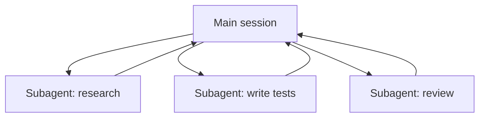

<LevelBadge level="advanced" />

<VerifyNote lastVerified="2026-06-20" source="https://docs.anthropic.com/en/docs/claude-code/sub-agents">
A configuração de subagentes e a interface `/agents` mudam com o tempo — confirme na documentação oficial.
</VerifyNote>

Um **subagente** é uma instância separada do Claude com sua **própria janela de contexto** e um **conjunto restrito de ferramentas**, ao qual sua sessão principal delega uma parte do trabalho. Ele reporta de volta um resultado, não toda a sua transcrição — então a sessão principal permanece focada e sem desordem.

## Por que delegar

- **Proteja o contexto principal.** Um mergulho de pesquisa ou uma varredura grande de arquivos pode queimar milhares de tokens; faça isso em um subagente e apenas a conclusão retorna.
- **Especialize.** Dê a um subagente um system prompt sob medida e apenas as ferramentas de que ele precisa (por exemplo, um revisor somente leitura).
- **Paralelize.** Execute subtarefas independentes ao mesmo tempo — por exemplo, explore três módulos simultaneamente.

## Definindo-os

Os subagentes são configurados como arquivos Markdown com frontmatter (nome, descrição, ferramentas permitidas, às vezes um modelo), gerenciados via a interface `/agents`. A `description` informa ao agente principal *quando* delegar a ele. Restrinja bem as ferramentas — um revisor raramente precisa de acesso de escrita.

## Quando NÃO paralelizar

:::warning Paralelismo não é grátis
- **Passos dependentes** precisam ser sequenciais — não distribua trabalho onde o passo B precisa da saída do passo A.
- **Escritas compartilhadas de arquivos** podem entrar em conflito; isole-as (veja [Git Worktrees](/docs/claude-code/worktrees)) ou serialize-as.
- **A sobrecarga de coordenação** pode exceder o benefício em tarefas pequenas. Delegue quando a subtarefa for grande e independente.
:::

## Subagente vs os "agentes" da API/SDK

Esta página é sobre a delegação integrada do Claude Code. Construir seus *próprios* agentes programaticamente é [Construindo Agentes sobre a API](/docs/api/building-agents). O modelo mental — um objetivo, um loop de ferramentas, contexto isolado — é o mesmo.

## Próximos passos

- [Projete um Fluxo de Trabalho com Múltiplos Subagentes (passo a passo)](/docs/walkthroughs/multi-subagent-workflow)
- [Gerenciamento de Contexto](/docs/claude-code/context-management)
- [Git Worktrees](/docs/claude-code/worktrees)
