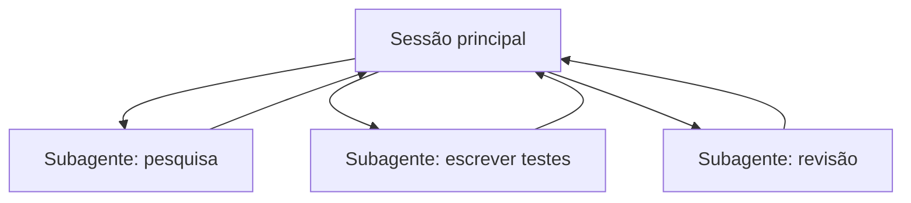

<LevelBadge level="advanced" />

<VerifyNote lastVerified="2026-06-23" source="https://code.claude.com/docs/en/sub-agents">
Os campos de frontmatter dos subagentes, o conjunto de agentes integrados e a interface `/agents` mudam ao longo do tempo — confirme na documentação oficial.
</VerifyNote>

Um **subagente** é uma instância separada do Claude com sua **própria janela de contexto** e um **conjunto restrito de ferramentas**, ao qual sua sessão principal delega uma parte do trabalho. Ele reporta de volta um resultado, não toda a sua transcrição — então a sessão principal permanece focada e organizada.

## Por que delegar

- **Proteja o contexto principal.** Uma investigação de pesquisa ou uma varredura grande de arquivos pode queimar milhares de tokens; faça isso em um subagente e apenas a conclusão retorna.
- **Especialize.** Dê a um subagente um system prompt sob medida e apenas as ferramentas de que ele precisa (por exemplo, um revisor somente leitura).
- **Paralelize.** Execute subtarefas independentes ao mesmo tempo — por exemplo, explore três módulos simultaneamente.



## Os integrados que você já tem

Antes de definir os seus próprios, saiba que o Claude Code vem com subagentes aos quais ele delega automaticamente:

- **Explore** — um agente rápido e somente leitura (roda em um modelo mais barato) para buscar e entender uma base de código sem tocá-la.
- **Plan** — reúne contexto durante o modo de planejamento, para que a pesquisa fique fora da conversa principal somente leitura.
- **General-purpose** — um agente com todas as ferramentas para trabalho complexo e de múltiplas etapas que mistura exploração e mudanças.

Você raramente invoca esses pelo nome; o Claude recorre a eles quando uma tarefa se encaixa. Subagentes personalizados são para os trabalhadores que *você* fica recriando com as mesmas instruções.

## Definindo os seus próprios

Um subagente é um arquivo Markdown com frontmatter YAML (o corpo se torna seu system prompt). Apenas `name` e `description` são obrigatórios; todo o resto é opcional. Armazene-o por projeto em `.claude/agents/` (faça commit no git para que a equipe compartilhe) ou por usuário em `~/.claude/agents/`. Crie um com o comando `/agents` ou manualmente:

```markdown
---
name: code-reviewer
description: Expert code reviewer. Use proactively after code changes.
tools: Read, Glob, Grep
model: sonnet
---

You are a senior reviewer. Read the changed files, then report only
high-confidence issues: correctness bugs, security risks, and missing
tests. For each, show the file:line, the problem, and a concrete fix.
Do not restate what the code does. Never edit files.
```

Duas coisas tornam um subagente bom:

- **A `description` é o sinal de roteamento.** O Claude a lê para decidir *quando* delegar, então escreva-a como um gatilho — "Use proactively after code changes" o ativa automaticamente; um vago "helps with code" não vai. Esta é a linha de maior alavancagem do arquivo.
- **Restrinja as ferramentas com rigor.** O campo `tools` é uma lista de permissões (ou use `disallowedTools` como lista de negações). Um revisor que só consegue `Read, Glob, Grep` *não pode* editar seu código acidentalmente — a restrição é uma garantia, não uma sugestão. Omita `tools` e o subagente herda tudo o que a sessão principal tem.

## Exemplo prático: uma distribuição paralela de revisão

Você terminou uma funcionalidade que toca três módulos e quer uma verificação rápida e independente de cada um. Na sua sessão principal:

> "Revise as mudanças em `auth/`, `billing/` e `api/` — use o subagente code-reviewer em cada um, em paralelo."

O Claude gera três instâncias `code-reviewer` ao mesmo tempo. Cada uma lê apenas seu módulo, consome seu próprio contexto com o conteúdo dos arquivos e retorna uma lista curta de achados. Sua sessão principal nunca vê os diffs brutos — apenas três relatórios organizados — e tudo termina em aproximadamente o tempo da instância de revisão mais lenta, em vez da soma das três. Como o revisor é somente leitura, três agentes trabalhando ao mesmo tempo não podem colidir em uma escrita.

## Quando NÃO paralelizar

:::warning Paralelismo não é grátis
- **Passos dependentes** precisam ser sequenciais — não distribua trabalho onde o passo B precisa da saída do passo A.
- **Escritas compartilhadas de arquivos** podem entrar em conflito; isole-as (veja [Git Worktrees](/docs/claude-code/worktrees)) ou serialize-as.
- **A sobrecarga de coordenação** pode exceder o benefício em tarefas pequenas. Delegue quando a subtarefa for grande e independente.
:::

## Subagente vs os "agentes" da API/SDK

Esta página é sobre a delegação integrada do Claude Code. Construir seus *próprios* agentes programaticamente é [Construindo Agentes sobre a API](/docs/api/building-agents). O modelo mental — um objetivo, um loop de ferramentas, contexto isolado — é o mesmo.

## Erros comuns

- **Uma `description` vaga.** Se ela não disser *quando* usar o subagente, o Claude não vai delegar no momento certo (ou não vai delegar de jeito nenhum). Comece com "Use when…" / "Use proactively after…".
- **Deixar as ferramentas totalmente abertas.** Um subagente destinado a revisar não deveria poder escrever. Uma lista de permissões transforma intenção em garantia.
- **Esperar memória compartilhada.** Um subagente recebe sua `description`, seu system prompt e a tarefa que você lhe entrega — não a sua conversa principal. Passe o contexto de que ele precisa na delegação.
- **Distribuir trabalho dependente.** O paralelismo só ajuda em subtarefas *independentes*; se B precisa da saída de A, execute-as em sequência.

## Próximos passos

- [Projete um Fluxo de Trabalho com Múltiplos Subagentes (passo a passo)](/docs/walkthroughs/multi-subagent-workflow)
- [Gerenciamento de Contexto](/docs/claude-code/context-management)
- [Git Worktrees](/docs/claude-code/worktrees)
