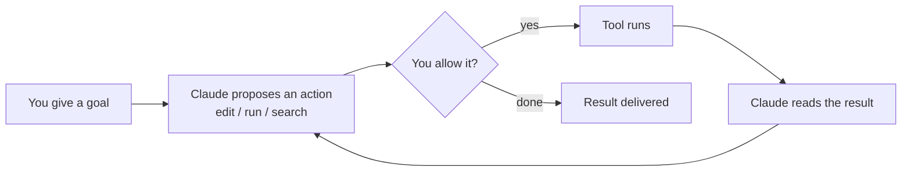

<LevelBadge level="beginner" />

<VerifyNote lastVerified="2026-06-20" source="https://code.claude.com/docs/en/overview">
Os comandos de instalação e o conjunto exato de recursos mudam com frequência. Trate a documentação oficial do Claude Code como fonte da verdade para a configuração.
</VerifyNote>

O **Claude Code** é a ferramenta de codificação *agêntica* da Anthropic. Diferentemente de uma janela de chat, ele consegue de fato **fazer coisas no seu projeto**: ler e editar arquivos, executar comandos de shell, pesquisar na base de código e chamar ferramentas externas — tudo com a sua permissão.

## O modelo mental: um loop agêntico

Essa é a única ideia que faz todo o resto fazer sentido:

Você dá um objetivo em linguagem simples ("adicione testes para o módulo de auth e corrija o que falhar"). O Claude **planeja, age, observa o resultado e repete** até que o objetivo seja alcançado. Você permanece no controle por meio de [permissões](/docs/claude-code) e do [Modo Plano](/docs/claude-code).

## Onde você pode executá-lo

- **Terminal (CLI)** — a superfície original; funciona em qualquer shell.
- **Extensões de IDE** — VS Code e JetBrains, com diffs inline.
- **Desktop e web** — e ele compartilha suas configurações, hooks e permissões entre as superfícies.

## O que você vai configurar (em ordem aproximada de alavancagem)

1. **[CLAUDE.md](/docs/claude-code)** — instruções persistentes do projeto. Maior impacto, menor esforço.
2. **[Modo Plano](/docs/claude-code)** — investigar e propor *antes* que qualquer edição seja executada.
3. **[Permissões](/docs/claude-code)** — o que o Claude pode fazer sem perguntar.
4. **[settings.json](/docs/claude-code)** — o sistema de configuração completo.
5. **[Comandos slash](/docs/claude-code)**, **[hooks](/docs/claude-code)**, **[skills](/docs/claude-code)**, **[subagentes](/docs/claude-code)**, **[servidores MCP](/docs/claude-code)** — recursos avançados, adicionados em camadas conforme você precisar deles.

## Sua primeira sessão (o formato dela)

1. Instale e autentique-se (veja a [documentação oficial](https://code.claude.com/docs/en/overview) para os comandos atuais).
2. Entre (`cd`) em um projeto e inicie o Claude Code.
3. Execute `/init` para gerar um **CLAUDE.md** inicial.
4. Peça algo pequeno e concreto: *"Explique como funciona o roteamento neste app."*
5. Em seguida, experimente uma mudança primeiro no **Modo Plano**, revise o plano e deixe-o executar.

:::tip Comece em modo somente leitura
Para sua primeira tarefa de verdade, use o [Modo Plano](/docs/claude-code) — o Claude investiga e mostra um plano sem tocar em arquivos. É a forma mais segura de construir confiança.
:::

## Próximos passos

- A configuração de maior alavancagem → [CLAUDE.md e Arquivos de Memória](/docs/claude-code)
- Faça de ponta a ponta → [Passo a passo: Personalize o Claude Code para um repositório real](/docs/walkthroughs)
- Crie suas próprias automações → [Modelos e Receitas](/docs/templates)
