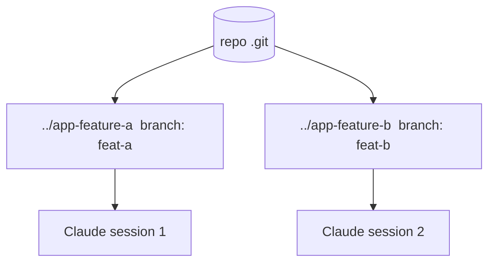

<LevelBadge level="advanced" />

Um **git worktree** permite que um repositório tenha **múltiplos diretórios de trabalho**, cada um com checkout de uma branch diferente. Combine isso com o Claude Code e você pode executar **várias sessões em paralelo** no mesmo projeto — cada uma editando seus próprios arquivos, sem colisões.

## O problema que ele resolve

Se duas sessões do Claude editam o mesmo diretório de trabalho ao mesmo tempo, elas tropeçam nas mudanças uma da outra. Os worktrees dão a cada sessão seu **próprio diretório e branch**, então o trabalho paralelo permanece isolado até você fazer o merge.



## O básico

```bash
# from your repo
git worktree add ../app-feature-a -b feat-a   # new dir + new branch
git worktree add ../app-fix-123 -b fix-123
git worktree list
# when done with one:
git worktree remove ../app-feature-a
```

Abra uma sessão do Claude Code em cada diretório de worktree e deixe-as trabalhar de forma independente.

## Quando vale a pena

- **Funcionalidades/correções paralelas** que você quer avançar ao mesmo tempo.
- **Uma tarefa longa em execução** em um worktree enquanto você continua trabalhando em outro.
- **Experimentos arriscados** isolados do seu checkout principal.

## Armadilhas

:::warning Atenção ao merge de volta
- As branches eventualmente vão **fazer merge** — os conflitos aparecem nesse momento, não durante. Mantenha os worktrees focados e de vida curta.
- Não execute **recursos compartilhados com estado** (um único BD de dev, uma única porta) a partir de dois worktrees sem separá-los.
- Faça a limpeza com `git worktree remove` para que diretórios obsoletos não se acumulem.
:::

## Worktrees vs subagentes

- **[Subagentes](/docs/claude-code/subagents)** = paralelismo *dentro* de uma sessão (delegação, contexto isolado).
- **Worktrees** = paralelismo *entre* sessões no disco (branches/arquivos isolados). Eles compõem bem: uma sessão em um worktree pode, ela mesma, gerar subagentes.

## Próximos passos

- [Subagentes e Agentes Paralelos](/docs/claude-code/subagents)
- [Modo Headless e o Agent SDK](/docs/claude-code/headless-and-agent-sdk)
- [Gerenciamento de Contexto](/docs/claude-code/context-management)
