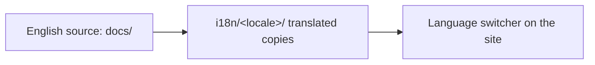

<LevelBadge level="intermediate" />

O AILmanac é em inglês primeiro, mas **feito para ser traduzido** — é assim que ele alcança "todos no mundo". Se você gostaria de trazê-lo para o seu idioma, aqui está o caminho.

## Como o i18n funciona aqui

O site usa a internacionalização nativa do Docusaurus. **O inglês é a fonte canônica.** Um idioma é um conjunto paralelo de arquivos traduzidos; o Docusaurus disponibiliza um seletor de idioma assim que um idioma é habilitado.

## A regra de ouro: assuma a responsabilidade antes de publicarmos

:::warning Sem traduções pela metade em produção
Um idioma só é **habilitado em produção quando alguém se compromete a mantê-lo.** Um idioma 30% traduzido e desatualizado há meses prejudica mais a credibilidade do que nenhuma tradução. Melhor traduzir bem uma *seção completa* do que espalhar páginas parciais.
:::

## Como contribuir com uma tradução

1. **Abra uma issue** (use o template de *translation*) dizendo qual idioma e qual seção você vai assumir.
2. **Traduza primeiro um trecho coerente** — por exemplo, todo o *Start Here* — e não páginas aleatórias.
3. **Mantenha código, comandos e as fontes de `VerifyNote` inalterados**; traduza prosa, títulos e o texto das admonições.
4. **Não traduza IDs de modelos nem links**; mantenha os caminhos `/docs/...` como estão.
5. **Abra um PR.** Um mantenedor revisa e, assim que um idioma tem um responsável + uma primeira seção completa, nós o habilitamos.

## Dicas

- **Use o Claude para fazer o rascunho** e então um humano fluente revisa — a tradução por IA é um ótimo primeiro passo, não a autoridade final ([Alucinações](/docs/foundations/hallucinations) também se aplicam à tradução).
- **Combine com o nível/tom** da página em inglês.
- **Sinalize termos intraduzíveis** (mantenha "prompt", "token" etc. onde isso for a norma na comunidade técnica do seu idioma).

## Próximo

- [Contribua em 10 Minutos](/docs/contribute/contribute-in-10-minutes)
- [Guia de Estilo de Conteúdo](/docs/contribute/style-guide)
- [Código de Conduta & Governança](/docs/contribute/governance)
