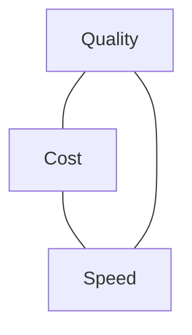

<LevelBadge level="intermediate" />

Qualidade, custo e velocidade puxam um contra o outro. Você não consegue maximizar os três de uma vez — mas *pode* gastar cada um onde importa e economizar em todo o resto.

## O triângulo

Um modelo maior é mais inteligente, mas mais lento e mais caro; um menor é rápido e barato, mas menos capaz. Boa engenharia é **rotear cada tarefa para o ponto certo** desse triângulo.

## As maiores alavancas (mais ou menos em ordem)

1. **Dimensione o modelo corretamente.** Não rode o Opus para classificação. Comece com o Sonnet, desça para o Haiku em etapas simples/de alto volume, reserve o Opus para as partes difíceis — [Escolhendo um Modelo](/docs/api/choosing-a-model).
2. **Escalonamento de modelos / cascatas.** Use primeiro um modelo barato; escale para um mais forte só quando necessário (ex.: casos de baixa confiança).
3. **[Prompt caching](/docs/api/prompt-caching).** Reutilize um prefixo de prompt estável entre chamadas — grande economia para system prompts repetidos, contexto de RAG ou catálogos de ferramentas de agentes.
4. **Reduza os tokens de entrada.** Envie só o que importa; o [RAG](/docs/foundations/rag) é melhor do que enfiar a base de conhecimento inteira. Entradas mais curtas = mais baratas *e* muitas vezes melhores.
5. **Limite a saída** com um `max_tokens` sensato e instruções de formato enxutas.
6. **Use batch** para trabalho offline em que a latência não importa.

## Ganhos específicos de latência

- **Faça streaming** das respostas para que os usuários vejam a saída imediatamente — enorme para a velocidade *percebida*, mesmo quando o tempo total não muda ([Streaming](/docs/api/streaming)).
- **Paralelize** subchamadas independentes.
- **Faça cache** de trabalho repetido; pré-calcule onde puder.
- Escolha um **modelo menor** para o caminho interativo; faça o trabalho pesado de forma assíncrona.

## Não otimize às cegas

Meça primeiro: para onde os tokens e os segundos estão realmente indo? Então otimize o maior item da conta. E recheque a qualidade com [evals](/docs/foundations/evals) após qualquer corte de custo — uma configuração mais barata que está errada não é mais barata.

## Próximo

- [Escolhendo um Modelo Claude](/docs/api/choosing-a-model)
- [Prompt Caching e Otimização de Custo](/docs/api/prompt-caching)
- [Tokens, Contexto e Preços](/docs/api/tokens-and-pricing)
