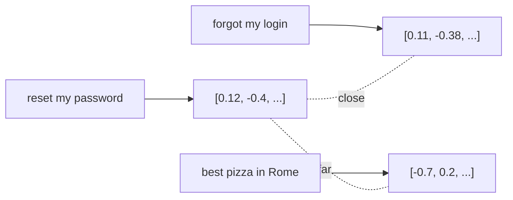

<LevelBadge level="intermediate" />

Um **embedding** transforma um trecho de texto em uma lista de números (um **vetor**) que captura seu *significado*. Textos com significado parecido recebem vetores próximos uns dos outros — mesmo que não compartilhem nenhuma palavra. Esse é o truque por trás da **busca semântica** e do [RAG](/docs/foundations/rag).

## A intuição

Imagine cada frase posicionada como um ponto em um enorme espaço multidimensional, arranjado de modo que **significados semelhantes fiquem próximos uns dos outros**. "How do I reset my password?" cai perto de "I forgot my login", longe de "best pizza in Rome".

## Busca semântica vs. por palavra-chave

- **A busca por palavra-chave** casa palavras literais ("password" encontra "password").
- **A busca semântica** casa *significado* — "I can't sign in" encontra o documento de redefinição de senha mesmo sem a palavra "password".

Os melhores resultados muitas vezes **combinam** as duas (busca híbrida).

## Como funciona uma busca vetorial

1. **Gere embeddings** dos seus documentos (geralmente divididos em **chunks**) e armazene os vetores em um **banco de dados vetorial**.
2. No momento da consulta, **gere o embedding da consulta**.
3. Encontre os vetores **mais próximos** (por similaridade/distância de cosseno).
4. Retorne esses chunks — tipicamente para alimentar o [RAG](/docs/foundations/rag).

## Notas práticas

- **O chunking importa.** Muito grande = correspondências ruidosas; muito pequeno = contexto perdido. Ajuste.
- **Use um único modelo de embedding de forma consistente** — vetores de modelos diferentes não são comparáveis.
- **Metadados + filtros** (data, fonte, tipo) tornam a recuperação muito mais precisa.
- Um banco de dados vetorial nem sempre é necessário — para corpora pequenos, uma busca simples em memória já basta.

## Próximo

- [Geração Aumentada por Recuperação (RAG)](/docs/foundations/rag)
- [Fine-tuning vs Prompting vs RAG](/docs/foundations/finetune-vs-prompt-vs-rag)
- [Alucinações e Como Reduzi-las](/docs/foundations/hallucinations)
