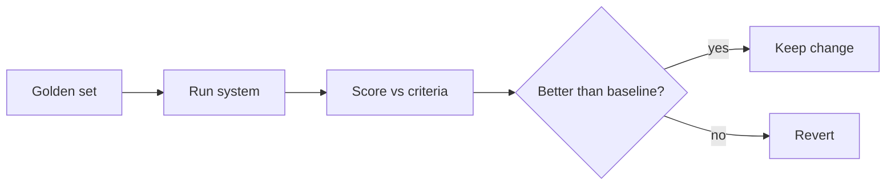

<LevelBadge level="advanced" />

Se você lança qualquer coisa construída sobre IA, os **evals** são como você sabe que funciona — e como você sabe que uma mudança tornou a coisa melhor, não pior. Sem eles você está voando às cegas: um ajuste de prompt que ajuda um caso pode quebrar dez outros silenciosamente.

## O eval mínimo viável

Você não precisa de um framework para começar:

1. **Reúna um conjunto de referência (golden set).** 20–100 entradas reais com as saídas *corretas* ou *aceitáveis* (ou critérios claros). Cubra os casos fáceis, os complicados e os casos extremos que já te morderam.
2. **Defina o que "bom" significa** por tarefa — correspondência exata, contém fatos-chave, esquema JSON válido, sem números alucinados, tom, etc.
3. **Execute e pontue** a sua configuração atual contra o conjunto.
4. **Mude uma coisa** (prompt, modelo, recuperação), execute de novo, **compare**. Mantenha a mudança apenas se a pontuação melhorar.

## Escolhendo métricas

- **Verificações determinísticas** sempre que possível: o esquema é válido? contém o valor certo? o código passa nos testes? São baratas e confiáveis.
- **LLM como juiz** para qualidade difusa (utilidade, tom): faça um modelo avaliar as saídas contra uma rubrica. Útil, mas **calibre-o** — juízes têm vieses (comprimento, posição). Valide o juiz contra avaliações humanas em uma amostra.
- **Revisão humana** para a fatia de maior risco.

## Quando executá-los

- **Antes/depois de qualquer mudança de prompt ou modelo.**
- **Em migração de modelo** — um novo modelo pode mudar o comportamento ([Erros e Migração](/docs/api/errors-and-rate-limits)).
- **Na CI** para sistemas em produção, como um portão.

:::tip Separe os estágios
Para [RAG](/docs/foundations/rag) e [agentes](/docs/api/building-agents), avalie cada estágio (a recuperação encontrou o documento certo? a ferramenta foi chamada corretamente?) — não apenas a resposta final. Isso localiza as falhas.
:::

## Próximo

- [Alucinações e Como Reduzi-las](/docs/foundations/hallucinations)
- [Construindo Agentes na API](/docs/api/building-agents)
- [Escolhendo um Modelo e Provedor](/docs/foundations/choosing-a-model-provider)
