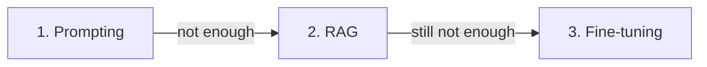

<LevelBadge level="intermediate" />

Quando o modelo não faz o que você quer, há três alavancas — e as pessoas recorrem primeiro à mais cara. Aqui está a ordem que realmente funciona.

## Tente nesta ordem

### 1. Prompting — comece aqui, sempre
Instruções mais claras, exemplos, um papel, restrições de saída ([Fundamentos de Prompting](/docs/prompting/basics)). Resolve a **maioria** dos problemas, não custa nada a mais e é instantâneo de iterar. A maior parte dos "o modelo é ruim em X" acaba sendo "o prompt estava vago".

### 2. RAG — quando ele precisa do *seu* conhecimento
Se a lacuna for **informação ausente ou atualizada** (seus documentos, seus dados, fatos atuais), adicione [RAG](/docs/foundations/rag). Mantém o conhecimento atualizável e citável sem tocar no modelo.

### 3. Fine-tuning — último recurso, para *comportamento/formato* em escala
O fine-tuning treina ainda mais um modelo com os seus exemplos. Recorra a ele apenas quando prompting + RAG não conseguirem **estilo, formato ou comportamento de tarefa** consistentes e você tiver **muitos exemplos de alta qualidade** e o volume que o justifique.

## A tabela de decisão

| Seu problema | Recorra a |
|---|---|
| Saídas vagas/erradas, formato errado | **Prompting** |
| Não conhece os seus dados / precisa de informação atual | **RAG** |
| Precisa de um estilo/comportamento muito específico, de forma consistente, em escala | **Fine-tuning** |
| Precisa executar ações | (Nenhum desses — isso é [uso de ferramentas/agentes](/docs/api/tool-use)) |

## Por que as pessoas erram

O fine-tuning *soa* como "ensinar o modelo", então parece a solução de verdade. Mas é a opção mais lenta, mais cara e menos flexível, ele **não adiciona conhecimento novo** bem (o RAG faz isso) e é fácil de fazer mal. Esgote prompting e RAG primeiro — você geralmente não precisará do passo 3.

:::tip Eles se combinam
Um sistema forte costuma ser um bom **prompt** + **RAG** para conhecimento, com o fine-tuning reservado para uma necessidade comportamental específica. Eles não são mutuamente exclusivos.
:::

## Próximo

- [Geração Aumentada por Recuperação (RAG)](/docs/foundations/rag)
- [Fundamentos de Prompting](/docs/prompting/basics)
- [Avaliando a Qualidade da IA (Evals)](/docs/foundations/evals)
