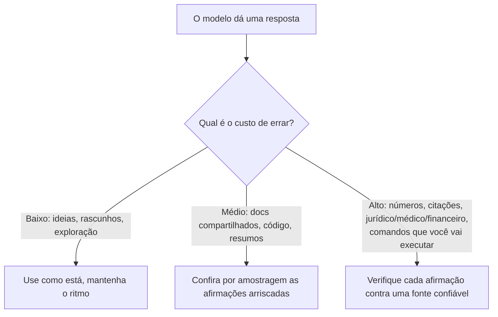

<LevelBadge level="intermediate" />

Uma **alucinação** é quando um modelo afirma algo falso com total confiança. Não é mentira nem defeito — é o outro lado de como os LLMs funcionam: eles geram texto *plausível*, e plausível nem sempre é verdadeiro (veja [O que é um LLM?](/docs/foundations/what-is-an-llm)). Você não consegue eliminar isso totalmente com prompting, mas pode reduzir drasticamente e pegar o resto.

## Por que acontece

O modelo prevê uma continuação provável. Quando ele não "sabe" algo, a continuação *de aparência mais provável* costuma ser uma resposta confiante, bem formada — e errada. Não há um sinal embutido de "não tenho certeza", a menos que você crie espaço para um.

## As zonas de alto risco

Seja mais cético quando a saída envolver:

- **Citações, frases e referências** — artigos inventados, URLs falsas, citações mal atribuídas.
- **Números, datas e estatísticas específicos** — valores plausíveis, porém inventados.
- **Fatos de nicho ou muito recentes** — além do que o modelo aprendeu de forma confiável.
- **Detalhes de APIs e bibliotecas** — métodos ou parâmetros que não existem.
- **Pessoas e especificidades jurídicas/médicas** — alto risco, fáceis de errar sutilmente.

## O kit de redução

Combine estes — cada um ajuda:

1. **Fundamente em fontes.** Cole o texto-fonte e diga *"responda apenas a partir do texto acima; se não estiver lá, diga isso."* Essa é a ideia central por trás do [RAG](/docs/foundations/rag).
2. **Dê uma saída.** Permita explicitamente *"Se você não tiver certeza, diga 'não sei'"* — isso reduz drasticamente os palpites confiantes.
3. **Peça raciocínio e citações.** *"Cite a frase exata que sustenta cada afirmação."* Afirmações sem suporte ficam óbvias.
4. **Reduza a criatividade** para tarefas factuais quando o modelo expõe um controle de temperatura (veja [Controles de Amostragem](/docs/foundations/sampling-controls)).
5. **Use ferramentas.** Para matemática, dados atuais ou consultas, dê ao modelo uma calculadora/busca/[ferramenta](/docs/api/tool-use) em vez de confiar na memória.
6. **Faça verificação cruzada.** Pergunte a mesma coisa de duas formas, ou faça uma segunda passagem criticar a primeira.

## Um prompt anti-alucinação para copiar e colar

A maior parte do kit acima se condensa em um único wrapper reutilizável. Cole sua fonte onde indicado e faça sua pergunta — ele fundamenta a resposta, dá ao modelo uma saída e força citações de uma só vez:

```text
Você responde APENAS a partir da FONTE abaixo.
Regras:
- Se a resposta não estiver na FONTE, responda exatamente: "Não consta na fonte."
- Após cada afirmação, cite a frase exata da FONTE que a sustenta.
- Não adicione conhecimento externo, estimativas ou suposições.

FONTE:
"""
[cole aqui o documento, a transcrição ou os dados]
"""

PERGUNTA: [sua pergunta]
```

Por que funciona: a saída de emergência "Não consta na fonte" remove a pressão de adivinhar, e a regra de citar-a-frase torna impossível esconder qualquer afirmação sem suporte. Remova o bloco FONTE quando você realmente quiser o conhecimento próprio do modelo — mas aí a verificação volta a ser sua responsabilidade.

## A mentalidade que de fato protege você

:::warning Verifique o que importa — sempre
Nenhum prompt torna a saída 100% confiável. Para qualquer coisa relevante — um número em um relatório, uma citação, um comando que você vai executar, um detalhe médico/jurídico/financeiro — **confira contra uma fonte confiável**. Trate a IA como um rascunho rápido, não como uma autoridade final. Esse é o cerne do [Uso Responsável](/docs/security/responsible-use).
:::

Uma regra simples: **o custo de errar define a quantidade de verificação.** Fazendo brainstorming? Confie à vontade. Publicando uma estatística? Verifique sempre.



## Próximo

- [Geração Aumentada por Recuperação (RAG)](/docs/foundations/rag)
- [Avaliando a Qualidade da IA (Evals)](/docs/foundations/evals)
- [Uso Responsável, Ética e Verificação](/docs/security/responsible-use)
