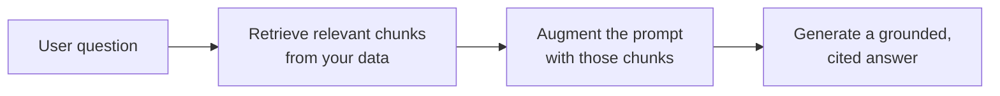

<LevelBadge level="intermediate" />

O **RAG** faz um modelo responder a perguntas sobre os **seus** dados — documentos, uma base de conhecimento, uma base de código — com os quais ele nunca foi treinado. A ideia é simples: **recuperar** os trechos relevantes, **aumentar** o prompt com eles e então **gerar** uma resposta fundamentada nesses trechos.

## O ciclo

1. **Indexe** os seus dados: divida em chunks, [gere os embeddings](/docs/foundations/embeddings) deles, armazene em um índice vetorial (e/ou de palavra-chave).
2. **Recupere** os chunks mais relevantes para a pergunta.
3. **Aumente**: coloque esses chunks no prompt com uma instrução como *"Responda apenas a partir do contexto abaixo; se não estiver lá, diga isso."*
4. **Gere** — e, idealmente, **cite** de qual chunk veio cada afirmação.

## Por que RAG em vez de fine-tuning?

O RAG mantém o conhecimento **atualizado** (atualize os dados, não o modelo), fornece **citações** e é muito mais barato do que retreinar. Para a maioria das necessidades de "responder sobre os meus documentos", é a primeira ferramenta certa — veja [Fine-tuning vs Prompting vs RAG](/docs/foundations/finetune-vs-prompt-vs-rag).

## Os modos de falha (onde a qualidade do RAG morre)

- **Recuperação ruim = resposta ruim.** Se o chunk certo não for recuperado, o modelo não pode usá-lo. A maioria dos problemas de "o RAG está errado" são problemas de *recuperação*.
- **Chunking grosso/fino demais** — arruína a relevância ([embeddings](/docs/foundations/embeddings)).
- **Sem instrução de fundamentação** — o modelo mistura fatos recuperados com os próprios palpites. Diga a ele para responder *apenas* a partir do contexto e para admitir lacunas.
- **Enfiar coisas demais** — chunks irrelevantes diluem o sinal e custam [tokens](/docs/foundations/tokens-and-context). Recupere poucos chunks de alta qualidade.
- **Sem citações** — você não consegue verificar, então não consegue confiar.

:::tip Avalie a recuperação separadamente
Meça "recuperamos o chunk certo?" à parte de "o modelo respondeu bem?". Isso localiza o problema rápido. Veja [Evals](/docs/foundations/evals).
:::

## Próximo

- [Embeddings e Busca Vetorial](/docs/foundations/embeddings)
- [Fine-tuning vs Prompting vs RAG](/docs/foundations/finetune-vs-prompt-vs-rag)
- [Playbook de Pesquisa e Síntese](/docs/playbooks/research)
