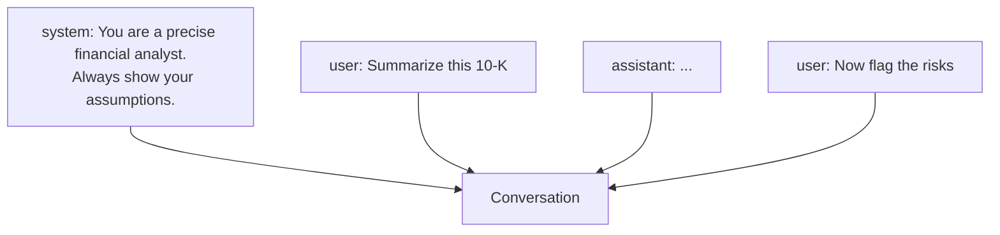

<LevelBadge level="beginner" />

Toda conversa com IA é construída a partir de **mensagens**, e cada mensagem tem um **papel**. Entender os três papéis explica como direcionar o modelo — e por que algumas instruções pegam enquanto outras não.

## Os três papéis

- **System** — configuração de nível superior para toda a conversa: quem o modelo deve ser, as regras, o formato. Definido uma vez, aplica-se o tempo todo.
- **User** — esse é você: suas perguntas e entradas, turno a turno.
- **Assistant** — as respostas do modelo. (Você também pode *colocar palavras na boca do assistant* como exemplos — veja [few-shot](/docs/prompting/few-shot).)

## Por que o system prompt é a sua alavanca mais poderosa

A mensagem system enquadra **tudo o que vem a seguir**. É onde você define o papel do modelo, os padrões, o tom e as regras rígidas — e o modelo dá muito peso a ela. Se você quer comportamento consistente ao longo de toda uma conversa (ou app), coloque aqui, e não enterrado em um turno de user.

Na prática:
- **Apps de chat:** as [instruções personalizadas](/docs/claude-app/custom-instructions) da sua conta funcionam como um system prompt pessoal.
- **Claude Code:** o [CLAUDE.md](/docs/claude-code/claude-md) desempenha esse papel para o seu projeto.
- **A API:** o [parâmetro `system`](/docs/api/first-call).

A mesma ideia, três superfícies.

## Dicas práticas

- **Seja específico no system prompt** sobre papel, regras e formato de saída — é o lugar de maior alavancagem para isso.
- **Mantenha os turnos de user focados** na tarefa em si; não recole as regras a cada turno.
- **Instruções conflitantes?** Uma instrução de user posterior e explícita pode sobrepor uma instrução de system vaga — seja consistente para evitar surpresas ([Solução de Problemas](/docs/contribute/troubleshooting)).

## Próximo

- [Fundamentos de Prompting](/docs/prompting/basics)
- [Instruções Personalizadas e Estilos](/docs/claude-app/custom-instructions)
- [Tokens, Contexto e Memória](/docs/foundations/tokens-and-context)
