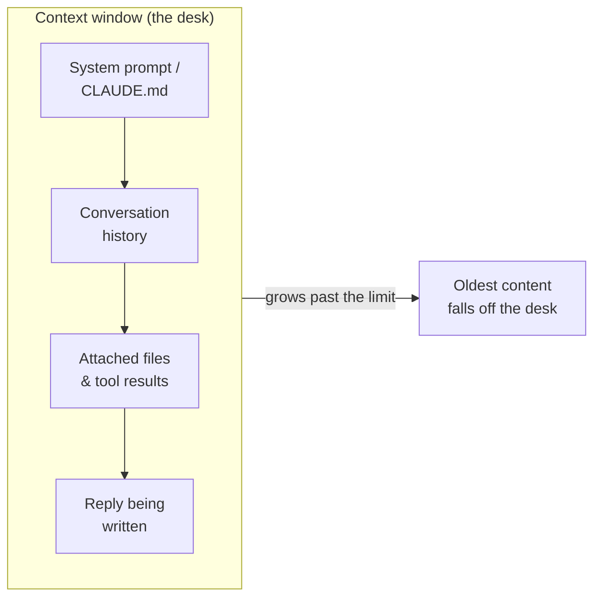

<LevelBadge level="beginner" />

Três ideias destravam muitos momentos de "por que ele fez isso?": **tokens**, a **janela de contexto** e a **memória**. Entenda esses conceitos e você vai parar de se surpreender com desvios, esquecimentos e contas inesperadas.

<Callout
  type="objectives"
  items={[
    "Ler o texto do jeito que um modelo lê — em tokens, não em palavras ou caracteres",
    "Imaginar a janela de contexto como uma mesa finita e prever quando as coisas caem dela",
    "Reconhecer o 'apodrecimento do contexto' — por que os modelos podem perder o meio de uma entrada longa",
    "Conhecer as quatro fontes reais de 'memória' e como fornecê-la de propósito"
  ]}
/>

## Tokens: a unidade em que os modelos pensam

Os modelos não leem caracteres nem palavras — eles leem **tokens**, pedaços de texto com cerca de ¾ de uma palavra em inglês. "Unbelievable" pode ser 3–4 tokens; palavras comuns são um cada; um espaço, uma vírgula ou um trecho de código também custam tokens. Tanto a sua entrada *quanto* a saída do modelo são contadas, e os tokens são exatamente o que [preços e limites](/docs/api/tokens-and-pricing) medem.

Você não precisa contar à mão, mas uma noção aproximada ajuda: **~750 palavras ≈ ~1.000 tokens**. Digite algo e observe:

<TokenEstimator />

:::tip Por que a proporção muda
Inglês simples fica perto de ¾ de palavra por token. Código, JSON, sistemas de escrita não latinos, URLs longas e palavras raras se dividem em *mais* tokens — então um arquivo de 500 linhas ou um parágrafo em chinês custa mais do que a contagem de palavras sugere. Quando uma conta ou um limite te surpreende, normalmente é por isso.
:::

## A janela de contexto: a memória de trabalho

A **janela de contexto** é o número máximo de tokens que o modelo consegue considerar de uma só vez — *o seu system prompt, toda a conversa até agora, quaisquer arquivos anexados e a resposta que ele está escrevendo,* tudo junto. Pense nela como a mesa do modelo: grande, mas finita. Os tamanhos de janela variam por modelo e continuam crescendo — veja [Modelos e Preços](/docs/whats-new/models-and-pricing) para os números atuais, em vez de decorar um só.

Tudo o que o modelo "sabe" no momento vive nessa mesa:

Quando uma conversa cresce além da janela, o **conteúdo mais antigo cai fora**. É por isso que um chat muito longo pode parecer "esquecer" como começou ou se afastar da sua instrução original.

## Apodrecimento do contexto: não é só *cheio* vs *vazio*

Um problema mais sutil: mesmo quando tudo ainda cabe, os modelos tendem a usar o **começo e o fim** de uma entrada longa de forma mais confiável do que o **meio**. Esconda a única frase que importa no centro de uma colagem de 50 páginas e ela pode ficar subvalorizada — uma falha frequentemente chamada de *"perdido no meio."*

<VerifyNote lastVerified="2026-06-29" source="https://arxiv.org/abs/2307.03172">O efeito "perdido no meio" — o uso degradado de informações colocadas no meio do contexto — foi documentado por Liu et al. (2023). Os modelos mais novos de contexto longo lidam melhor com isso, mas o hábito prático abaixo ainda compensa.</VerifyNote>

<Steps
  items={[
    {title: "Comece pelo pedido", body: "Coloque a instrução ou pergunta de verdade primeiro, antes de colar um documento longo — e não escondida depois dele."},
    {title: "Reafirme no final", body: "Repita a instrução-chave em uma linha depois do conteúdo longo. As posições inicial + final são as mais fortes."},
    {title: "Enxugue antes de colar", body: "Descarte as seções irrelevantes. Menos ruído no meio significa que o sinal que sobra recebe mais atenção."},
    {title: "Divida quando for enorme", body: "Para entradas muito grandes, resuma ou divida em pedaços em vez de despejar tudo — ou comece um chat novo para uma nova subtarefa."}
  ]}
/>

Aqui está o mesmo pedido, estruturado para que a instrução fique nas posições fortes:

<PromptCard title="Instrução primeiro, reafirmada por último">{`Tarefa: Encontre todos os pontos em que este contrato limita a nossa responsabilidade e cite a cláusula exata.

[... cole o contrato completo de 40 páginas aqui ...]

Lembrete da tarefa: liste apenas as cláusulas de limitação de responsabilidade, com citações exatas e números de seção. Ignore todo o resto.`}</PromptCard>

:::tip No Claude Code
Sessões longas de agente esbarram no mesmo teto. O Claude Code gerencia isso de propósito — compactando o histórico e deixando você controlar o que permanece à vista. Veja [Gerenciamento de Contexto](/docs/claude-code/context-management) e [Engenharia de Contexto](/docs/frontiers/context-engineering).
:::

## Memória: não existe nenhuma, a menos que você a forneça

Por padrão, cada conversa é uma **folha em branco**. O modelo não lembra do seu último chat. Tudo o que parece memória é uma de quatro coisas:

| Fonte | O que é | Você controla por |
| --- | --- | --- |
| **Histórico reenviado** | Os apps de chat reenviam a conversa a cada turno, até a janela encher | Começando chats novos; mantendo as threads focadas |
| **Recursos de memória** | Algumas superfícies do Claude carregam fatos entre chats | Configurações de [Memória Entre Chats](/docs/claude-app/memory) |
| **Arquivos que você fornece** | Contexto persistente que você anexa de propósito | [Projects](/docs/claude-app/projects), [CLAUDE.md](/docs/claude-code/claude-md) |
| **Seu próprio código** | A API é **stateless** — você reenvia as mensagens anteriores | [Primeira Chamada de API](/docs/api/first-call) |

A ideia central: *se você quer que o modelo lembre de algo, você tem que continuar colocando isso na mesa.*

## Por que isso importa

Quase todo problema do tipo "ele ignorou minha instrução anterior" ou "ele se perdeu" remonta a uma de três coisas: a janela encheu, uma nova sessão começou do zero, ou o detalhe-chave ficou no meio morto de uma colagem longa. Sabendo disso, você vai estruturar prompts e sessões para manter o que importa *à vista*.

## Teste-se

<Quiz
  questions={[
    {
      q: "Aproximadamente quantos tokens são 750 palavras de inglês simples?",
      options: ["Cerca de 250", "Cerca de 1.000", "Cerca de 3.000", "Exatamente 750"],
      answer: 1,
      explain: "Uma regra prática útil é ~750 palavras ≈ ~1.000 tokens para inglês comum. Código e sistemas de escrita não latinos ficam mais altos."
    },
    {
      q: "Um chat longo começa a 'esquecer' como começou. A causa mais provável é:",
      options: [
        "O modelo está quebrado",
        "O conteúdo mais antigo caiu fora da janela de contexto à medida que a conversa cresceu",
        "O modelo aprendeu permanentemente suas mensagens anteriores",
        "Os tokens foram reembolsados"
      ],
      answer: 1,
      explain: "A janela de contexto é finita. À medida que uma conversa a excede, os tokens mais antigos caem da 'mesa' — então instruções iniciais podem desaparecer de vista."
    },
    {
      q: "Você precisa colar um documento enorme mais uma instrução-chave. Melhor posicionamento?",
      options: [
        "Instrução apenas no meio exato do documento",
        "Instrução logo no começo E reafirmada no final",
        "Sem instrução — deixe o modelo adivinhar",
        "Instrução em um chat separado que o modelo não pode ver"
      ],
      answer: 1,
      explain: "Os modelos usam o começo e o fim de uma entrada longa de forma mais confiável ('perdido no meio'). Comece pelo pedido e reafirme-o no final."
    }
  ]}
/>

## Termos-chave

<Flashcards
  title="Fixe o vocabulário"
  cards={[
    {front: "Token", back: "O pedaço de texto que um modelo de fato processa — cerca de ¾ de uma palavra em inglês. Entrada e saída são ambas contadas, e o preço é por token."},
    {front: "Janela de contexto", back: "O máximo de tokens que um modelo consegue considerar de uma vez: system prompt + histórico + arquivos + a resposta, tudo junto. Finita — o conteúdo além do limite cai fora."},
    {front: "Perdido no meio", back: "A tendência de usar o começo e o fim de uma entrada longa de forma mais confiável do que o meio. Coloque instruções críticas nas posições fortes."},
    {front: "Statelessness", back: "A API não lembra de nada entre chamadas. Para continuar uma conversa, você mesmo reenvia as mensagens anteriores."}
  ]}
/>

:::note Pontos principais
- Os **tokens** são a unidade tanto do raciocínio quanto da cobrança — ~1.000 por 750 palavras em inglês, mais para código e outros sistemas de escrita.
- A **janela de contexto** é uma mesa finita; chats longos esquecem porque o conteúdo antigo cai dela.
- Mesmo dentro da janela, **comece pela sua instrução e reafirme-a no final** — o meio é subutilizado.
- Não há **memória por padrão**. Forneça-a de propósito com arquivos, Projects, CLAUDE.md ou reenviando o histórico.
:::

## Próximo

- [O Que É um LLM?](/docs/foundations/what-is-an-llm)
- [Papéis System, User e Assistant](/docs/foundations/roles)
- [Engenharia de Contexto](/docs/frontiers/context-engineering)
- [Tokens, Contexto e Preços (API)](/docs/api/tokens-and-pricing)
