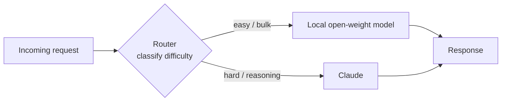

<LevelBadge level="advanced" />

O enquadramento "modelo de fronteira **ou** modelo local" é uma falsa escolha. Os sistemas mais econômicos, respeitosos da privacidade e resilientes em produção usam **ambos** — um pequeno modelo de peso aberto rodando localmente para o trabalho fácil, de alto volume ou sensível, e um modelo de fronteira como o Claude como a **camada inteligente** que lida com o raciocínio difícil. Esta página é sobre os *padrões* duráveis que conectam os dois para que cada um faça o que é melhor. Os padrões são neutros de provedor — o Claude simplesmente encaixa muito bem no papel de "raciocínio" — e eles sobrevivem a qualquer nome de modelo específico.

<Callout type="objectives" items={[
  "Entender POR QUE um híbrido (fronteira + local) vence qualquer um dos modelos sozinho em custo, privacidade e resiliência",
  "Aprender os cinco padrões híbridos duráveis: roteador/big-little, rascunho-e-refino, redação de privacidade, pré/pós-processamento em massa e fallback offline",
  "Para cada padrão: saber quando usá-lo, o trade-off que você aceita e um esboço concreto",
  "Projetar o seu próprio híbrido Claude+local com um método repetível de quatro passos",
  "Saber que esses padrões são neutros de provedor — o Claude encaixa como a 'camada inteligente', não um lock-in",
]} />

## Por que híbrido, não ou-um-ou-outro

Um modelo local de peso aberto (veja [Rode modelos localmente com Ollama](/docs/models/run-models-locally-ollama)) e um modelo de fronteira são bons em coisas *diferentes*:

- **Local** é privado (os dados nunca saem da sua máquina), barato-em-escala (sem conta por token), de baixa latência para modelos pequenos e funciona offline. Mas tem uma **lacuna de capacidade** real nas tarefas de raciocínio, longo contexto e agênticas mais difíceis.
- **Claude (fronteira)** lidera exatamente nessas tarefas difíceis, mas cada chamada custa tokens e envia dados a uma API na nuvem.

A percepção por trás de todo padrão abaixo: **a maioria das requisições é fácil, e as difíceis são a minoria.** Se um modelo local barato consegue lidar com o grosso e você reserva o modelo de fronteira para a fatia genuinamente difícil, você obtém a maior parte da qualidade de fronteira por uma fração do custo — e pode manter dados sensíveis locais. O paper *Hybrid LLM* da Microsoft formalizou isso: um roteador aprendido que envia consultas fáceis para um modelo pequeno fez **até 40% menos chamadas** ao modelo grande sem queda na qualidade da resposta ([arXiv 2404.14618](https://arxiv.org/abs/2404.14618)). O framework open-source [RouteLLM](https://github.com/lm-sys/RouteLLM) relata resultados parecidos — qualidade quase de fronteira por cerca de **metade do custo** em benchmarks comuns roteando cerca de metade das consultas para o modelo mais barato.

> Escolha o seu híbrido por **restrição**, não por hype. Se você ainda não sabe qual modelo encaixa em qual tarefa, comece em [Escolhendo um modelo](/docs/models/choosing-a-model) — depois volte e decida *onde fica a fronteira* entre local e fronteira.

---

## Padrão 1 — Roteador / big-little

**A ideia.** Coloque um **classificador** fino na frente de cada requisição. Ele olha a tarefa e decide: fácil/em massa → modelo local; raciocínio difícil → Claude. Emprestado do design de CPU "big.LITTLE", em que um celular roda o trabalho de fundo em núcleos minúsculos e eficientes e acorda o núcleo grande só para carga pesada.

**Quando usar.** Você tem um fluxo misto de requisições — muitas triviais, algumas genuinamente difíceis — e quer pagar preços de fronteira só pelas difíceis. Este é o híbrido burro de carga.

**O trade-off.** O roteador pode estar *errado*. Rotear mal uma tarefa difícil para o modelo local e a qualidade cai; rotear mal uma fácil para o Claude e você paga demais. Você ajusta um limiar para trocar custo por qualidade, e você deve **medir** esse limiar nos seus próprios dados com uma pequena avaliação (veja [Avaliações](/docs/power-user/evals)).

**O esboço.** O roteador pode ser tão simples quanto uma camada de regras (comprimento, palavras-chave, presença de código) ou tão rico quanto um pequeno modelo classificador. Uma opção barata e transparente é pedir ao próprio modelo **local** para classificar a dificuldade, depois despachar:

<PromptCard title="Prompt de classificação do roteador (roda no modelo local)">{`You are a request router. Classify the user request into exactly one tier.

Return ONLY a JSON object: {"tier": "...", "reason": "..."}

Tiers:
- "local"  → simple, mechanical, or high-volume: short rewrites, formatting,
             single-fact lookup, basic classification/extraction, boilerplate.
- "frontier" → hard reasoning, multi-step planning, long-context synthesis,
             ambiguous instructions, code that must be correct, anything where
             a wrong answer is costly.

Bias toward "local" when in doubt about a CHEAP, low-risk task,
and toward "frontier" when a mistake would be EXPENSIVE.

Request:
"""
{{REQUEST}}
"""`}</PromptCard>

A saída do roteador é uma decisão de roteamento, não a resposta final — mantenha-a minúscula e rápida. Para roteamento mais rico entre muitas ferramentas ou modelos, a mesma lógica de classificar-depois-despachar generaliza (e lembra como os modelos escolhem entre [ferramentas](/docs/api/tool-use)).

---

## Padrão 2 — Rascunho-e-refino

**A ideia.** O modelo local produz um **primeiro rascunho barato**; o Claude **poli, corrige ou verifica**. Você paga tokens de fronteira por refino, não por geração do zero — e um bom rascunho torna o trabalho do Claude mais curto e mais confiável.

**Quando usar.** Geração aberta em que um rascunho grosseiro é muito mais barato que um perfeito, mas a saída final precisa ser de alta qualidade: escrita longa, código, documentos estruturados, resumos que precisam estar exatamente certos.

**O trade-off.** Duas chamadas de modelo em vez de uma adicionam latência, e um rascunho *ruim* pode ancorar o refinador em direção aos seus erros. O ganho aparece quando rascunhar é a parte cara e refinar é comparativamente barato — verifique nos seus dados que "rascunho local + refino de fronteira" realmente vence "a fronteira faz tudo" em custo-por-saída-aceitável.

**O esboço.** Modelo local rascunha → passe o rascunho ao Claude com uma instrução focada: *"Aqui está um rascunho. Corrija erros, aperte e verifique as afirmações; devolva a versão corrigida."* Essa é a mesma intuição que alimenta o **decodificação especulativa** no nível de token — um pequeno rascunhador propõe, o modelo grande verifica e mantém só o que se sustenta ([NVIDIA: decodificação especulativa](https://developer.nvidia.com/blog/an-introduction-to-speculative-decoding-for-reducing-latency-in-ai-inference/)). No nível de tarefa você faz a mesma coisa manualmente: proposta barata, verificação cara.

---

## Padrão 3 — Redação de privacidade

**A ideia.** Um modelo local (ou ferramental de NLP local) **remove PII** do texto *antes* de qualquer coisa ser enviada a uma API na nuvem. O Claude raciocina sobre a versão redigida; você reinsere os valores reais localmente no caminho de volta, se preciso.

**Quando usar.** Você quer raciocínio de fronteira mas está lidando com dados regulados ou sensíveis (saúde, finanças, registros de clientes) e o PII bruto **não pode** sair do seu ambiente. A redação deixa você usar o modelo na nuvem sobre a *forma* do problema sem expor as pessoas nele.

**O trade-off.** A redação nunca é perfeita — uma entidade perdida é um vazamento, e a redação excessiva destrói o contexto de que o modelo precisa para responder bem. Trate o redator como um controle de segurança: teste o seu recall e mantenha o mapeamento de des-redação estritamente local.

**O esboço.** Rode um detector/anonimizador local sobre a entrada, substituindo entidades por placeholders (`[PERSON_1]`, `[EMAIL_1]`), envie o texto redigido ao Claude, depois re-hidrate os placeholders localmente. O [Presidio](https://github.com/microsoft/presidio) open-source da Microsoft é o bloco de construção comum aqui — ele detecta e anonimiza PII e pode usar um backend de NLP plugável, incluindo um modelo local para uma segunda passada nos casos difíceis. Um detalhe crucial e muitas vezes esquecido: redija **tudo** que chega ao modelo, incluindo documentos recuperados e resultados de ferramentas — não só a mensagem mais recente do usuário.

---

## Padrão 4 — Pré/pós-processamento em massa

**A ideia.** O modelo local lida com o trabalho **de alto volume e repetitivo** — extração, classificação, tagueamento, normalização em milhares de itens — e o Claude lida só com os **poucos casos difíceis** que o modelo local marca como de baixa confiança.

**Quando usar.** Cargas de pipeline: classificar 100 mil tickets de suporte, extrair campos de uma montanha de documentos, taguear uma torrente de conteúdo. Rodar cada item por uma API de fronteira seria lento e caro; a maioria dos itens é fácil.

**O trade-off.** Você precisa de um **sinal de confiança / escalonamento** confiável para que os itens certos sejam escalonados. Ansioso demais e você paga demais; tímido demais e a qualidade sofre na cauda difícil. A confiança auto-reportada do modelo local é um ponto de partida, mas valide-a.

**O esboço.** O modelo local processa o lote inteiro e anexa uma pontuação de confiança; itens abaixo de um limiar (ou que falham numa verificação de schema/validação) são escalonados ao Claude para a decisão difícil. Este é o Padrão 1 aplicado a um lote em vez de uma requisição ao vivo — a mesma economia de "o barato lida com o grosso, a fronteira lida com a cauda" que as cascatas exploram, muitas vezes **40–70% de economia de custo** com perda mínima de qualidade na maioria fácil.

---

## Padrão 5 — Fallback offline

**A ideia.** O modelo local é a **rede de segurança**. Quando a API na nuvem está fora, com rate-limit ou inalcançável, as requisições fazem *failover* para o modelo local em vez de falhar *de vez*. Respostas degradadas vencem páginas de erro.

**Quando usar.** Qualquer coisa em que a disponibilidade importa mais que a qualidade sempre-melhor: ferramentas internas que precisam continuar funcionando, recursos no dispositivo, produtos que não podem mostrar aos usuários um erro duro durante uma indisponibilidade do provedor.

**O trade-off.** As respostas de fallback são **de menor qualidade** por definição — você está trocando o teto de fronteira por "ainda funciona". Torne a degradação explícita (rotule-a, estreite o conjunto de recursos) em vez de servir silenciosamente respostas mais fracas como se fossem a coisa de verdade.

**O esboço.** Envolva as chamadas numa cadeia ordenada: tente o Claude → em erro de disponibilidade (timeout, 429/5xx), tente de novo com backoff → se ainda falhar, roteie para o modelo local. Gateways de LLM como o LiteLLM e o OpenRouter implementam exatamente esse padrão de cadeia-de-fallback, incluindo cache de prompts comuns para que um caminho offline ainda possa servir algo útil. O princípio durável: **mantenha um modelo local aquecido como sua última linha**, para que uma indisponibilidade degrade a experiência em vez de quebrá-la.

---

## Projete o seu próprio híbrido Claude+local

<Steps items={[
  {title: "Mapeie a sua distribuição de requisições", body: "Amostre tráfego real e rotule qual fração é genuinamente difícil vs fácil/em massa vs sensível. A forma dessa distribuição diz qual padrão compensa — uma cauda fácil longa favorece um roteador ou pré-processamento em massa; uma pequena fatia sensível favorece a redação."},
  {title: "Escolha o padrão que combina com a restrição", body: "Tráfego ao vivo misto → Padrão 1 (roteador). Geração de alta qualidade com orçamento → Padrão 2 (rascunho-e-refino). Dados regulados/sensíveis → Padrão 3 (redação). Volume de pipeline / lote → Padrão 4 (em massa). Disponibilidade é crítica → Padrão 5 (fallback). Muitos sistemas combinam dois ou três."},
  {title: "Defina a fronteira, depois meça-a", body: "Decida onde o local para e o Claude começa (um limiar de roteador, um corte de confiança, uma política de redação). Rode uma pequena avaliação nos SEUS dados para pôr números no trade custo-vs-qualidade. Não confie num leaderboard ou na manchete de um fornecedor — meça na sua tarefa. Veja a página de Avaliações."},
  {title: "Adicione observabilidade e uma válvula de segurança", body: "Registre cada decisão de roteamento/escalonamento e seu desfecho para você poder re-ajustar a fronteira conforme modelos e tráfego mudam. Mantenha um fallback explícito (Padrão 5) para que uma indisponibilidade do provedor degrade com graça em vez de quebrar."},
]} />

<VerifyNote lastVerified="2026-06-28" source="https://docs.anthropic.com/en/docs/build-with-claude/models">
Nomes de modelos específicos, janelas de contexto, preços por token e limites de taxa mudam com frequência e **não** são reafirmados aqui de propósito — eles são a parte volátil. Antes de fixar um limiar de custo ou qualidade para um roteador ou cascata, confira a linha atual de modelos Claude e os preços na fonte acima, e os nomes atuais dos modelos locais na <a href="https://ollama.com/library">biblioteca do Ollama</a>. Os padrões nesta página são duráveis; os números exatos por trás da fronteira não são.
</VerifyNote>

<Quiz title="Teste-se" questions={[
  {q: "Qual é a percepção econômica central que faz todo padrão híbrido funcionar?", options: ["Modelos locais são sempre melhores que modelos de fronteira", "A maioria das requisições é fácil; só uma minoria realmente precisa de raciocínio de fronteira", "Modelos de fronteira são mais baratos por token que modelos locais"], answer: 1, explain: "O grosso do tráfego real é fácil. Se um modelo local barato lida com a maioria fácil e você reserva o modelo de fronteira para a minoria difícil, você obtém a maior parte da qualidade por uma fração do custo. Essa assimetria é o que todo padrão aqui explora."},
  {q: "Você precisa usar um modelo de fronteira para raciocinar sobre registros de clientes, mas o PII bruto não pode sair do seu ambiente. Qual padrão encaixa?", options: ["Roteador / big-little", "Redação de privacidade", "Fallback offline"], answer: 1, explain: "A redação de privacidade remove PII localmente antes de qualquer coisa chegar à API na nuvem, então o Claude raciocina sobre uma versão redigida e os valores reais ficam no seu ambiente. O roteador decide PARA ONDE enviar o trabalho; ele não remove dados sensíveis."},
  {q: "Qual é o principal risco específico do padrão roteador / big-little?", options: ["Ele só pode usar um modelo", "Uma tarefa mal roteada custa qualidade (difícil enviada ao local) ou dinheiro (fácil enviada à fronteira)", "Ele exige que a API na nuvem esteja online o tempo todo"], answer: 1, explain: "O roteador é um classificador e pode estar errado. Rotear mal uma tarefa difícil para o modelo fraco prejudica a qualidade; rotear mal uma fácil para a fronteira desperdiça dinheiro. Por isso você ajusta e mede o limiar de roteamento nos seus próprios dados."},
  {q: "Por que rascunho-e-refino às vezes NÃO vale a pena?", options: ["Ele sempre produz qualidade menor que uma única chamada de fronteira", "Duas chamadas adicionam latência, e um rascunho local ruim pode ancorar o refinador em direção aos seus erros", "Modelos de fronteira não conseguem editar texto que não escreveram"], answer: 1, explain: "Rascunho-e-refino só vence quando rascunhar é a parte cara e refinar é barato. Duas chamadas de modelo adicionam latência, e um rascunho fraco pode desviar o refinador — então verifique nos seus dados que rascunho-local + refino-de-fronteira realmente vence a-fronteira-faz-tudo."},
]} />

<Flashcards title="Os cinco padrões híbridos num relance" cards={[
  {front: "Roteador / big-little", back: "Classifique cada requisição, depois despache: fácil/em massa → local, raciocínio difícil → Claude. O híbrido burro de carga. Trade-off: o roteador pode rotear mal — ajuste o limiar nos seus próprios dados."},
  {front: "Rascunho-e-refino", back: "O modelo local rascunha barato; o Claude poli/verifica. Pague tokens de fronteira por refino, não por geração. Trade-off: latência extra, e um rascunho ruim pode ancorar o refinador."},
  {front: "Redação de privacidade", back: "Um modelo local/ferramenta de NLP remove PII antes de qualquer coisa chegar à API na nuvem; re-hidrate localmente. Deixa você usar raciocínio de fronteira sobre dados sensíveis. Trade-off: uma entidade perdida é um vazamento; redija também resultados de ferramentas e docs recuperados, não só a mensagem do usuário."},
  {front: "Pré/pós-processamento em massa", back: "O local lida com extração/classificação de alto volume no lote inteiro; o Claude lida só com escalonamentos de baixa confiança. O Padrão 1 aplicado a um lote. Precisa de um sinal confiável de confiança/escalonamento."},
  {front: "Fallback offline", back: "O modelo local é a rede de segurança: quando a API na nuvem está fora ou com rate-limit, faça FAILOVER para o local em vez de falhar de vez. Respostas degradadas vencem erros. Torne a degradação explícita."},
]} />

<Callout type="takeaways" items={[
  "Fronteira vs local é uma falsa escolha — os melhores sistemas usam ambos, com o Claude como a 'camada inteligente' neutra de provedor para a minoria difícil do trabalho",
  "Os cinco padrões cavalgam uma percepção: a maioria das requisições é fácil e barata; reserve o gasto de fronteira para a fatia genuinamente difícil",
  "Roteador/big-little é o burro de carga; rascunho-e-refino compra qualidade com orçamento; a redação libera dados sensíveis; o pré-processamento em massa escala pipelines; o fallback offline compra resiliência — e eles se compõem",
  "Todo padrão tem uma fronteira (um limiar, um corte de confiança, uma política de redação) — meça-a nos SEUS dados com uma pequena avaliação, nunca num leaderboard",
  "Mantenha os números voláteis (nomes de modelos, preços, limites) por trás de um passo de verificação; os padrões são duráveis, as especificidades não",
]} />

## Fontes e leitura adicional

- [Hybrid LLM: Cost-Efficient and Quality-Aware Query Routing (arXiv 2404.14618, ICLR 2024)](https://arxiv.org/abs/2404.14618)
- [RouteLLM — framework open-source para servir e avaliar roteadores de LLM (GitHub, LMSYS)](https://github.com/lm-sys/RouteLLM)
- [RouteLLM: An Open-Source Framework for Cost-Effective LLM Routing (blog LMSYS)](https://www.lmsys.org/blog/2024-07-01-routellm/)
- [Microsoft Presidio — detectar, redigir e anonimizar PII (GitHub)](https://github.com/microsoft/presidio)
- [Mascaramento de PII com Presidio no LiteLLM — tutorial](https://docs.litellm.ai/docs/tutorials/presidio_pii_masking)
- [An Introduction to Speculative Decoding (Blog Técnico da NVIDIA)](https://developer.nvidia.com/blog/an-introduction-to-speculative-decoding-for-reducing-latency-in-ai-inference/)
- [Model fallbacks — IA confiável com failover automático (docs do OpenRouter)](https://openrouter.ai/docs/guides/routing/model-fallbacks)
- [Anthropic — visão geral dos modelos Claude](https://docs.anthropic.com/en/docs/build-with-claude/models)
