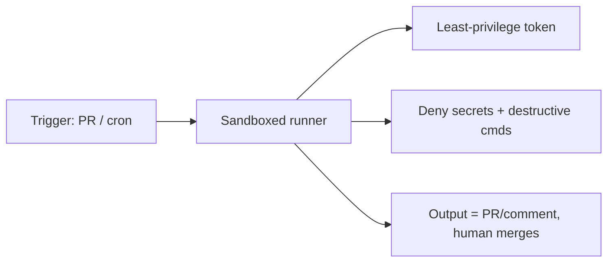

<LevelBadge level="advanced" />

Executar o Claude em modo [headless](/docs/claude-code/headless-and-agent-sdk) ou de forma [agendada](/docs/claude-code/background-tasks) — em CI, num cron job, num pre-commit hook — remove o humano que normalmente perceberia uma ação ruim. Essa conveniência é exatamente o motivo pelo qual essas execuções precisam das proteções mais rígidas.

## Os riscos exclusivos das execuções sem supervisão

- **Ninguém para dizer "não"** a uma chamada de ferramenta arriscada no momento.
- **Credenciais ambientes.** O CI frequentemente tem tokens poderosos (deploy, registro de pacotes, nuvem). Um agente ali os herda.
- **Entradas não confiáveis.** Uma execução acionada por um PR ou uma issue pode processar conteúdo escrito por atacantes ([injeção](/docs/security/prompt-injection)).

## Um checklist de blindagem

- **Negue segredos explicitamente.** Bloqueie a leitura de `.env`, arquivos de chave e caminhos de credenciais via [regras de negação de permissão](/docs/claude-code/permissions). Não confie no modelo para evitá-los.
- **Nunca use o modo bypass/yolo numa máquina com acesso real.** Reserve "pular todas as solicitações" para sandboxes descartáveis.
- **Restrinja o token.** Dê à execução um token de privilégio mínimo (somente leitura quando possível), não suas credenciais de acesso total.
- **Sandbox e efêmero.** Execute num contêiner que é destruído depois; sem acesso persistente à produção.
- **Mantenha allowlists de comandos e domínios.** Permita seus comandos de teste/lint/build; negue os de rede ou destrutivos.
- **Imponha limites.** Máximo de iterações, orçamento de tempo, orçamento de tokens/custo — para que um loop ou um agente manipulado não saia do controle.
- **Torne as saídas revisáveis, não aplicadas automaticamente.** Prefira "abrir um PR / postar um comentário" a "fazer push para a main." Um humano faz o merge.

## Exemplo: um revisor de CI seguro

Um bot de revisão de PR deve: fazer checkout do código em somente leitura, ter acesso **nenhum** a deploy/segredos, executar num contêiner e **comentar** suas descobertas — nunca modificar branches protegidas. Veja o [passo a passo de revisão de PR](/docs/walkthroughs/pr-review-action).

## Próximos

- [Permissões e Modos de Permissão](/docs/claude-code/permissions)
- [Protegendo Agentes e Ferramentas](/docs/security/securing-agents)
- [Modo Headless e o Agent SDK](/docs/claude-code/headless-and-agent-sdk)
