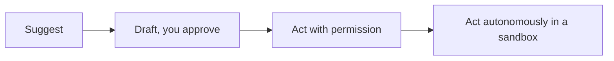

<LevelBadge level="all" />

Aproveitar ao máximo a IA inclui usá-la de forma *responsável*. Esta página é curta, prática e se aplica a todos — do iniciante ao desenvolvedor.

## A mentalidade de verificação

O hábito mais importante de todos: **ajuste sua verificação ao nível de risco.**

| Risco | Exemplo | Quanto verificar |
|---|---|---|
| Baixo | Brainstorming, rascunhos preliminares | Confie livremente, leia por alto |
| Médio | Um e-mail de trabalho, um resumo | Leia, confira os fatos por sanidade |
| Alto | Estatísticas publicadas, código que você vai executar, jurídico/médico/financeiro | Verifique cada afirmação contra uma fonte confiável |

A IA é um rascunho inicial rápido, nunca uma autoridade final — veja [Alucinações](/docs/foundations/hallucinations).

## A escada de autonomia

Dê mais independência à IA somente conforme a confiança for conquistada:

Comece com "proponha, eu aprovo" ([Plan Mode](/docs/claude-code/plan-mode)); reserve a autonomia total para trabalho de baixo risco, em sandbox e reversível ([Blindando Execuções Autônomas](/docs/security/hardening-autonomous-runs)).

## Privacidade e dados

- Não cole segredos, credenciais ou dados pessoais de terceiros numa ferramenta que você não avaliou.
- Conheça a política de tratamento de dados e de treinamento do seu provedor antes de compartilhar material sensível — veja [Privacidade e Tratamento de Dados](/docs/foundations/privacy).
- Para dados regulados ou confidenciais, use as configurações empresariais/controladas apropriadas.

## Viés, justiça e limites

Os modelos refletem padrões nos seus dados de treinamento, que podem carregar **viés**. Seja especialmente cuidadoso quando a saída da IA influencia decisões sobre pessoas (contratação, concessão de crédito, moderação). Mantenha um humano responsável por decisões consequentes e trate a IA como um auxílio ao julgamento, não como um substituto para ele.

## Não terceirize o seu pensamento

:::tip Use a IA para pensar melhor, não menos
Os melhores usuários permanecem engajados — eles questionam as saídas, aprendem com elas e assumem a responsabilidade pelo resultado. Para estudar, isso significa o [ciclo de teach-back](/docs/playbooks/learning), não copiar e colar. Você é responsável pelo que entrega com a ajuda da IA.
:::

## Segurança, em resumo

Se a IA algum dia ler conteúdo não confiável (páginas web, e-mails, documentos) ou tomar ações, você herda um modelo de segurança. Leia [Prompt Injection](/docs/security/prompt-injection) e [Protegendo Agentes](/docs/security/securing-agents).

## Próximos

- [Prompt Injection Explicado](/docs/security/prompt-injection)
- [Alucinações e Como Reduzi-las](/docs/foundations/hallucinations)
- [Privacidade e Tratamento de Dados](/docs/foundations/privacy)
